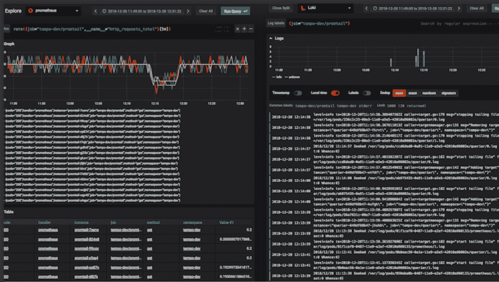

# 格拉芙娜·洛基的摇滚明星创作人谈到了产品发布的时间和内容

> 原文：<https://thenewstack.io/grafana-lokis-rockstar-creator-on-the-whens-and-whats-of-the-production-release/>

Grafana Loki 的创建者[Tom Wilkie](https://uk.linkedin.com/in/tomwilkie),[Grafana Labs](https://grafana.com/)的产品副总裁告诉新的堆栈，开发人员可以期待“在接下来的几天或几周内”看到这款广受欢迎和谈论的测井工具的测试版，并在下一季度初做好全面的生产准备

“我们几乎功能齐全，”威尔基说。

在巴塞罗纳[kube con+CloudNativeCon Europe](https://events.linuxfoundation.org/events/kubecon-cloudnativecon-europe-2019/schedule/)期间，在一个拥挤的礼堂里，Wilkie 用 GitHub 的标题“Grafana Loki: Like Prometheus，but for Logs”恰当地命名了他的演讲后的新堆栈，他将 Loki 的广泛吸引力归因于其简单性。虽然 Elasticsearch 是 Kubernetes 最受欢迎的日志解决方案，而且它是“一个真正强大的产品”，但 Wilkie 说开发者一直“渴望更简单的东西”

自从去年年初发布以来， [Loki](https://grafana.com/loki#about) 已经在 GitHub 上获得了 6114 颗星，当时它在“黑客新闻”上保持了大约 12 个小时的第一名。

“Loki 永远不会用于商业分析。这不是我们想要做的，”威尔基说。

Wilkie 说，Elasticsearch 仍然是“Kubernetes 最受欢迎的日志解决方案，这是一个非常强大的产品”。“但我认为人们渴望更简单的东西。就像我们也站在巨人的肩膀上一样，就像普罗米修斯倡导这种简单易用、功能强大的公制系统一样，”威尔基说。“普罗米修斯团队所做的一切让我们深受鼓舞，事实上，我们只是将许多技术复制到了伐木领域。”

威尔基将最终结果描述为“简单性、普罗米修斯式的灵感、库伯内特式的专注、零日体验与一个命令的结合。”

Wilkie 说，设计团队还受益于在用户界面上与 Grafana 的集成。“我们在推出时，Grafana 的工作流程真的让我们受益匪浅。想象一下，如果我们以命令行工具的形式推出:它可能不会这么受欢迎，”威尔基说。“因此，在这种集成的基础上构建工作流，并关注用户的旅程。从第一天开始，我认为很快就产生了巨大的影响。”

威尔基说，设计团队现在正“疯狂地努力使它尽可能具有生产价值”。“我们已经在生产中运行了。因此，我们的一些用户，但真的，有一些粗糙的边缘，我们想平滑它，”威尔基说。

更具体地说，Wilkie 描述了设计团队(当然是在开源社区的帮助下)如何通过提供警报功能的数值分析等来扩展用例。“我们已经从审计日志用例的种类和可验证性中看到了很多兴趣，”Wilkie 说。

在这次演讲中，Wilkie 说，开发专家一直专注于使 Loki 易于使用，使其易于与现有的可观测性工具集成，同时“完全是云原生的”

“现有的日志聚合系统做全文索引，并支持复杂的查询，”威尔基说。Loki 不对日志的文本进行索引，而是将条目分组到“流”中，并用标签对其进行索引。

Wilkie 描述了 Prometheus 如何与 Kubernetes“对话”,以发现一系列目标。他描述了如何使用 Prometheus 对目标信息进行“重新标记”以构建标签，从应用程序中提取指标，并将目标标签添加到“系列标签”中

同时，Wilkie 描述了 Loki 的数据模型是如何的相似:

*   时间戳是纳秒浮点；
*   值是字节数组；
*   标识符与标签集相同。

与此同时，许多开发人员总是在等待测试版，当生产版本可用时，他们可能会选择利用 Loki 的简单性来登录云原生部署。

威尔基说，洛基“人气飙升，因为我认为我们触及了痛处”。

云原生计算基金会和 KubeCon + CloudNativeCon 是新堆栈的赞助商。

<svg xmlns:xlink="http://www.w3.org/1999/xlink" viewBox="0 0 68 31" version="1.1"><title>Group</title> <desc>Created with Sketch.</desc></svg>