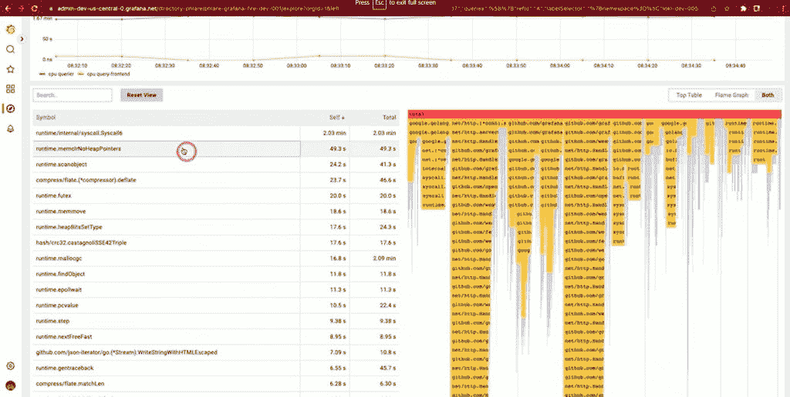
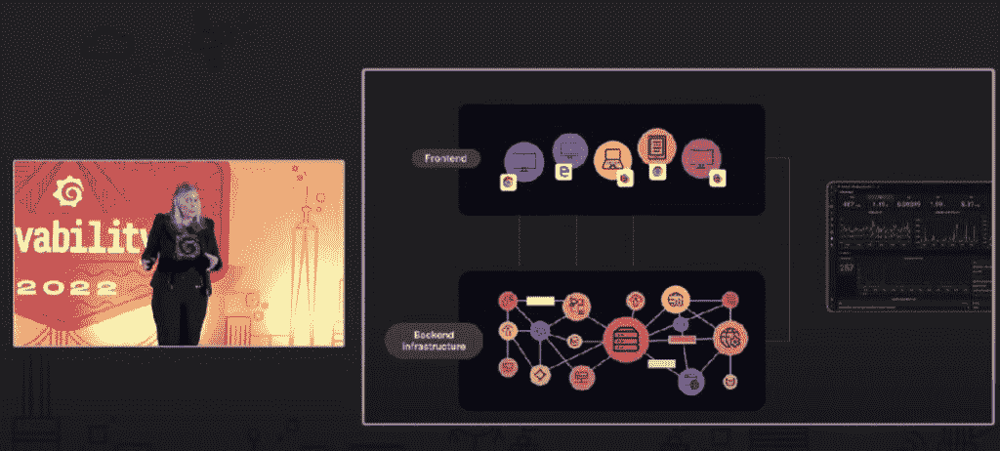
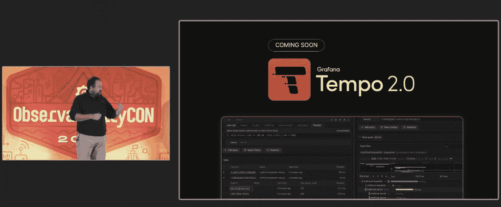

# Grafana 在 ObservabilityCON 展示新的可观测性项目

> 原文：<https://thenewstack.io/grafana-shows-new-observability-projects-at-observabilitycon/>

使用开源 Grafana 已经不仅仅是开发人员和运营社区中可视化可观测性数据的主要方式，还包括那些使用面板查看任何内容的人，从监控烤箱温度到 SpaceX 使用 Grafana 监控航天器中的燃料流量。在当今软件驱动的大公司世界中，开发人员的角色已经演变成一股不可忽视的力量。

这有助于解释——至少部分解释——为什么 [Grafana](https://thenewstack.io/will-grafana-become-easier-to-use-in-2022/) 越来越多地被整合到基于开发人员和运营人员需求的企业基础设施中(与不久前首席信息官或其他首席执行官可能规定工程师必须使用的平台(通常是专有的)形成对比)。今天，情况发生了一些变化，工程师们对采用什么样的基础设施有了更大的兴趣。

在本月早些时候在纽约举行的[observibility con](https://grafana.com/about/events/observabilitycon/2022/)2022 期间，Grafana 达到了 1000 万用户的高峰，Grafana 的受欢迎程度和基层推动的大型组织的采用是显而易见的，来自大型银行和其他企业实体的 Grafana 用户数量众多。Grafana 还在会议前夕在谷歌位于曼哈顿市中心的一个地点举办了几次价格合理的研讨会，那里有大量的小吃和水果。

在会议期间，来自 Grafana 和客户的发言人阐述了它计划如何进一步提供比最初的数据可视化面板更广泛的可观测性体验。为了帮助做到这一点，Grafana 宣布了两个新的开源项目 [Grafana Phlare](https://go.grafana.com/MzU2LVlGRy0zODkAAAGIAT7RMxj4_xBkiwbzWZHMTsHOLos11o7raEaBmG_NkWkTYf3cwl-hfKTZMWIs4ANzQlhWgDc=) 用于持续剖析，以及 [Grafana Faro](https://go.grafana.com/MzU2LVlGRy0zODkAAAGIAT7RM7_7OVhm0vSzzC6416KuN1b2eA89MNiDx_mKZ-TtR1J-QG5j4FJARqtVlLvYdkb6q-U=) 用于前端应用程序可观察性，作为两个新的 Grafana 附加项目，当您下次访问 Grafana 面板时。这些开源项目建立在 Grafana 现有的开源项目[米伊美(metrics)](https://grafana.com/oss/mimir/)[Loki(logs)](https://grafana.com/oss/loki/)和 [Tempo (traces)之上。](https://grafana.com/oss/tempo/)(下文有更多相关内容)。

还讨论并演示了用于日志的[格拉法纳洛基、](https://go.grafana.com/MzU2LVlGRy0zODkAAAGIAT7RMyKj6VzEENyyD9FIm9c5nJic-fgdLq1BWS_0dIa7206hVgbtxBWEkQgE6QUNF3wB2J0=)T2、用于性能测试的格拉法纳 k6 以及用于指标的格拉法纳速度整合和[格拉法纳米伊美的新功能](https://go.grafana.com/MzU2LVlGRy0zODkAAAGIAT7RM18K2xYicU68lc0QNCYnrJQDr-IVemRmOaEvaKl7Tr4cqiYTJjK8Z_Pvoz77uz_JmR0=)。

如果有什么不同的话，Grafana 确实希望保持与开发商的联系。它的“LGTM”指的是当 GitHub 上的拉请求被批准时“看起来不错”的做法，以及代表 [Loki](https://thenewstack.io/grafanas-loki-2-0-features-new-log-labels-direct-alerts-and-a-prettier-dashboard/) 、Grafana、Tempo 和米伊美。

“我们花了四年时间开发初始核心堆栈。因此，我们下一步要做的是在软件开发周期的早期进行更多的测试，包括混沌测试，以及使用像 [k6](https://k6.io/) 这样的工具进行可靠性工程。“我们在软件生命周期的早期进行生产前测试，并继续投资于可观察性。”

但是，当然，在使用 Grafana 面板可视化数据时，您不必为了可观察性而选择 Grafana 数据源。正如 Dutt 在他的主题演讲中提到的，Grafana 的设计是为了优先考虑互操作性。这是因为大多数组织与许多可观测性供应商和解决方案以及不同的数据库合作。“我们非常独特，我认为作为供应商，我们与众不同。因为我们不会告诉您，我们不要求您将所有数据整合到一个平台中。我们允许您将数据保存在您想要的地方，并使用对您的公司有意义的技术，”Dutt 说。“我们希望您使用有意义的供应商，并最终拥有自己的可观察性战略，我们认为这将改变我们与客户和用户的关系，因为这使我们更像是一个真正的合作伙伴，而不是一个将整合您所有数据和支出的供应商。”

## 剖析加电

帮助开发人员解决他们的可观察性问题在很大程度上推动了 Grafana 最近最雄心勃勃的努力:Grafana Phlare 的推出，持续分析意味着什么，为什么这种新的开源替代方案会引起开发人员和运营人员的兴趣？首先，让我们看一下剖析的定义。Grafana 首席软件工程师 Cyril Tovena 表示，profiling 是通过收集堆栈跟踪样本(一组导致资源消耗的函数调用)对代码执行进行分析。“在我看来，概要分析是一种强大的能力，因为它能告诉你实际的代码行问题是什么……并允许你精确定位性能问题，”Tovena 说。

Phlare

Tovena 说，Phlare 背后的想法是填补现有开源项目在存储和查询连续分析数据方面的空白，这些数据不符合 Grafana 用户欣赏的可伸缩性、可靠性和整体性能要求。它还迎合了那些已经熟悉 Grafana 及其工作方式的人，因为它与 Loki、Temp 和米伊美共享相同的底层架构。

Grafana 认为 Phlare 是“可观测性的另一个支柱”，[Grafana Labs 的产品副总裁 Tom Wilkie](https://www.linkedin.com/in/tomwilkie/?originalSubdomain=uk) 在主题演讲中说，他也是 Prometheus 的维护者和 Loki 和米伊美的共同创造者。因此，Phlare 的连续分析能力“是内存和 CPU 分析的定期收集。它有助于程序优化，有助于识别和减少尾部延迟，并优化您的总拥有成本，”他说。“将它带到 Grafana 意味着您可以看到它与您的指标、跟踪和日志放在一起，并且可以在两者之间建立关联。”

## 最终用户看到的内容

Grafana Labs 工程总监 Myrle Krantz 在她的主题演讲中。

Grafana Pharo 的目标是前端应用可观察性，它有观察最终用户客户在他们的屏幕上看到什么的目标业务用例，” [Myrle Krantz，](https://www.linkedin.com/in/myrlekrantz/?originalSubdomain=de)Grafana Labs 的工程总监在她的主题演讲中说你仍然需要知道什么真正进入了客户。前端是你的客户所看到的和他们接触到的，以及他们获取你的公司所提供的价值的地方。它也比其他东西更难监控，因为前端发生的事情不是发生在您控制的计算机上，而是发生在您客户的计算机上。

根据其 [GitHub 文档，](https://github.com/grafana/faro-web-sdk)它将推出 Grafana Faro Web SDK，Grafana 将其描述为一个高度可配置的真实用户监控(RUM)Web SDK，该 SDK 可以控制浏览器前端应用程序来捕获可观察性信号。前端遥测然后可以与后端和基础设施数据相关联，以实现全栈可观察性。

## 找到那些痕迹

Grafana Labs 产品副总裁 Tom Wilkie 在主题演讲中说。

即将发布的 Tempo 2.0 版本代表了其发展过程中的一个潜在转折点，它提供了一种用于跟踪的查询语言。有了它，更容易找到并勾画出你要找的痕迹。以前，用户需要通过搜索日志和样本或属性(如服务名)来精确定位跟踪。

该功能旨在允许用户交互式地提取和搜索他们的踪迹。威尔基说，该语言的未来阶段将允许用户根据其结构来查找和分析痕迹。他们将能够搜索具有特定属性主跨度的踪迹，然后将该属性与其他属性相结合，“这样你就可以匹配踪迹的结构，”他说。

威尔基说:“我认为最让我兴奋的是，我们不知道人们会用它来做什么。”“这项功能将支持哪些应用？在未来，我认为我们会看到一些令人兴奋的基于 TraceQL 命令的应用程序内置到 Tempo 中。

威尔基说: [Prometheus](https://thenewstack.io/6-things-to-consider-in-a-prometheus-monitoring-platform/) 用户和其他已经熟悉 [PromQL](https://thenewstack.io/query-optimization-in-the-prometheus-world/) 的用户将会注意到 Tempo 2.0 的 TraceQL 是如何模仿 PromQL 和 LogQL 的。“如果你熟悉这些项目中的任何一个，你应该能够马上跟上节奏，”他说。

## 这应该不难

开发人员和运营社区中的草根兴趣是 Grafana 用户激增的主要原因，他们正在从 Prometheus 或其他可观测性数据源中寻找指标。这种激增也可以归因于 Grafana 面板如何使可观测性易于使用，或者至少易于开始。换句话说，Grafana 正在尝试的是，让常驻的 Prometheus 或 observability 专家出去，让每个人都能在短时间内知道如何使用 observability。

“这里的愿景是，这些应该真正帮助您在五分钟内开始，而不是几天。这应该很简单，只需点击几个步骤，部署代理，你就可以了。我特别高兴的一件事是，最近，我们发现这些集成确实有助于您在整个组织中部署这些最佳实践，”Wilkie 说。“因此，现在不仅仅是专注于开始，实际上是在一个大组织中获得封闭的专业知识:在我们只开始一个集成(这有点尴尬)后，已经有大约[100，000 次在 Grafana Cloud 中使用大约 50 个集成]”。

<svg xmlns:xlink="http://www.w3.org/1999/xlink" viewBox="0 0 68 31" version="1.1"><title>Group</title> <desc>Created with Sketch.</desc></svg>