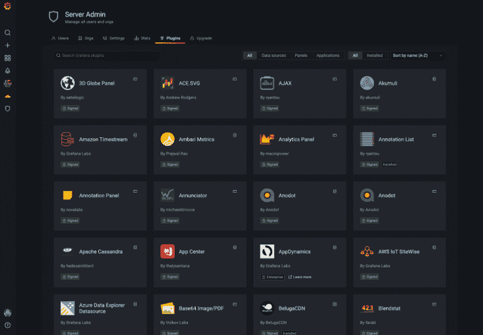
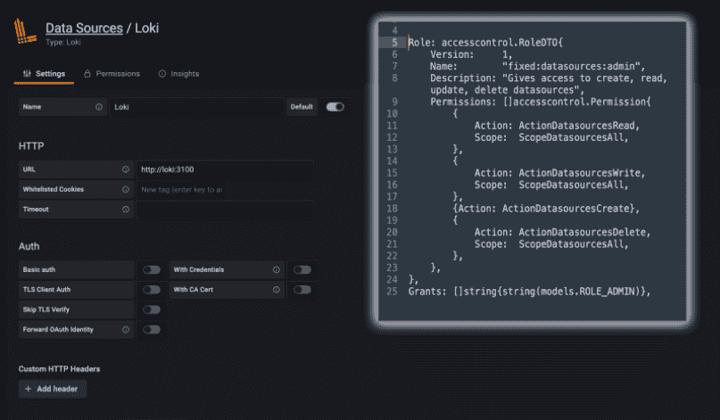
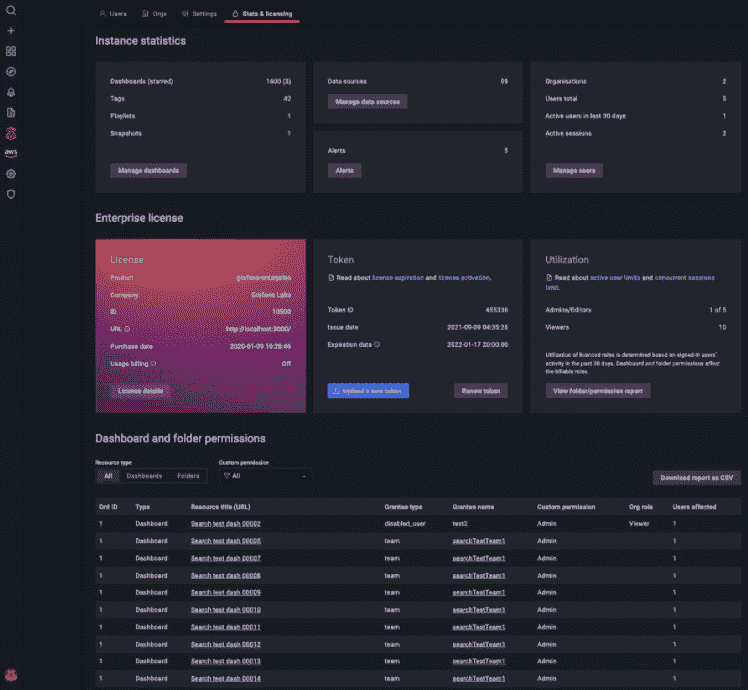

# Grafana 希望“民主化”云原生指标

> 原文：<https://thenewstack.io/grafana-wants-to-democratize-cloud-native-metrics/>

开源的 observability dashboard[Grafana](https://grafana.com/)补充了一些期待已久的新功能，值得一看，包括企业功能，如改进的访问和权限控制。

开源版本的 [Grafana 8.2](https://grafana.com/docs/grafana/latest/release-notes/release-notes-8-2-0/) 的新功能包括一个插件目录和在时间范围控件中配置财政年度和季度的能力。 [Grafana Enterprise](https://grafana.com/products/enterprise/grafana/) 还提供了新的统计数据和许可状态可视化，以及改进的性能洞察和更易于访问的报告。

Grafana 的高级产品经理 Petros Kolyvas 在一篇[博客文章](https://grafana.com/blog/2021/10/07/grafana-8.2-released-dynamic-plugin-catalog-new-fine-grained-access-control-permissions-and-more/)中写道，Grafana 8.2 中的这些变化主要集中在导航上，“还会有更多变化”。

“这一发布标志着我们工作的开始，重点是对 Grafana 的可访问性进行可衡量的改进——这是我们实现指标民主化的持续使命的一部分，”Kolyvas 写道。

因此，这次发布显示了 Grafana 将仪表盘的使用扩展到不同 DevOps 团队的意图。[Enterprise Management Associates(EMA)](https://www.enterprisemanagement.com/)的分析师 [Torsten Volk](https://www.linkedin.com/in/torstenvolk/) 告诉 The New Stack 说:“随着数据源数量的迅速增加，开发人员、sre、DevOps 工程师和业务分析师很快意识到滚动他们自己的定制仪表板的价值，让尽可能多的这些角色与他们的仪表板挂钩变得至关重要。

## 插件电源

Grafana 8.2 的开源版本支持插件的更多可见性和管理。例如，可以安装和卸载插件，而不必重启 Grafana。监控也得到改进，因为现在可以在同一个屏幕上区分已安装和所有可用的插件。

沃尔克说，这些新功能简化了可用性，有助于为更多用户和用例开放平台。

## 最后:更好的访问管理

考虑到许多组织在管理几个不同的用户帐户时面临的困难，企业版改进的访问和权限功能可以说是一个“适时”的附加功能。这在缩放操作时尤其具有挑战性。当然，格拉夫纳并不是唯一有罪的一方。无论是 Google Docs、WordPress 还是用于 Kubernetes 集群管理的 APIs 仅举几个随机的例子——管理员和运营团队成员通常很难微调用户对数据和应用程序访问的权限。

在 8.2 版本中，Grafana 提供了所谓的“细粒度”访问控制，以提供数据源和供应权限:Grafana 8.2 现在允许管理员为用户划分角色和访问权限，如查看者、编辑者或管理员。还可以设置哪些角色允许用户重新加载仪表板、数据源和其他已调配资源的调配配置。Kolyvas 在他的博客帖子中写道，Grafana 仪表板和 API 键将会有更多的访问改进。

Volk 说，提高角色和基于用户的访问控制的粒度是 Grafana 寻求深化企业采用其平台的关键要求。

## 一个屏幕显示统计数据、许可证和文件夹权限

Grafana 的可视化功能在 IT 社区广为人知并得到广泛使用，在此次企业版中，它在将信息拉入一个结合了统计、许可和权限的单一屏幕(屏幕也非常大)方面更进了一步。此功能使理解和管理不同的许可条款和用户帐户变得更加容易。例如，现在可以更容易地看到某个许可证或某组许可证即将到期。屏幕上显示的统计数据包括 Grafana 统计数据，例如给定实例中的仪表板、数据源和警报的数量。该屏幕还包括仪表板和文件夹权限的交互式列表，这可以影响您的用户在 Grafana 中的许可角色。

## 会计年度和季度选择

Grafana 8.2 的开源版本包括 Kolyvas 在他的博客文章中描述的“时间范围菜单的重大变化”它现在包括设置组织财政年度开始月份的功能。这项功能可以为需要它的用例提供可配置的财年和财年季度时间范围，他说这对“走向市场”、财务和其他业务利益相关者仪表板“特别有帮助”。

“我们可以看到 Grafana 一点一点地添加新的企业功能，所有这些都是该公司最终将数据驱动的仪表板纳入运营和整个企业主流所必需的，”Volk 说。

## 更好的使用洞察和监控

8.2 企业版提供了使用洞察日志，这些日志提供了以前无法用 Grafana 跟踪的用户仪表板访问、查询和前端错误的信息。虽然这些指标以前必须导出到基于[普罗米修斯](https://prometheus.io/)的日志聚合系统 [Loki Grafana](https://grafana.com/oss/loki/) ，但现在可以通过常规服务器日志查看日志数据，从而有助于检测问题仪表板和数据源。

<svg xmlns:xlink="http://www.w3.org/1999/xlink" viewBox="0 0 68 31" version="1.1"><title>Group</title> <desc>Created with Sketch.</desc></svg>