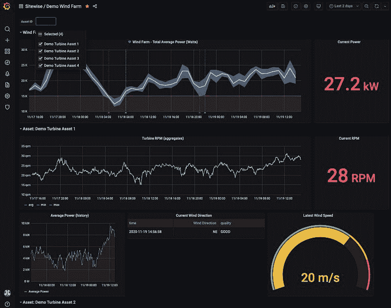

# Grafana 与 AWS 的合作预示着更好的性能和潜在的采用优势

> 原文：<https://thenewstack.io/grafanas-aws-partnership-portends-better-performance-and-a-potential-boon-in-adoption/>

在本周 re:Invent 期间宣布合作关系后，Grafana Labs 广受欢迎的 observability platform 和其他工具应该可以更好地运行，并更容易与亚马逊网络服务(AWS)集成。

Grafana 高管告诉 New Stack，现在可以作为“Grafana Enterprise 对 Grafana 的亚马逊托管服务的官方升级”使用，这是 AWS 合作伙伴关系的结果，可以在许多方面帮助 Grafana Labs 推进其 Grafana Enterprise 软件的商业战略。

当然，在此之前，组织可以在其 AWS 托管环境中实施和运行 Grafana Enterprise 和 Grafana Cloud，Grafana、Loki 和 Cortex 的开源版本，以及 Prometheus。现在的变化是，Grafana Enterprise 和其他 Grafana 工具现在可以在 AWS 直接向其客户提供的产品中使用。这解决了 Grafana 用户可能面临的潜在操作和实施挑战。Grafana Labs 的产品副总裁 Tom Wilkie 告诉新的堆栈，这一合作伙伴关系因此被视为 Grafana 对用户的可访问性和可用性的巨大潜在好处，他也是 Prometheus 的维护者和 T2 Loki 和 Cortex 的共同创造者。

“亚马逊能够有效地将这些作为这个领域事实上的标准，真是太好了。威尔基说:“亚马逊有一个如此庞大的市场渠道，他们的软件有如此庞大的受众，只要将它作为亚马逊托管服务作为第一方提供就可以了。”“这将把格拉夫纳和普罗米修斯带给更广泛的观众——老实说，这可能是最大的贡献。”

Grafana 的 AWS 物联网 SiteWise 插件。

威尔基不愿就 AWS 可能提供开源项目，然后直接向其云客户提供软件服务的争议发表评论。

凭借其软件包，AWS 可以有效地与创建平台的组织竞争，该平台的商业模式是基于软件的服务和支持。例如，[荷兰的 Elastic over AWS 的 Elasticsearch Distribution](https://thenewstack.io/what-the-fork-amazon/) 以及其他公司也表达了类似的观点。

然而，Wilkie 描述了-同时再次拒绝评论或推测其他开源商业模式及其与 AWS 的关系 Grafana Labs 的商业模式如何在很大程度上基于 Grafana Enterprise 和开源。

威尔基说:“我认为作为一家开源创业公司，与亚马逊做生意是可能的，我认为我们是如何做到这一点的榜样。”“我们有着非常好的关系，这有助于我们和亚马逊取得成功。”

根据亚马逊副总裁兼首席技术官[沃纳·威格尔](https://www.linkedin.com/in/wernervogels)本周早些时候在 re:Invent 主题演讲中宣布的合作条款，Grafana 还将与 AWS 合作，为 Prometheus 提供亚马逊托管服务，该服务基于 Cortex 项目，旨在大规模运行和管理 Prometheus。

Grafana Labs 还交流了亚马逊 Grafana 托管服务如何适应 ServiceNow、Splunk、Snowflake、Datadog、MongoDB、Oracle、New Relic、Dynatrace、Wavefront 和 AppDynamics 的数据源插件。

Grafana Labs 的仪表盘尤其受欢迎。今年早些时候，Grafana Labs 表示，它已寻求通过改进其仪表板来采用 Prometheus，并通过 Grafana 仪表板来提高 Prometheus 的安全性、可靠性和其他功能。这些新功能将作为 AWS 云产品在“Grafana 的亚马逊托管服务”下提供。

虽然这种合作关系是与 AWS 密切合作的结果，几个月来“每周检查，共享积压工作和加班”，Grafana Labs 的高级产品经理 [Mitchel Seaman](https://www.linkedin.com/in/mitchelseaman) 也提到了 AWS 和 Grafana 工程师之前如何在 Grafana 数据源插件上工作，如亚马逊 CloudWatch，AWS X-Ray，亚马逊 Timestream，以及最近的 AWS IoT SiteWise。

“为了帮助推出 Grafana 的亚马逊托管服务，我们的工程师编写了代码，并分享了我们在运行 Grafana 云方面的专业知识，以帮助 AWS 建立一个在 AWS 内运行的可靠服务，”希曼告诉 New Stack。“我们还一起开发了新功能，比如 Grafana 中的 AWS Provisioning App’，它让用户只需点击几下就可以设置他们的 AWS 数据源。”

希曼还表示，Grafana Labs 与微软 Azure 和谷歌云平台都有云产品的合作伙伴关系。Grafana Labs 过去也曾与 GCP、Azure 和甲骨文以及 AWS 合作，为它们的 Grafana 服务创建插件。

“与 AWS 的合作取得了成果，因为很明显，我们有机会在用户所在地见到他们，”希曼说。“我们期待看到社区接下来会把我们带到哪里。”

亚马逊网络服务公司(AWS)是新堆栈的赞助商。

<svg xmlns:xlink="http://www.w3.org/1999/xlink" viewBox="0 0 68 31" version="1.1"><title>Group</title> <desc>Created with Sketch.</desc></svg>