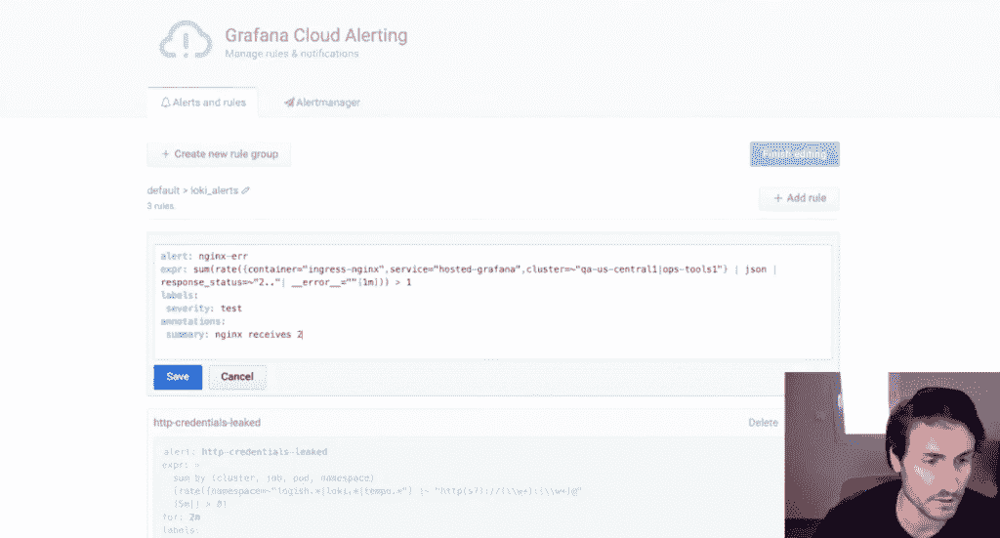
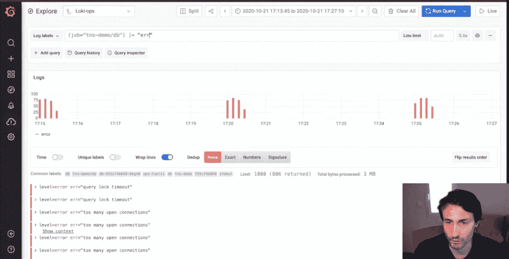

# Grafana 的 Loki 2.0 具有新的日志标签、直接提醒和更漂亮的仪表板

> 原文：<https://thenewstack.io/grafanas-loki-2-0-features-new-log-labels-direct-alerts-and-a-prettier-dashboard/>

Grafana 最新发布的 2.0 版本的 [Loki](https://grafana.com/oss/loki/) 日志聚合工具[具有](https://github.com/grafana/loki/releases/tag/v2.0.0)改进的查询语言和直接从日志本身生成警报的能力。

例如，通过 Loki 的日志聚合仪表板，Loki 2.0 改进了日志和指标的标记、分类和描述方式以供分析:该工具现在允许用户直接从仪表板中编写警报查询——以前该功能需要使用 [Grafana](https://grafana.com/) 配置警报，这是 Loki 的配套分析和交互式可视化 web 应用程序。

Grafana Labs 的产品副总裁 Tom Wilkie 在 [ObservabilityCON](https://grafana.com/about/events/observabilitycon/) 的主题演讲中说:“我们将此次发布的重点放在了三件事情上:从日志中获取指标，根据这些指标构建警报，以及构建漂亮的交互式仪表盘。”。

在 ObservabilityCON 主题演讲期间，Grafana Labs 的高级软件工程师 Cyril Tovena 展示了这些新功能的工作原理。例如，他展示了如何用 Loki 设置转发给警报管理器的规则。一旦收到警报，他向我们展示了如何以这样一种方式来分析数据库，即通过使用 Loki 来分析应用程序的日志(用表格分类)的特定时间跨度，从而快速找到“问题的根本原因”。

在演示期间，他还展示了 Loki 的新功能如何有助于为 web 服务器管理寻找 [Nginx](https://www.nginx.com/) 的关键指标，Tovena 说，“这不是一项容易的任务。”例如，他展示了如何使用 Loki 为过滤和聚合添加更复杂和详细的标签，以提高分析延迟数据的度量能力。“现在，它非常轻便，容易消化和发现问题，”他说。“所以，这不仅仅是日志”，因为您还可以将新标签提取到指标中。

大约两年前，Grafana 发布了 Loki 来支持“开发者和操作者”角色，以这样的方式让用户“尽快找到日志中包含的错误，”Wilkie 在 [ObservabilityCON 的主题演讲中说道。](https://grafana.com/about/events/observabilitycon/)“我们允许您快速从指标转到日志，为您的查询显示相关的日志和指标，”Wilkie 说。“我们希望尽可能简化这一过程。”

Loki 的大部分功能归功于仪表板列出日志元数据的方式，而不是将整个日志文本转储到屏幕上，否则解析起来会更困难。

Wilkie 说:“我们通过保存您构建查询和指标的元数据和上下文来做到这一点，然后将元数据直接转移到您的日志中。”“这种简化和集成流程确实有助于减轻事故响应工作流程的压力，这正是我们努力实现的目标。”

Grafana 说，自去年发布 Loki 1.0 以来，Loki 实例已从 5000 个增加到 27000 多个。

Grafana 还在 ObservabilityCON 期间推出了 Grafana 7.3，它具有更好地访问相关指标、日志和跟踪功能，以便进行调试和分析。这项新功能是 Grafana 最初创建者的使命的一部分，即创建一个涵盖所有可观测性要求的单一平台。Grafana 创建者和项目负责人、Grafana 实验室的联合创始人[托克尔·奥德加德](https://se.linkedin.com/in/torkel-odegaard)说，这个想法是为了让用户能够“选择符合你需求的数据来源，记录和跟踪，给你更多的选择和自由，并防止你被供应商锁定”。

<svg xmlns:xlink="http://www.w3.org/1999/xlink" viewBox="0 0 68 31" version="1.1"><title>Group</title> <desc>Created with Sketch.</desc></svg>