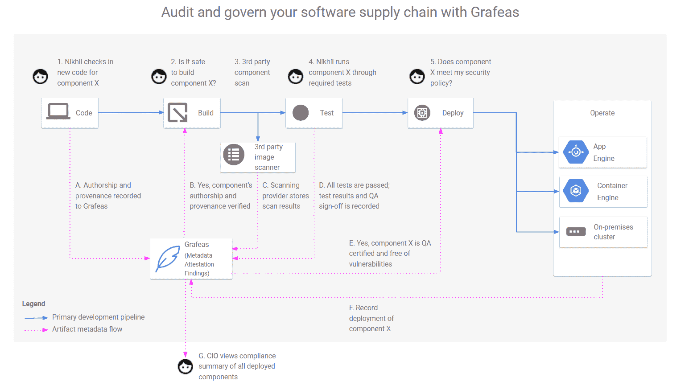

# Grafeas:追踪 DevOps 供应链的新方法

> 原文：<https://thenewstack.io/grafeas-new-way-track-devops-supply-chain/>

新推出的开源倡议 [Grafeas](https://github.com/grafeas) 定义了一种开放、统一的元数据交换格式和 API，它将提供一种一致的方式来聚集和消费来自软件组件的元数据。

这个元数据的中央存储库[承诺](https://cloudplatform.googleblog.com/2017/10/introducing-grafeas-open-source-api-.html)提供一个全新的软件供应链可见性层——并增强审计和治理能力。

Grafeas 从在[谷歌](https://cloud.google.com/kubernetes-engine)的工作中成长起来，但是 JFrog、[红帽](https://www.openshift.com/)、IBM、黑鸭、 [Twistlock](https://www.paloaltonetworks.com/prisma/cloud) 、Aqua Security 和 [CoreOS](https://coreos.com/) 都加入了这个倡议。

“现代(软件开发)过程在很多情况下让事情变得更难——创建彼此独立的较小服务，”谷歌产品经理、开发者平台的 Stephen Elliott 说。

这一过程加剧了一些问题，例如首席信息官们是否确信交付生产的产品是安全的，是最新的，是内部制造的，并且拥有正确的许可证。

“我们从顾客那里听说这个问题越来越严重，”他说。

“我们收到的一个常见问题是，‘我如何判断组件 X 是否正在生产中运行？’或者‘我如何判断这个最新的漏洞是否会影响到我即将投入生产的任何东西？'

“这些都不是因为容器而产生的新问题。这只是事情开放和分布的方式，只是更难回答。”

Google 内部也有同样的问题，处理大量的容器和发布，拥有一个灵活可信的系统，可以跟踪所有的组合组件。

Grafeas(希腊语中的“scribe”)为跨软件开发团队和管道跟踪和执行策略提供了一个核心的事实来源。

“如果你有一个关于你的工件的真正强大的知识库，那么你可以建立一个真正强大的治理工具，”Elliott 说。

通过第二个部分，Kritis(希腊语中的“法官”)组织可以实时地为 Kubernetes 集群执行治理策略，这些策略来自 Grafeas 元数据。

对于电子商务平台 [Shopify](https://www.shopify.com/) 来说，每天有 6000 个容器构建，其主要容器注册表中有 33 万个图像，跟踪所有组件一直是一个挑战。该公司在一篇[博客文章](https://shopifyengineering.myshopify.com/blogs/engineering/how-shopify-governs-containers-at-scale-with-grafeas-and-kritis)中解释说，它使用 Grafeas 来回答以下问题:

*   该容器是否已部署到生产环境中？
*   这个容器从我们的注册表中取出(下载)的时间是什么时候？
*   这个容器中安装了什么包？
*   这个容器包含任何安全漏洞吗？
*   这个集装箱符合我们的安全控制吗？

“通过将 Grafeas 和 Kritis 集成到我们的 Kubernetes 管道中，我们现在能够自动存储漏洞并构建我们创建的每个容器映像的信息，并严格执行由 Shopify 构建的策略:我们的 Kubernetes 集群只运行由我们的构建者签名的映像，”Shopify 的高级安全工程师 [Jonathan Pulsifer](https://twitter.com/jonpulsifer) 说。

谷歌正在托管其 alpha Grafeas API，但它希望围绕它建立一个生态系统。因为它没有与任何特定的行业技术或打包技术相结合，所以它可以在任何地方运行并存储元数据，即使在混合云用例中也是如此。它集成和聚合了来自现有工具的元数据。

“我们希望我们的合作者在他们自己的系统中实现它，但是他们都能够相互交流。因此，对于 JFrog，我们正在进行双向同步，因此，如果他们在自己的私有云上使用 Artifactory 和[Jfrog] XRay 或谷歌产品，他们都可以相互交谈。这对拥有混合环境的金融服务公司等客户来说非常重要，”Elliott 说。

他把它比作基本的互联网管道。有了供应链强大的中央元数据存储，构建仪表板就变得容易多了。

“你不必做大量的定制工程来将每个不同的工具集成到某种仪表板中，”他说。“如果将 API 插入用于构建/测试/部署的工具中，仪表板不必查询所有不同的工具，它只需查询 Grafeas，并且只查询您需要的元数据，因此您不会得到一些单一的报告。它可以处理简单的查询，比如“QA 团队已经在这张图片上签字了吗？”更丰富的查询，例如，“我是首席信息官，我想查看我部署的所有组件中某些漏洞的状态。"

根据一篇博客文章，它为进一步的自动化开辟了可能性:

“如果所有组件都以标准格式呈现其元数据，那么从使用不同技术创建的组件中添加和提取元数据的过程更容易实现自动化，并且您可以使用标准 API 提取元数据。但这仅仅是开始。当您开始使用相同的标准添加自己的私有元数据时，您就为正在使用的软件组件的自动化审计和治理开辟了新的机会，无论它们是开源组件还是内部创建的专有组件。”

预计本季度发布:

*   JFrog 的 Grafeas API 的 x 射线实现
*   Grafeas 的 Google 工件元数据 API 实现，以及 Google 容器注册表漏洞扫描
*   JFrog Xray 和 Google 工件元数据 API 之间的双向元数据同步
*   Black Duck 与 Grafeas 和 Google 工件元数据 API 的集成

[CoreOS](https://coreos.com/) 、 [Google](https://cloud.google.com/kubernetes-engine) 、 [Red Hat](https://www.openshift.com/) 和 [Twistlock](https://www.paloaltonetworks.com/prisma/cloud) 是新栈的赞助商。

通过 Shopify 展示艺术。

<svg xmlns:xlink="http://www.w3.org/1999/xlink" viewBox="0 0 68 31" version="1.1"><title>Group</title> <desc>Created with Sketch.</desc></svg>