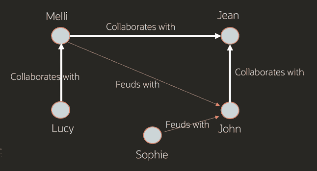

# 图形数据库:为什么它们突然流行起来？

> 原文：<https://thenewstack.io/graph-databases-why-are-they-suddenly-popular/>

图论已经存在了几个世纪，图形分析技术也已经存在了几十年。那么为什么现在图人气飙升呢？

图形分析是以图形格式分析数据的过程，使用数据点作为节点，关系作为边。以这种方式查看数据可以帮助您发现以前不明显的联系和关系。这可以在很多情况下释放价值。例如，图表可以帮助快速找到欺诈付款，跟踪敏感数据以确保合规性，发现公用事业网络中的中断，执行人员流动分析以留住有价值的员工，以及跟踪用于疫苗开发的蛋白质。

 [杰夫·埃里克森

杰夫是甲骨文公司技术内容总监。你可以在 twitter @erickson4 上关注他，在那里你可能会看到关于禅宗、有趣的科技、足球和公开水域游泳的帖子。](https://www.linkedin.com/in/jeff-erickson-6ba4b41/) 

应用程序几乎是无止境的，特别是现代应用程序优先考虑连接整个组织的数据，无论是来自 ERP 或人力资本管理(HCM)系统的应用程序数据、社交媒体交互还是第三方数据。这有助于解释为什么 Gartner 连续三年选择图表技术作为其[十大数据和分析趋势](https://www.gartner.com/smarterwithgartner/gartner-top-10-data-and-analytics-trends-for-2021/)之一。

图形分析需要支持图形格式的数据库。这可以是一个专用的图形数据库，也可以是一个支持多种数据模型的融合数据库，[包括图形](https://www.oracle.com/database/graph/)。两者都可以让你执行基于连接的“遍历查询”,并应用图形算法来寻找模式、路径、社区、影响者、单点故障和其他关系。图算法探索顶点之间的路径和距离、顶点的重要性以及顶点的聚类。例如，为了确定重要性，算法通常会查看传入的边、相邻顶点的重要性以及其他指标。

让我们来看看 Oracle graph 团队的产品经理编写的“[什么是图形数据库](https://www.oracle.com/big-data/what-is-graph-database/)”中的一些用例:

## **六度凯文·贝肯**

下图显示了流行的派对游戏“凯文·贝肯六度角”的视觉表现对于那些新手来说，这个游戏涉及到凯文·贝肯和另一个演员之间的联系，基于一系列共同的电影。这种对关系的强调使得它成为展示图表分析的理想方式。

想象一个包含两类节点的数据集:曾经拍过的每一部电影和参与过这些电影的每一个演员。然后，使用图形技术，我们运行一个查询，要求将凯文·贝肯与布偶偶像猪小姐联系起来。结果将如下所示:

在这个例子中，可用的节点(顶点)既是演员又是电影，关系(边)是“参与演出”的状态从此处，查询返回以下结果:

*   凯文·贝肯和梅丽尔·斯特里普一起出演了《荒野之河》。
*   梅丽尔·斯特里普和比利·康诺利一起出演了莱蒙尼·斯尼克的《一系列不幸事件》。
*   比利·康诺利和猪小姐一起出演了《布偶宝岛》。

图形数据库使得查询这个凯文·贝肯例子的许多不同的关系成为可能，例如:

*   "连接凯文·贝肯和猪小姐的最短链条是什么？"(最短路径分析，如上面六度游戏中使用的)。
*   “谁和最多的演员合作过？”(程度中心性)。
*   "凯文·贝肯和其他演员的平均差距是多少？"(亲近中心性)。

## **洗钱**

从概念上讲，洗钱很简单。脏钱被传来传去，与合法资金混在一起，然后变成硬资产。这就是巴拿马文件分析中使用的那种程序。

更具体地说，循环资金转移涉及犯罪分子向自己发送大量欺诈所得的资金，但通过“正常”账户之间一系列漫长而复杂的有效转移来隐藏这些资金。这些“正常”账户实际上是用合成身份创建的账户。它们通常共享某些相似的信息，因为它们是从窃取的身份(电子邮件地址、地址等)生成的。).正是这种相关信息使得图表分析非常适合于揭示合成身份的欺诈来源。

为了使欺诈检测更简单，用户可以根据实体之间的交易以及共享一些信息(包括电子邮件地址、密码、地址等)的实体创建图表。一旦创建了一个图表，运行一个简单的查询就可以找到所有拥有相似信息的帐户并且互相汇款的客户。

## **社交媒体分析**

社交网络是理想的用例，因为它们涉及大量的节点(用户账户)和多维连接(在许多不同方向的参与)。社交网络的图形分析可以确定:

*   用户活跃度如何？(节点数)
*   哪些用户的影响力最大？(连接密度)
*   谁的双向参与度最高？(连接的方向和密度)

然而，如果这些信息被机器人不自然地歪曲了，那么它们就毫无用处。幸运的是，图形分析可以提供一种识别和过滤僵尸程序的极好方法。

在一个真实的用例中，甲骨文团队使用[甲骨文营销云](https://www.oracle.com/cx/marketing/)来评估社交媒体广告和牵引力，具体来说，就是识别歪曲数据的虚假机器人账户。这些机器人最常见的行为是转发目标账户，从而人为地扩大了它们的受欢迎程度。一个简单的模式分析允许我们使用转发次数和邻居的连接密度来识别这些假账户。与 bot 驱动的帐户相比，自然流行的帐户显示了与邻居的不同关系。

这里的关键是使用图形分析的能力来识别自然模式和机器人模式。从那里，就像过滤掉那些账户一样简单，尽管也可以更深入地检查，比如说，机器人和转发账户之间的关系。

社交媒体网络尽最大努力消除 bot 帐户，因为它们会影响整体用户群体验。为了验证这一僵尸程序检测过程的准确性，一个月后对标记的账户进行检查。结果如下:

*   暂停:89%
*   删除:2.2%
*   仍然活跃:8.8%

这一极高的被惩罚账户百分比(91.2%)表明了模式识别和清洗过程的准确性。在标准的表格数据库中，这将花费很长时间，但是有了图形分析，就有可能快速识别复杂的模式。

查看甲骨文的“[什么是图形数据库](https://www.oracle.com/big-data/what-is-graph-database/)”页面，了解更多细节和用例，包括信用卡欺诈。

## **甲骨文的图表**

如果图形数据库是[融合数据库](https://www.oracle.com/database/graph/)产品的一部分，它就不需要建立单独的数据库和移动数据。它还为图形数据库提供了所有企业级安全性和其他基础设施，以支持大型数据工作负载。同时，图形数据库很容易访问应用程序数据。

“图表补充了关系技术，可以成为机器学习的基础，特别是神经网络，”甲骨文公司的[雪莉·条](https://www.linkedin.com/in/sherrytiao/)在她的博客文章“图表数据库:它们能做什么？”在这篇文章中，Sherry 列举了图形数据库的更多应用，并深入探讨了 Oracle 图形数据库的工作原理。Sherry 还提供了一些实验室的链接，在那里你可以[练习用图表分析、查询和可视化](https://apexapps.oracle.com/pls/apex/dbpm/r/livelabs/view-workshop?p180_id=686&session=130252505570607)，还有一个是关于如何[使用图表建立一个实时推荐引擎](https://apexapps.oracle.com/pls/apex/dbpm/r/livelabs/view-workshop?wid=754)。

<svg xmlns:xlink="http://www.w3.org/1999/xlink" viewBox="0 0 68 31" version="1.1"><title>Group</title> <desc>Created with Sketch.</desc></svg>