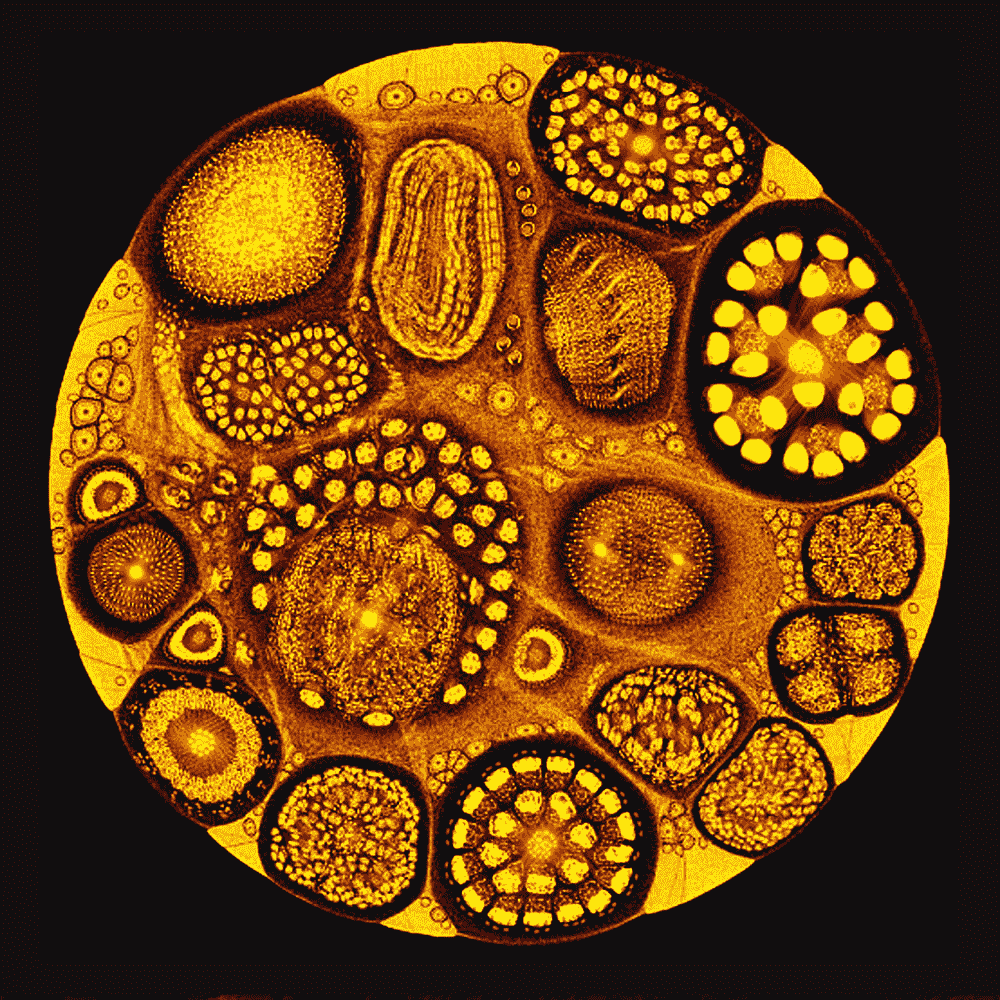
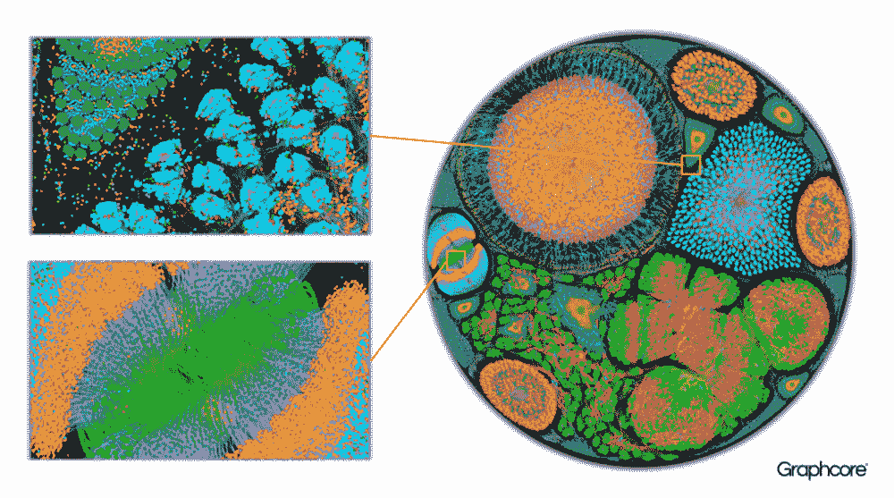
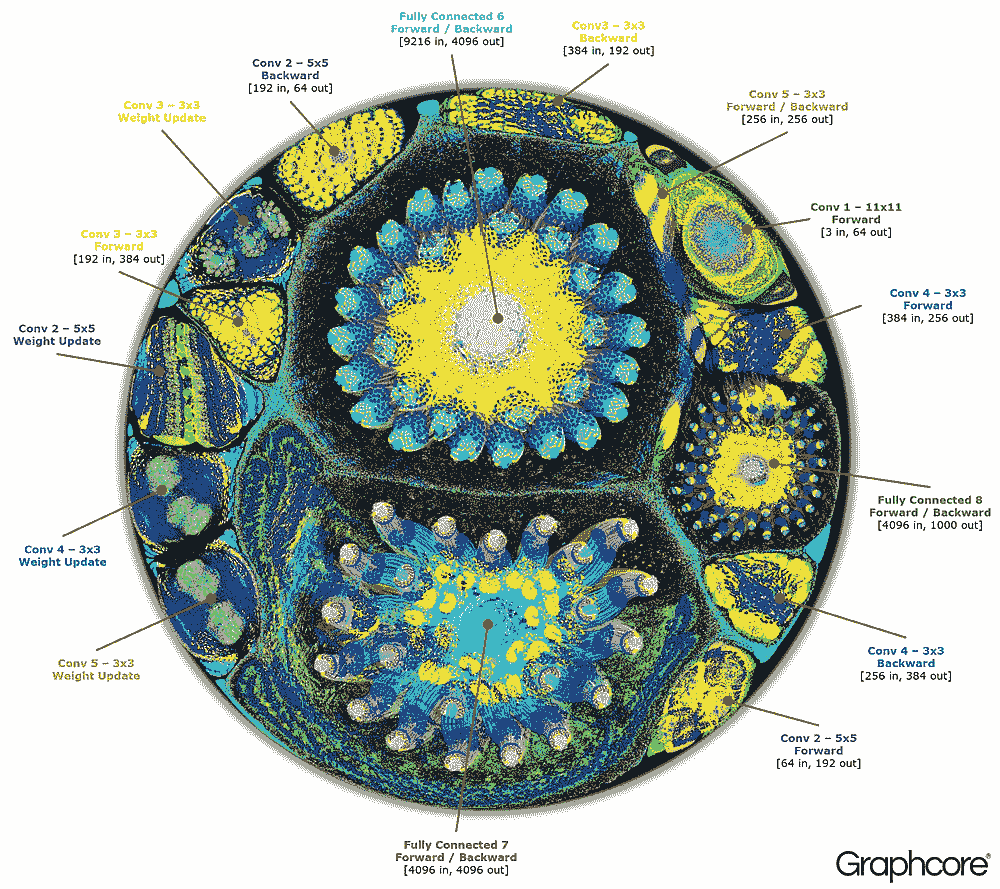
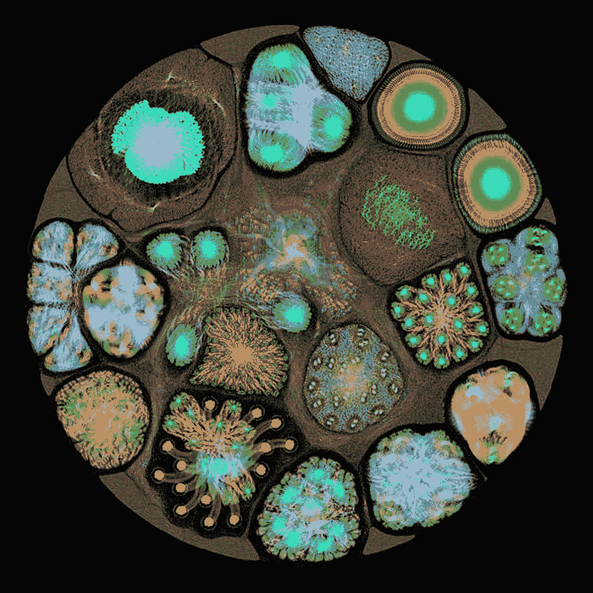

# Graphcore 充满活力的计算图像显示了人工智能的作用

> 原文：<https://thenewstack.io/graphcores-vibrant-computational-images-show-artificial-intelligence-action/>

对于那些对人工智能的发展感兴趣但没有相关领域背景的人来说，很难理解围绕它的抽象概念。卷积神经网络、贝叶斯网络和马尔可夫链等术语听起来几乎是深奥的想法，但这些是今天用于许多有用应用的一些[机器学习](/category/machine-learning/)技术，我们开始认为这些应用是理所当然的，例如图像和语音识别、医疗诊断和预测文本生成。但是，当一个人能够从视觉角度真正看到这些算法如何工作的“大画面”时，这种迟钝就变得更加清晰了。

使用一种为人工智能系统设计的新处理器技术，总部位于布里斯托尔的初创公司 [Graphcore](https://www.graphcore.ai/) 使用其智能处理单元(IPU)创建了这些令人惊叹的图像，展示了机器学习模型中的算法在运行时的样子。

“与标量 CPU 或矢量 GPU 不同，Graphcore 智能处理单元(IPU)是一种图形处理器，”该公司在一篇博客文章中解释道。“设计用于处理图形的计算机是机器学习框架创建的计算图形模型的理想目标。”

我们在这里看到的这些[伪彩色](https://starchild.gsfc.nasa.gov/docs/StarChild/questions/question20.html)图像实际上是计算图。在数学中，图形是显示顶点、节点、由边、弧和线连接的点之间的关系的数据结构，很像人脑及其神经元和突触之间的相互连接的示意图。

在这种情况下，这些映射到 IPU 的计算图表可以让这些模型的本质一目了然，显示出令人想起人脑扫描的连接的复杂性，甚至可能让人想起一些奇怪的细胞或变形虫结构的微观视图。

此图显示了部署在 Graphcore 的 IPU 上的微软研究院的 ResNet-34 架构的完整训练图。

该公司的图形编译器软件 Poplar 是基于 C++的可扩展编程框架，可以生成这些漂亮的数学图表。它旨在用于基于 IPU 的系统，但该公司也在致力于为机器学习建立一套广泛的开源图形库，以便在其他机器学习框架中编写的应用程序——如[tensor flow](https://thenewstack.io/look-inside-tensorflow-googles-open-source-deep-learning-framework/)——也可以在 IPU 上使用。

此外，Poplar 还附带了一个图形编译器，能够将其他机器学习平台使用的操作翻译和优化为可用于 IPU 的代码。图形编译器然后可以创建和显示计算图形，因为它已经被翻译成计算关系的可视图。

例如，我们在下面看到一个用于分析天体物理数据的机器学习模型的计算图:

下图显示了 [AlexNet](https://github.com/BVLC/caffe/tree/master/models/bvlc_alexnet) 的正向和反向训练循环，这是一个深度神经网络(DNN)，使用连接的卷积层构建。由微软研究人员创建的 AlexNet 因在 2012 年击败其他图像分类模型而闻名。高度计算活动的区域以明亮的颜色突出显示，神经网络已由杨树的图形编译器转换为描绘 1870 万个顶点和 1.158 亿条边的计算图形，其中顶点用于显示计算过程，边显示这些过程之间的信息交换，这些过程在层内和层间的强度不同。高度完全连接活动的节点位于编号为 6、7 和 8 的区域:

该公司表示，使用 IPU 的优势之一是“它强调大规模并行、低精度浮点计算，并提供比其他解决方案高得多的计算密度”。图形处理器不仅可以用于构建、训练和执行各种机器学习模型，而且整个模型本身可以托管在 IPU 上，这意味着与 CPU 或 GPU 相比，模型可以更快、更有效地进行训练。此外，其架构设计为可扩展，将有助于加速深度学习应用，当与计算图的使用相结合时，可以允许研究人员和开发人员在意想不到的方向上推动创新。在任何情况下，图表本身都提供了一个有趣的视角，让人们了解这些人工智能模型如何看起来像视觉概念，而不仅仅是抽象的代码行。

图片来自 Graphcore。

<svg xmlns:xlink="http://www.w3.org/1999/xlink" viewBox="0 0 68 31" version="1.1"><title>Group</title> <desc>Created with Sketch.</desc></svg>