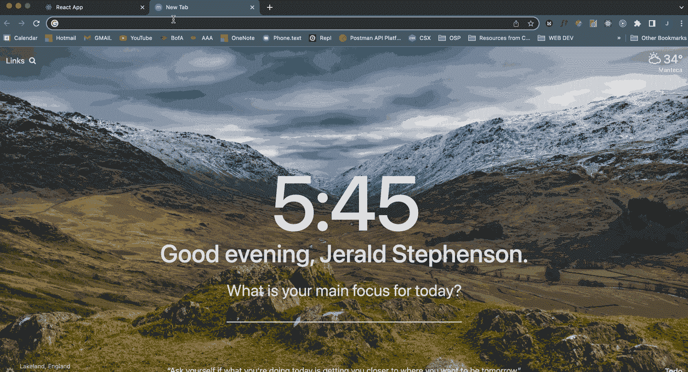

# GraphErrQL 为 GraphQL 错误提供了急需的上下文

> 原文：<https://thenewstack.io/grapherrql-provides-much-needed-context-for-graphql-errors/>

唯一比查询响应出错更糟糕的是模糊的错误响应或根本没有响应。对于这一点， [GraphQL](https://thenewstack.io/the-shape-of-things-to-come-graphql-and-the-web-of-apis/) API 查询语言当然是有罪的。

对于工程师[格温·菲利普斯](https://www.linkedin.com/in/gwen-phillips/)、[杰拉尔德·斯蒂芬森](https://www.linkedin.com/in/jerald-stephenson/)、  [乔希·梅雷尔](https://www.linkedin.com/in/joshmerrell/)和[玛丽亚·塔利库兰](https://www.linkedin.com/in/mariahtalicuran/)来说，这是一个值得解决的问题。

他们在技术加速器 [OSLabs](https://opensourcelabs.io/) 的帮助下开发了一个开源工具，名为[grapher QL](http://grapherrql.io/)，它在 Node.js 运行时环境中为 [GraphQL](https://graphql.org/) 查询引入了清晰的错误上下文，而没有给生产应用程序添加任何依赖。

对于这个问题，Talicuran 解释说，这使得使用 GraphQL“很难调试”。这是一个需要更多补救的问题。”

Phillips 在解释调试 GraphQL 查询的挑战时，用了这样的例子，“数据库中没有用户并不是错误，他们只是不存在于数据库中。”因为从技术上来说，意料之外的结果是错误吗？是的，如果它是一个拼写错误的名字，但没有，如果用户只是不在数据库中。清晰的错误响应是了解查询实际情况的好方法。

“我们最初的动机是开发一种工具，可以区分两种类型的错误，第一种是实际的错误，第二种是意想不到的结果，目的是帮助开发人员改进他们的代码库，”Merrell 说。

他们最初的范围太窄，无法以 GraphErrQL 工程师知道必须解决的方式完全解决手头的挑战。由于缺乏现成的 GraphQL 沙盒环境，该沙盒环境也可以无缝连接到用户应用程序的前端以实时捕获查询，所以该项目得以发展。改进现有沙盒的想法不再存在，团队也必须构建自己的用户界面。

最终结果是 GraphErrQL，这是一个 [npm 包](https://www.npmjs.com/org/grapherrql)，它可以测试查询并从主机应用程序的前端接收查询和变化，在一个单独的工具中实时捕获查询，并记录查询结果，包括时间戳和错误上下文特性。

## GraphErrQL 是做什么的？

GraphErrQL 的任务是在应用程序或功能进入生产之前，识别并清楚地说明 GraphQL 查询的问题。因为 GraphErrQL 是一个开发工具，所以这个包可以作为一个开发依赖项保存，或者在生产之前完全删除。

Node.js/ Express 中间件的这一部分是为现有的基于 GraphQL Expressed 的主机应用程序而构建的，并且与所有前端框架、库和普通代码兼容。GraphErrQL 运行不需要前端修改或连接。

一旦包被安装到主机应用程序中，并且发生了初始浏览器呈现，GraphErrQL 的事件监听器(通过服务器端事件设置)接收从主机应用程序的服务器发送的所有 GraphQL 查询。

通过转到特定的/grapher QL 端点，开发人员将可以完整地查看显示查询和结果的 grapher QL 用户界面。成功的结果也会显示在用户界面中。

关于技术细节的更多细节，请查看他们的[文章](https://medium.com/@gkphillips/introducing-grapherrql-22d877a8f353)。

## **开发可扩展、用户友好的应用**

“如果容易使用，就更有可能被使用。如果只是为了获得更好的错误处理而需要大量的加速时间，开发人员就不太可能会使用它，”Merrell 说，团队中所有工程师都有同感。

这些想法促使团队努力确保 GraphErrQL 不需要自己的服务器。现在是发布时间，每个人都相信这是正确的选择，但这个话题是在讨论构建产品的最大技术挑战时出现的。

挑战如下。用户界面是用 React 构建的。React 需要在提供之前进行编译，这在理论上没有问题，但是这里没有服务器。由于端点不能导致一堆组件到处浮动，团队必须为用户界面配置一种预编译的方式。完成后，他们必须编写一个脚本，允许从主机应用程序的节点模块中访问页面。

团队需要解决的最后一个挑战是编写指令，说明如何从开发人员计算机上的任何地方动态获取 React 文件。虽然这不是最后一部分的唯一目的，但这也是 GraphErrQL 与桌面应用程序兼容的原因之一。

## **代码越少越好**

为了保持易于实现的主题，Stephenson 阐述了在不损失任何功能的情况下，将功能和逻辑压缩到尽可能少的代码中的挑战。他解释说，“这有点棘手，因为我们必须触及多个端点，这意味着我们至少需要四行代码。我们利用闭包中的闭包来清理一切！”

用户可以在应用程序中实现的最终代码包括连接到 GraphQL 端点的中间件，提供 React 用户界面，并将 GraphErrQL 界面连接到服务器端事件。

## **前方道路(地图)**

上周的初始版本是测试版。工程师们很高兴拥有一个功能齐全的平台。随着对主机应用程序的实时查询的访问的启动和运行，有了一个丰富的工作领域。目前，该团队正在开发一个功能，该功能将查明哪些错误需要开发重点和优先级。

该团队关注的另一个特性是增加了识别哪个文件或代码行导致错误的能力，以及与 Apollo 的兼容性。这些功能的发布日期尚未确定。

<svg xmlns:xlink="http://www.w3.org/1999/xlink" viewBox="0 0 68 31" version="1.1"><title>Group</title> <desc>Created with Sketch.</desc></svg>