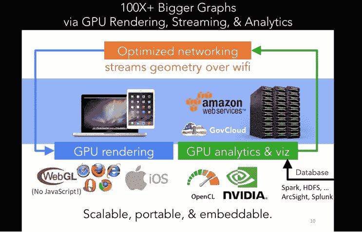

# Graphistry 利用 GPU 对安全性、调试问题进行快速可视化调查

> 原文：<https://thenewstack.io/graphistry-makes-security-investigation-visual/>

总部位于加州奥克兰的初创公司 [Graphistry](https://www.graphistry.com/) 的联合创始人 [Leo Meyerovich](https://www.linkedin.com/in/leo-meyerovich-09649219/) 表示，使用大数据来提高安全性的转变正在进行中，该公司专注于使用可视化图形技术来改善安全漏洞调查。

一开始，它只是加载所有的数据，也许你可以在上面写一些查询。但这对分析师来说是压倒性的。你写什么样的查询？

在那之后，许多公司开始使用[机器学习](/category/machine-learning/)技术来挑选出最重要的警报，并对它们进行优先排序。“机器学习就像治标一样。这是提高警惕的一种更好的方法，”Meyerovich 说，并将其与医生诊断耳部感染的方法进行了比较。

“老实说，在这一点上，那东西是商品技术。有一些很酷的人工智能初创公司，但最终，他们都在做[随机森林](http://scikit-learn.org/stable/modules/generated/sklearn.ensemble.RandomForestClassifier.html)和深度学习……Graphistry 是之后的下一代，”他说。

该公司声称，Graphistry 专注于调查方面:处理 100 倍或 1000 倍以上的数据，并展示对日常安全团队有用的结果…

## 浏览器中的 GPU

Meyerovich 和联合创始人 Matt Torok 来自加州大学伯克利分校，他们在那里从事并行网络浏览器操作。托罗克还为 GPU 视觉分析创造了[超导体](http://superconductor.github.io/superconductor/)语言。

Graphistry 代表了他们并行浏览器工作的扩展。

“启动它的一个想法是，我们可以在浏览器中使用 GPU，获得许多类型的渲染内容，然后将其与数据中心的一系列 GPU 连接，这是现在的商品，整个往返过程在 100 毫秒内完成。Meyerovich 在纽约企业技术会议的视频中解释道:

[https://www.youtube.com/embed/sJgKTj8mEPs?feature=oembed](https://www.youtube.com/embed/sJgKTj8mEPs?feature=oembed)

视频

“想象一下像谷歌地图或网飞这样的东西，在它们之间来回切换。Meyerovich 在一次采访中说:“让我们兴奋的是，你的视觉体验不仅仅是你的手机或笔记本电脑，而是你口袋里或桌面上的超级计算机，以及数据中心里的超级计算机，它们可能更大。”。

“一旦我们意识到我们可以同时查看如此多的数据，想象一下与数百万样本进行一秒钟的交互，这种方式的最佳用途之一就是安全，或者更广泛地说，任何类型的事件分析。”

## 直接互动

在那次会议上，Meyerovich 展示了基于一天的攻击警报的图表，这些攻击警报来自客户系统的安全信息和事件管理(SIEM)。

为了进行演示，Meyerovich 启动了一个 Hadoop 集群，运行了一个 Spark SQL 查询，在那一天，集群中有 1.3 亿个事件。查看所有优先级 10(最紧急的优先级)，数据减少到大约 880，000 个事件，其中大约 840，000 个是防火墙。

该软件显示了每一个数据点，用图表表示。“这有点像客户端的谷歌地图。有非常直接的互动。从这个角度来看，网络上的每个设备都是一个点，”Meyerovich 解释道。

分析师可以调查在那些感兴趣的节点上还发生了什么，以及之后还发生了什么。他可以使用颜色编码来按类别处理大量事件。根据该公司的说法，图表视图可以快速揭示事件的范围，以及进展，相关性和异常值。

在视频中，Meyerovich 是这样解释其技术的:

*“我们有一个 GPU 集群，有点像数据库，但运行在 GPU 上，然后我们运行一个运行在服务器上的过滤器。然后，有点像网飞，我们将结果流式传输给客户端。然后，我们不再使用 JavaScript 和普通的慢速 CPU，而是将所有数据从服务器放到 GPU 上，从客户端放到 WebGL 上。通过跳过所有 CPU 的东西，我们可以保证我们比普通技术做得更好。”*

[WebGL](https://developer.mozilla.org/en-US/docs/Web/API/WebGL_API) 是一个用于渲染交互式 3D 和 2D 图形的 JavaScript API。

“如果你有 [Splunk](https://www.splunk.com/) ，我们可以接入你所有的大数据堆栈，”Meyerovich 说。“我们不会给某人的工作量增加更多的警报，”他在采访中说。“我们将帮助他们更有效地与他们合作。”

Graphistry 从所有系统(数据库、邮件服务器或任何其他 API 公开的系统)收集上下文，并将其放入分析引擎。然后，它以图形方式将所有事件活动呈现给分析师，以便他或她能够更好地关联实际发生的情况。

“如果有人在做调查，我们会看看数据瓶颈在哪里。为什么变得不靠谱了？”他说。

## 视觉剧本

可视化剧本是 Graphistry 关注的第二项技术。实际上，用户可以记录他们最常调查的事件的工作流程。

“我们发现，即使我们可以显示所有的数据，人们也不一定会加载正确的数据。或者也许你已经加载了正确的数据，但你是一名高级分析师，你刚刚参加工作，不了解环境。或者你是一个初级分析师，你不知道这些事情，”Meyerovich 说。

“我们发现他们收集数据、连接数据和处理数据的方式——很多使用案例都是相似的。这是人们正在创造的所有这些制度知识的瓶颈之一，”他说。“这有点像仪表盘加仪表盘。这是一种记录跨多个系统的多步骤调查的方式。”

可视化行动手册提供了一个可视化分析会话，反映了具有分析功能的操作手册的概念。

“视觉分析不再是一种探索性和临时性的东西，而是一种可靠的日常事物。他说:“数据不再对整天写代码的人开放，而是对普通分析师开放。

这变得类似于软件工程世界中的[代码覆盖](https://stackoverflow.com/questions/195008/what-is-code-coverage-and-how-do-you-measure-it)自动保证你的过程安全。

“我们一直将这一理念应用于安全领域。有了行动手册，您可以在出现问题时询问，是否有自动化的流程来处理它？您的每日或每周事故中有百分之多少被覆盖？当我们审视这些调查领域时—安全、欺诈等。—我们帮助团队提高他们用于调查的自动化程度，”他说。

Graphistry 也是名为 [GoAI](https://www.continuum.io/blog/news/data-science-and-deep-learning-application-leaders-form-gpu-open-analytics-initiative) (GPU 开放分析倡议)的倡议的一部分，该倡议使不同类型的 GPU 分析能够协同工作。

<svg xmlns:xlink="http://www.w3.org/1999/xlink" viewBox="0 0 68 31" version="1.1"><title>Group</title> <desc>Created with Sketch.</desc></svg>