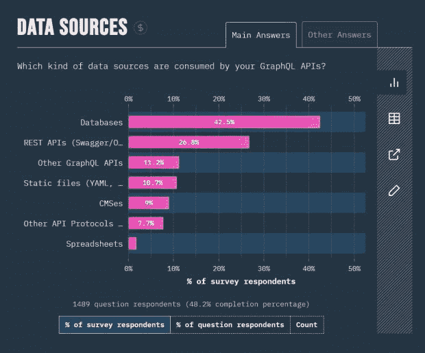

# GraphQL 和 REST 可以共存，作者 Will Lyon 说

> 原文：<https://thenewstack.io/graphql-and-rest-can-coexist-author-will-lyon-says/>

REST 首字母缩略词，通常表示代表性状态转移。是的，这句话总是有点夸张。就 Red Hat 而言，它断言 REST 实际上是一组关于应用程序如何使用 API 来处理其他软件的约束。这是一种问“你好吗？”并得到一个有意义的答案。

然而，你可能已经看到了正在进行的比较，例如，供应商将 GraphQL 描述为“比 REST 更有效、更灵活和更强大的使用 API 的方式”，并“比 REST 得分更低”回到 2019 年 2 月，[营销平台结晶器公开宣称](https://crystallize.com/blog/why-we-killed-our-rest-api-in-favour-of-graphql)，“我们现在已经完全杀死了我们的 REST API，用 GraphQL 取而代之。性能和开发者体验是主要驱动因素。”

在新的筹码中，你甚至看到过类似的正面交锋。Jessica Wachtel 称 GraphQL 比 REST“更适合复杂系统和微服务”。Richard MacManus 记录了电子商务平台 [Shopify 如何从 REST 过渡到 GraphQL](https://thenewstack.io/why-shopify-favors-graphql-over-rest-for-its-apis/) ，从它的角度来看，主要是因为它用于其 API 的 REST 方案将返回非结构化的 JSON，而不是可以映射到强类型变量的值。

也许最具说服力的是，当脸书在 2016 年首次提出 GraphQL 时，GitHub 和其他人采用了它，正如 GitHub 自己所描述的那样，[明确打算抛弃 REST](https://thenewstack.io/github-dumps-rest-graphql-api/) 。

然而，如果 REST 更多的是一种方法论而 GraphQL 是，作为它的维护者。。。好吧，维护，“[你的 API 的查询语言](https://graphql.org)”，那么这两者之间的直接匹配就不公平了，不是吗？不是两个独立的重量类别吗？也许吧，除非 GraphQL *本身*不是真正的查询语言*——也就是说，除非它更属于 REST 类别而不是 SQL 类别。*

 *## REST 规范缺乏特异性

图形数据库生产商 Neo4j 的开发者支持者 Will Lyon 评论道:“首先要理解的是，REST 是什么还没有一个明确的定义。”Lyon 是刚刚由 Manning Publications 出版的“[Full Stack graph QL Applications with React、Node.js 和 Neo4j](https://www.manning.com/books/fullstack-graphql-applications) ”的作者。

威尔·里昂

“通常我们认为 REST 是，‘我有一个映射到某个资源的端点’，”Lyon 解释道。因此，如果我有电影和演员，我有一个“电影”端点，然后我有另一个“演员”端点，这映射到一些资源。但是实现 REST API 的方式可能非常不同——取决于开发人员。

“没有休息规范。所以你拥有了一切，从只是一个返回一些 JSON 的端点，到一个 JSON API，到 REST 最完整的版本: [HATEOAS(作为应用状态引擎的超媒体)](https://restfulapi.net/hateoas/)。休息真的有一个范围。GraphQL 就不是这样的。”

因此，Shopify 和 Crystallize 的转变，以及其他类似的转变，并不是真正的迁移，正如 Lyon 所认为的那样，甚至不是除了低效率之外的任何东西的消灭。此外，如果有一个与方法目标相匹配的规范，它们可能是系统地收紧协议和约束的例子，它们的 REST API 从一开始就应该有这些协议和约束。

“GraphQL 的优点之一是它与数据层无关，”Lyon 继续说道。“我可以在任何数据层、多个数据层之上构建一个 GraphQL API。我可以从数据库中获取数据，我甚至可以在其他 graph QL API 或 REST APIs 的基础上构建 graph QL API。所以 REST 和 GraphQL 并不互斥。我可以在 REST API 的基础上构建一个 GraphQL API，将它们作为数据源一起使用。”

里昂引用了最近的 2022 年 GraphQL 状态调查。当大约 1，489 名受访者被问到“您的 GraphQL APIs 使用哪种数据源？”26.8%的受访者回答 REST APIs，以 Swagger 和 OpenAPI 为例。这是仅次于数据库的第二个答案，有 42.5%的受访者。

对于超过四分之一的调查对象来说，GraphQL 是进行 REST 的一种方式，而不是替代 REST 的方法。

## 搁置非此即彼的问题

里昂告诉我们，第一批从 2016 年开始采用 GraphQL 的企业通常不以早期采用未经验证的技术而闻名。他认为，GraphQL 的热潮只有在不发生剧变的情况下被接受才是可行的。这些第一批采用者并没有采用“搬来搬去”的方法，而是简单地将 GraphQL 捆绑到他们拥有的 API 上。他们成功了。

“理解 GraphQL 和 REST 之间的区别很重要，它们并不相互排斥，”Lyon 说。“两者都有一席之地。REST APIs 实际上可以帮助您构建 GraphQL 并将其公开给组织。”

假设您有一个数据库查询，它遇到了三个共享关系的元素:例如，已知的病原体、已知的治疗方法和已知的副作用。使用一个通用的 REST API 实现，这个查询可以到达三个独立的端点。他们都是可靠的联系人。但是这种程度的分离，他们会很慢。第二组数据检索调用将跟随第一组，第三组将跟随第二组，以级联方式进行。但是因为检索到的数据直到所有的调用都被解决之后才会被处理，所以应用程序总是会比它可能需要的总次数多发出一个调用——典型的 [*n + 1 查询问题*](https://restfulapi.net/rest-api-n-1-problem/) 。

“当我们将 GraphQL 放在其他数据层之上时，我们需要注意我们的性能影响，”Lyon 评论道。“这不是魔法。那里有工作要做。”对于日常的 REST 实现来说，这项工作可能是不可能的，因为在日常的 REST 实现中没有任何协议，也没有任何最佳实践被实现。当组织说要为 GraphQL 抛弃 REST 时，他们抛弃的就是这种混乱。

## 你自己去问里昂

Lyon 计划深入探讨 GraphQL 主题，包括在 10 月 13 日(美国东部时间)周四下午 2 点/上午 11 点与 Scott Fulton 在[举行的免费直播网络研讨会](https://freecontent.manning.com/william-lyon-live-chat-deep-dive-into-graphql/)期间，演示如何使用可靠的 GraphQL APIs 将应用程序连接到图形数据库。他还将在周三举行的 NODES 2022 虚拟会议上发表题为“利用知识图表理解地理空间数据”的现场演讲。，11 月 16 日，Neo4j 出品。[注册免费。](https://hopin.com/events/nodes-2022/registration)

<svg xmlns:xlink="http://www.w3.org/1999/xlink" viewBox="0 0 68 31" version="1.1"><title>Group</title> <desc>Created with Sketch.</desc></svg>*