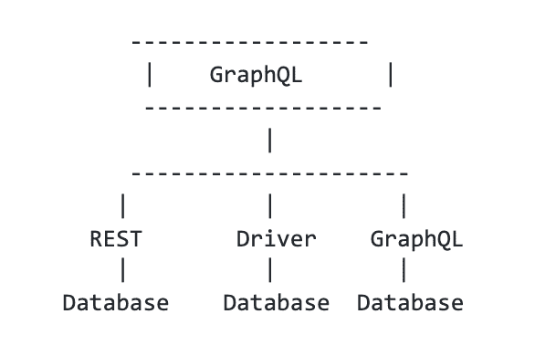

# GraphQL:弥合数据库和应用程序之间的鸿沟

> 原文：<https://thenewstack.io/graphql-bridging-the-gap-between-databases-and-your-apps/>

正如你们中的一些人所知道的，我从事数据库工作已经有大约四十年了(这让我觉得很老了！).从早期的 System R 和 Ingres，到 DB2 和 Oracle 的商业引擎，开源的 MySQL 和 Postgres，再到现在的 MongoDB 和 Cassandra 等 NoSQLs，以及 CockroachDB 和 Yugabyte 等可扩展的 SQL 通过这一切，任何曾经预测数据库消亡的人都被证明是错误的。

SQL 作为查询语言一直存在、发展和改进，但基本的`select * from foo where x = 1 group by y`是成千上万的开发人员都知道的语言。这是为什么呢？因为数据库只是工作，我们能对许多其他事情这么说吗？这些数据库中的数据为你我每天接触的数字产品和体验提供了动力。

## 使用 GraphQL API 访问 SQL、NoSQL 数据库

 [阿南特·金格兰

Anant 是 StepZen 的创始人兼首席执行官，step Zen 是一家初创公司，采用新的方法来简化开发人员访问数据的方式，以增强数字体验。Anant 的职业生涯跨越了 IBM Fellow、IBM 信息管理部门的 CTO、Apigee 的 CTO 和 Google Cloud 的产品负责人，他的职业生涯一直处于数据库、机器学习和 API 创新的前沿。在 StepZen，Anant 正在享受创建一家公司，将他对这些技术的热爱结合在一起，以简化、加速和扩展前端开发。](https://www.linkedin.com/in/anantjhingran) 

前端开发人员将这些数字体验放在一起，他们需要反映业务术语和概念的数据，如`Customer`、`Orders`、`Delivery Status`。他们需要数据库中的数据，但这些数据不一定直观、可访问或易于编程。现实世界中的数据库模式可能有数百个表，这些表为了提高更新效率而进行了规范化，为了对应用程序保持一定的保真度而进行了命名(我曾经见过一个名为`cust_01_x_t`的表！).

作为一种查询语言，SQL 与表达用户的愿望紧密结合，并以直接忠实于数据库结构的方式编写。或者以 NoSQL 的数据库为例——Cassandra、MongoDB、Firestore 等等。每种语言都有自己的查询语言，并且这些查询语言与数据的存储和有效获取方式绑定在一起。虽然许多语言类似于 SQL，但它并不是 SQL，因为 SQL 根本不足以表达这些系统中存储的丰富数据。因此，尽管所有的数据库都很受欢迎并且工作正常，但是它们都附带了绑定到实现的查询语言。企业中各种各样的数据库意味着各种各样的语言，以及理解与每种语言相关的语法和优化的认知负荷。

## 视图与实现

让我们举一个构建数字体验的开发者可能想要做的事情的例子:获取客户信息。因此，考虑到他们的业务需求，前端开发人员可以通过编写如下代码从数据库中获取数据:

```
select concat  (c.cust_first,  ' ',  c.cust_last)  as name,  c.contact_mail as email,  a.street from cust_x_01  c,  cust_x_01_addr  a
where  a.cust_id  =  c.base_num

```

…或者类似这样的:

```
{
    "customer":  {
        "name":  "John Doe",
        "email":  "john.doe@example.com",
        "addresses":  [
            {
                "street":  ...
            }
        ]
    }
}

```

正如他们所说，开发者在用脚投票。他们采用的是后一种方法，GraphQL 方法。不难看出，数据的“形状”更符合开发人员对其应用程序或体验的需求。

但是仅仅因为这些开发人员使用 GraphQL，并不意味着将他们拥有的`views`转换成数据库拥有的`implementations`的问题消失了。因此，有两种方法可以缩小差距。

## **提供图表视图的数据库**

以 Stargate 为例，它是基于 Apache Cassandra 的 NoSQL 数据库 DataStax 之上的 GraphQL 视图。这是一项了不起的技术，用它的视图完全隐藏了 Cassandra 中数据的实现。DataStax 中设置的默认示例是 Chipotle 商店及其位置的列表。该查询看起来像这样:

```
type  Query  {
  """
  Query for the table 'chipotle_stores'.
  Note that 'state', 'latitude' and 'longitude' are the fields that correspond to the table primary key.
  """
  chipotle_stores(
    value:  chipotle_storesInput
    filter:  chipotle_storesFilterInput
    orderBy:  [chipotle_storesOrder]
    options:  QueryOptions
  ):  chipotle_storesResult
}

```

所有到 CQL 的适当映射对我们都是隐藏的，我们假设因为这是由 Cassandra 的人构建的，他们已经做了适当的优化。因此，当数据库提供 GraphQL 接口时，使用它很可能是个好主意。

## 提供图表视图的中间层

纯数据库方法在一些情况下会失败:

*   一些数据库不提供这样的视图。例如，虽然 [Cloud Firestore](https://firebase.google.com/docs/firestore) 提供了一个很好的 REST 接口，但是没有 GraphQL 视图。
*   如果您需要混合和匹配来自两个不同系统的数据，那么来自一个数据库的 GraphQL 是好的，但还不够。

你需要的是这样的东西:

[](https://cdn.thenewstack.io/media/2021/06/9c7da584-screen-shot-2021-06-29-at-11.34.07-am.png)

换句话说，在数据库提供 GraphQL 接口的地方，很好；如果没有，使用它的驱动程序或其他接口，如 REST，来连接。然后需要的时候再混搭。

GraphQL 支持所有数据的层必须包括重要的功能和非功能特性。这些功能包括协议之间的转换、自省、轻量级转换等等。在等式的非功能端，有性能优化。许多软件系统，包括我公司的软件系统，已经开始解决这些问题。

## 摘要:向任何数据库添加一个 GraphQL API 层

数据库存储世界上的数据，并提供像 SQL 及其变体这样的接口，让用户访问和操作数据。然而，开发者不能也不应该在这些界面之外构建数字体验。此外，GraphQL 正在成为访问和操作数据的自然语言。因此，我们需要弥合执行和观点之间的分歧。

前端和后端之间的[鸿沟](https://thenewstack.io/decoupling-frontends-and-backends-with-graphql/)可以而且必须被弥合。我们相信，提供 GraphQL 接口的数据库将弥合这一鸿沟。但是一个在顶层使用 GraphQL，在底层使用本地语言的中间件将完善这个解决方案。毫无疑问，在未来几年，我们将看到这一领域的巨大创新。

<svg xmlns:xlink="http://www.w3.org/1999/xlink" viewBox="0 0 68 31" version="1.1"><title>Group</title> <desc>Created with Sketch.</desc></svg>