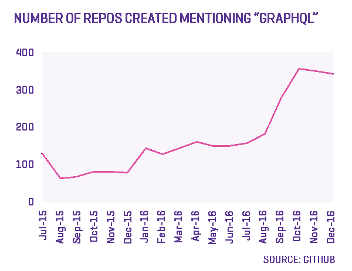
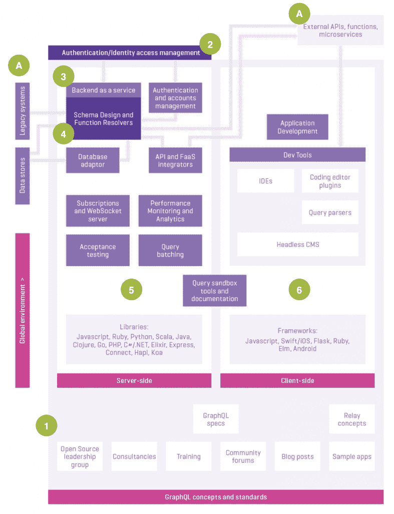

# GraphQL 数据查询语言:资源指南

> 原文：<https://thenewstack.io/graphql-data-query-language-resource-guide/>

GraphQL 正迅速成为创建和发布 API 的可行替代方案。

由脸书在 2012 年创建，用于支持他们的移动应用程序(导致核心开发人员 T2 的马丁·沃尔雷文开玩笑说几乎每个人都在使用 GraphQL API，甚至不知道它)，T4 的 GraphQL 在 2015 年初作为开源项目发布。

GraphQL 是一种与编程语言无关的应用程序查询语言，经常被误认为是数据库查询语言。在 GraphQL API 中，服务器描述了哪些数据是可用的，客户端可以准确地查询他们需要的数据。因为它不是数据库查询语言，所以它不包含任何过滤、排序、计算或连接——尽管 GraphQL 查询支持参数，这使得过滤和排序易于实现。

出于这个原因，需要向移动和其他客户端应用程序公开数据的开发人员选择了 GraphQL，在这些应用程序中，REST 负载变得很麻烦。在 REST API 架构中，一个简单的查询可能需要三次或更多次数据调用，然后需要在客户端对数据进行解析，以便界面显示所需的信息。在 GraphQL 中，所有数据都由一个端点访问，这使得查询客户机应用程序想要的数据成为可能。

> 在 GraphQL 中，整个数据模型在一个模式中描述，并定义了解析函数来解释从哪里以及如何从数据库中获取数据。

GraphQL 非常适合复杂的嵌套数据模型，这些模型在社交媒体(用户、评论、喜欢和群组可能会创建一个关系网)、电子商务(跨产品目录、销售、愿望清单、推荐、库存和客户数据的数据关系)和出版(文章/视频、作者/艺术家和观众评论具有多对多关系)中很常见。金融时报、Shopify 和 Coursera 等出版商和电子商务网站已经在使用 GraphQL。

最近，Vevo 和 Vimeo 等在线视频网站发布了 GraphQL 开发人员的招聘广告。虽然这些用例大多是内部的，但 GitHub 在去年 9 月完成了第一批开放的 GraphQL APIs 中的一个。

GraphQL 也有可能被逐步引入到一个架构中，这意味着与 REST 相比，它不是一个非此即彼的决定，而是被视为一种补充技术，可以解决访问数据的特定难点，同时确保低延迟并降低查询复杂性。在 GraphQL 中，整个数据模型在一个模式中描述，并定义了解析函数来解释从哪里以及如何从数据库中获取数据。

GraphQL 可能是 API 设计和部署的一种新方法，但它正在被迅速采用。GraphQL 生态系统的工具每个月都在增长。看看在标题或描述中提到 GraphQL 的 GitHub 回购，每个月都有不到 350 个新项目在增长，年初 GitHub 上列出了 3023 个项目。

GraphQL 后端即服务提供商 [Scaphold](http://scaphold.io) 的联合创始人 Vince Ning 预计，GraphQL 社区将在 2017 年继续以两种方式增长:“将会有自上而下的增长，越来越多的公共 GraphQL APIs 得到 GitHub 等大公司的支持。宁说，这肯定会起到推动作用，将会出现自下而上的增长。围绕 GraphQL 的工具和服务才刚刚开始具体化，围绕该技术的社区正在萌芽。"

GraphQL 架构和生态系统由以下组件组成:

1.  规范、共享概念和知识管理支持。
2.  认证。
3.  后端即服务提供商。
4.  模式设计工具。
5.  服务器端库和工具。
6.  客户端框架和工具。

关于每个组件及其相关资源的更多信息如下:

开源的 GraphQL 规范、培训、社区论坛、活跃的博客社区、峰会活动和示例应用程序代码(1)都支持 GraphQL。GraphQL 工作流存在于一个更大的全球环境中，其中数据存储在数据存储、遗留系统中，并通过 API、微服务和函数进行访问(A)。认证和身份访问管理组件可以位于管理许可的 GraphQL 架构之外(2)。在 GraphQL 架构中，设计是在位于后端服务器(3)上的模式(4)中定义的。这包括描述客户端应用程序如何访问数据的函数解析器。服务器端的开发工具(5)包括性能分析、批量查询工具、订阅和 WebSocket 支持工具、将外部数据存储映射到 GraphQL 模式的数据库适配器以及验收测试服务。客户端应用程序(6)可以直接测试查询和解析来自外部 API 的结果，以及对模式、ide 和代码编辑插件以及 Chrome DevTools 的请求。

## 1.规范、共享概念、知识管理支持

[GraphQL 规范](https://github.com/facebook/graphql) 已经由脸书出版。来自脸书的客户端应用框架， [Relay](https://github.com/facebook/relay) ，也详细介绍了 GraphQL 应该如何工作的具体概念。例如，规范中没有详细说明分页，但是出现了一些最佳实践。

许多开发人员都在遵循 Relay 中详述的分页概念和方法，即使他们本身并没有使用 Relay 框架。正如 GraphQL 工具提供商 [Apollo](http://www.apollodata.com/) 的 Sashko Stubailo 所解释的那样，“在 GraphQL 中，还没有一个包罗万象的数据分页解决方案。就像休息一样，有几种不同的方法可以做到这一点。”

### 资源

*   [您所有的疑问都得到了解答:GraphQL 市场状况报告](http://mgboyd.com/graphql)(Platformable):graph QL API 的使用概况、挑战和优势，以及当前的使用案例。
*   [和 GraphQL for all？](https://apihandyman.io/and-graphql-for-all-a-few-things-to-think-about-before-blindly-dumping-rest-for-graphql/) (API 杂工):盲目为 GRaphQL 倾倒 REST 之前要思考的几件事。
*   [牛逼 graph QL](https://github.com/chentsulin/awesome-graphql):graoh QL 资源的精选列表。
*   用 GraphQL 构建更好的 API(Matthew Mueller):这是一门收费的 Udemy 课程，提供了用 GraphQL 构建更好更快的 API 的分步指南。
*   [备忘单](https://github.com/sogko/graphql-schema-language-cheat-sheet) (Sogko): GraphQL 速记批注备忘单。
*   [社区资源](http://graphql.org/community/) (GraphQL.org):加入 GraohQL 社区的途径目录，包括 Slack 频道、IRC、Twitter 和脸书群组。
*   (脸书):GraphQL 项目的网站，包括学习资源和最佳实践讨论。
*   [【GraphQL 欧洲](https://graphql-europe.org/) :欧洲 graph QL 会议将于 5 月举行。
*   (Clay Allsop):关于 GraphQL 的博客。
*   [GraphQL 开放 API](https://github.com/APIs-guru/graphql-apis)(APIs-guru):官方开放 GraphQL APIs 列表。
*   [GraphQL 资源](https://github.com/devknoll/)(Devknoll):graph QL 资源的目录。
*   GraphQL 峰会(流星):GraphQL 开发者大会。
*   [GraphQL 与 REST 的对比](https://philsturgeon.uk/api/2017/01/24/graphql-vs-rest-overview/) (Phil Sturgeon):这篇博文详细介绍了 GraphQL 的优势和挑战。
*   [【GraphQL Weekly】](https://graphqlweekly.com/):关于 graph QL 的最佳新闻、文章和项目的每周简讯。
*   [如何搭建一个 GraphQL 服务器](https://dev-blog.apollodata.com/tutorial-building-a-graphql-server-cddaa023c035#.lghkuto77) (Apollo):将 SQL、REST、MongoDB 连接到 GraphQL。
*   [学习阿波罗](https://www.learnapollo.com/)【graph cool】:阿波罗 GraphQL 客户端动手教程。
*   学习 graph QL(Kadira):graph QL 概念的演练。
*   OK 成长！ (OK 成长！):GraphQL 开发和培训。
*   [学习 GraphQL](https://github.com/mugli/learning-graphql) (Mugli):一个开发者学习 GraphQL 的尝试。
*   [零到 GraphQL](https://github.com/steveluscher/zero-to-graphql) (Steve Luscher):使用各种语言/框架创建的 GraphQL 端点的例子。

## 2.证明

认证和授权通常由企业作为 GraphQL 架构之外的一个独立问题来处理。在生产环境中使用 GraphQL 的开发人员倾向于首先使用一个 [OAuth](https://oauth.net/) 过程来认证客户端。OAuth 以用户为基础授予 API 令牌，然后在进行 GraphQL 查询时，GraphQL 只显示那些在该权限角色设置下允许用户使用的字段。OAuth 用于标识权限范围。在某些情况下，对数据的访问权限是在数据库级别的数据集元数据中定义的，也在架构文档中进行了描述，其中解析器会为任何未授予权限的字段返回 null。

[来自 GraphQL 后端服务提供商](https://github.com/schickling) [的 Johannes Schickling](http://graph.cool) 表示，GraphQL“在支持身份访问管理和认证方面做得非常好，但不会限制你如何做。”他举例说明了在 Graphcool 产品中，如何在模式中定义的字段级创建不同种类的访问规则。

数据平台 [Curio](http://curio.org) 也发现 GraphQL 中的授权有点“古怪”。联合创始人 [Steve Willard](https://github.com/stevewillard) 解释说:“通过 GraphQL 和 Node-JS 实现，它确实传递了上下文对象来解析函数，在初始身份验证之后，它允许我们传递用户信息，这就是我们进行授权的地方。

在较高的 Node.js 级别，您在每个请求时解析模式，因此允许每个请求模式。我们可以处理那个级别的授权。因此，如果用户有权这样做，就可以将突变添加到模式中。我们有这两个级别的授权，所以如果你获取了用户的请求，你就不能伪造请求。“每请求模式的巧妙之处在于，当我们动态构建模式时，它使我们的效率更高，并加快了请求的速度。”

### 资源

*   [账户](https://github.com/js-accounts/accounts) (JS 账户):GraphQL 和 REST 的全栈认证和账户管理

## 3.后端即服务提供商

Scaphold、Reindex 和 Graphcool 的商业产品已经可以使用，并在开发人员社区中得到广泛应用，SimilarWeb 报告称每个网站每月有大约 20，000 名访问者。每项服务都在 GraphQL 上提供定期的内容和教程流，并有引人入胜的 Slack 频道，在那里问题和查询会得到快速响应。

### 资源

*   [graph cool](https://www.graph.cool/)(graph cool):生产就绪的 GraphQL 后端。
*   [Reindex](https://www.reindex.io/)(Reindex):Reindex 是一个 GraphQL 后端，作为 React 和 React 原生应用的服务。
*   [scap hold](https://scaphold.io/)(scap hold):graph QL API 托管数据平台。

## 4.模式设计工具

除了后端即服务提供商将模式设计工具嵌入到他们的产品中之外，还有一系列开源项目可用。这些工具包括数据库、API 和功能适配器工具，它们将现有的数据库、API、微服务和功能描述到 GraphQL 模式中。

### 资源

*   [Apollo-codegen](https://github.com/apollostack/apollo-codegen)(Apollo):基于 GraphQL 模式和查询文档生成 API 代码或类型注释。
*   [Compose](https://github.com/nodkz/graphql-compose)(Nodkz):构建 GraphQL 模式、组合和关联类型、构建修改 GraphQL 类型的辅助函数的工具。
*   [Elastic Search-graph QL](https://github.com/nordsimon/elasticsearch-graphql)(nord Simon):用于弹性搜索的模式和查询构建器。
*   [格式塔](https://github.com/charlieschwabacher/gestalt) (Charlie Schwabacher):使用 GraphQL 模式语言和一小组指令来定义一个带有 PostgreSQL 后端的 API，以声明的方式，非常快速地，用很少的代码。
*   图[图。QL](https://github.com/matthewmueller/graph.ql) (马修·穆勒):创建和查询 GraphQL 模式的更快更简单的技术。
*   (graph cool):生产就绪的 GraphQL 后端。
*   [GraphpostgresQL](https://github.com/solidsnack/GraphpostgresQL)(solid snack):用于 Postgres 的 GraphQL。
*   [GraphQL 模式](https://github.com/devknoll/graphql-schema) (DevKnoll):创建带有流畅/可链接接口的 GraphQL 模式。
*   [GraphQL-tools](https://github.com/apollostack/graphql-tools)(Apollo):支持使用 graph QL 模式语言构建 GraphQL.js 模式，包括有用的模式工具，如每种类型模拟。
*   (Sheerun):GraphQL 服务器模式可视化器。
*   [JSON 到 GraphQL](https://github.com/aweary/json-to-graphql) (Aweary):从 JSON 文件和 API 创建 GraphQL 模式。
*   [PostgreSQL](https://github.com/calebmer/postgraphql)(Caleb Meredith):有了 PostgreSQL，你就可以通过一个设计良好的 GraphQL 服务器来访问 PostgreSQL 的强大功能。PostgreSQL 使用 PostgreSQL 反射 API 来自动检测主键、关系、类型、注释等，从而提供一个对您的数据高度智能的 GraphQL 服务器。
*   [scap hold](https://scaphold.io/)(scap hold . io):使用 schema designer 定义数据模型，并立即获得一个由高可用性 SQL 集群支持的 GraphQL API
*   [SQL-to-graph QL](https://github.com/rexxars/sql-to-graphql)(rex xars):根据你的 SQL 数据库结构生成一个 GraphQL API。
*   [Swapi](https://github.com/graphql/swapi-graphql) (脸书):将现有 Swapi 公开为 GraphQL 服务器的示例项目。

## 5.服务器端工具和库

在所有主要的编程语言中都有使用 GraphQL 的库。还定期创建工具来为查询批处理、订阅(相当于 REST webhooks)、性能监控和集成工具提供额外的选项。

### 图书馆

**C# /。净**

**Clojure**

**仙丹**

**走**

**Java**

**JavaScript**

**PHP**

**Python**

**红宝石**

**Scala**

### **数据库适配器**

### **订阅**

### 查询批处理

*   [数据加载器](https://github.com/facebook/dataloader) (脸书):合并对 **load()** 的任何调用，以便基于调用集合批量加载数据。
*   [【graph QL-Batch](https://github.com/Shopify/graphql-batch)(Shopify):graph QL gem 的查询批处理执行器。
*   [Join Monster](https://github.com/stems/join-monster)(Stem):一个 GraphQL-to-SQL 查询执行层，用于批量数据取数。

### 性能监控

*   [Optics](http://www.apollodata.com/optics)(Apollo):Optics 帮助您了解 GraphQL 查询的行为和性能，包括每个查询的成本和组装方式的图形字段细分。您可以使用 Optics 来监控整体 API 使用情况，跟踪哪些 GraphQL 查询正在访问您的服务器，识别性能热点，并检测 API 工作负载的趋势或变化。

### 验收测试

*   (CATS):一组实现 GraphQL 规范的库的兼容性验收测试。

## 6.客户端框架和工具

客户端 GraphQL 框架正在快速发展。特别是，由 Apollo 构建的一个 [iOS 客户端已经从早期发布快速进入生产准备阶段。虽然在正式发布之前，它还在等待来自社区的更多反馈和支持，但仍有一项工作正在进行中。](http://dev.apollodata.com/ios/)

### 结构

**安卓**

**榆树**

**烧瓶**

**JavaScript**

**讲述**

哈斯克尔

**红宝石**

**无服务器**

**Swift/iOS**

### ide 和开发工具

### 编码插件编辑器

### 查询分析器

*   [ESLint 插件](https://github.com/apollostack/eslint-plugin-graphql) (Apollo):一个 ESLint 插件，检查 JavaScript 内部带标签的查询字符串或者内部的查询。针对 graphql 模式的 GraphQL 文件。
*   GraphQL anywhere(Apollo):在任何地方对任何数据运行 graph QL 查询，没有模式。
*   [GraphQL 标签](https://github.com/apollostack/graphql-tag) (Apollo):解析 GraphQL 查询的 JavaScript 模板文字标签。
*   [libgraphql parser](https://github.com/graphql/libgraphqlparser)(GraphQL . org):一个 C++中的 graph QL 查询解析器，带有 C 和 c++ API。
*   [Modelizr](https://github.com/julienvincent/modelizr)(Julien Vincent):从可以模拟和规范化的模型中生成 GraphQL 查询。

### 无头 CMS

*   [GraphCMS](https://graphcms.com/) (致命 Webapps):一个基于 GraphQL 的无头内容管理系统。

*上述目录是作为免费的[graph QL《2017 年市场状况报告:你所有的问题都有答案](http://mgboyd.com/graphql) 》的背景研究的一部分而创建的，由 Platformable 制作，由 GitHub 和 APIdays 赞助。*

<svg xmlns:xlink="http://www.w3.org/1999/xlink" viewBox="0 0 68 31" version="1.1"><title>Group</title> <desc>Created with Sketch.</desc></svg>