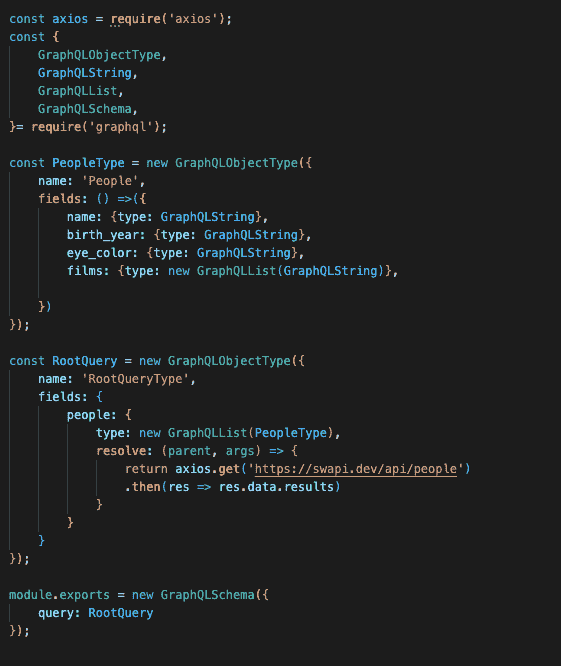

# GraphQL:用于休息太慢的时候

> 原文：<https://thenewstack.io/graphql-for-when-rest-just-doesnt-cut-it/>

GraphQL 是一种查询语言，允许对应用程序编程接口(API)进行高度可定制的查询。GraphQL 的使用率正在上升，目前正在被 PayPal、网飞、Shopify、Github、Airbnb 和其他许多公司用于生产级应用。

虽然经常被称为一种技术， [GraphQL](https://www.graphql.com) 是一种规范，一组规则和概念，允许开发人员构建自己的查询语言实现。正因为如此，GraphQL 为开发人员的创新和创造力留下了很大的空间。

那么 GraphQL 是什么呢？让我们从 REST 与 REST 的相似之处开始，REST 是 web 应用程序交易信息的当前标准。REST 和 GraphQL 都利用 HTTP 请求来获取数据。两者都是与服务器、语言和框架无关的。

这就是共同点的不同之处，因为 GraphQL 是作为 REST 架构的替代解决方案而构建的。

回到 2012 年，脸书用户正从主要使用台式机和笔记本电脑转向 iOS 和 Android 应用。在此之前，脸书将大部分工程资源投入到 web 开发中。GraphQL 的联合创始人 [Lee Byron](https://leebyron.com/) 解释说，移动资源需要一些新的东西，一种更快、更轻便和定制的方式来即时传输大量数据。需要更快、更细致的东西。

[https://www.youtube.com/embed/VjHWkBr3tjI?feature=oembed](https://www.youtube.com/embed/VjHWkBr3tjI?feature=oembed)

视频

因为 GraphQL 总是旨在以闪电般的速度为大量使用的应用程序提供大量数据，所以它需要一种革命性的数据获取方式。

考虑 REST HTTP Get 请求的基本工作流如下:

1.  从数据源请求数据
2.  接收返回的完整响应对象
3.  操纵响应对象，只提取必要的数据
4.  如果需要来自另一个端点的数据，请再次重复

REST 关注于多个端点，因此会连续进行多个调用，这可能会增加开销，降低非常繁忙或数据繁重的 web 页面的速度。GraphQL 更侧重于建立一个详细的面向组织的查询结构，并且只获取必要的数据，而不是对多个调用进行优先级排序以获得每一个可用的数据，然后对所有数据进行解析以找到必要的项目并相应地实现。

Postman 最近发布的[“2022 年 API 状态”](https://www.postman.com/state-of-api/)报告显示，参与 API 的人继续对 GraphQL 感到兴奋，将其用作架构的人数略有上升，从 24%上升到 28%。劳伦斯·赫克特。

## **graph QL 是如何工作的？**

[grapher QL](http://grapherrql.io/)软件工程师 [Josh Merrell](https://www.linkedin.com/in/joshmerrell/) 在谈到 GraphQL 数据建模设置时说道，“考虑这一点的主要因素是，GraphQL 在开发方面可能更重，因为您必须定义模式。”该模式由特定于 GraphQL 的 GraphQL 类型(字符串、布尔、整数)组成，指定了查询结果应该返回的数据类型。

这并不比使用 TypeScript 更费力，而且包括了对查询中包含哪些数据点及其相关数据类型的类似的、深思熟虑的考虑。构建 GraphQL 模式还有助于在工程团队成员之间、团队之间或未来的工程师之间建立理解，因为现在被查询的数据就在代码中清楚地陈述，而不是在响应对象中搜索。

解析器函数也包含在模式中，它是对数据进行 HTTP 请求的地方。这可以是任何东西，取决于每个应用程序的数据。在下图的例子中，这是一个对第三方星球大战 API 的简单请求，使用了一个简单的 Axios get 请求。

下图显示了在 Node.js/快递中设置的示例模式。

在 grapher QL 的开发过程中做了大量的工作后，[grapher QL](https://thenewstack.io/grapherrql-provides-much-needed-context-for-graphql-errors/)项目的软件工程师 Mariah Talicuran 承认，“启动时间很长，会让一些开发人员失去兴趣。” [Jerald Stephenson](https://www.linkedin.com/in/jerald-stephenson/) ，也是 GraphErrQL 的一名软件工程师，附和道，  “这取决于开发者。”

## **使用 GraphQL 和 Rest**

GraphErrQL 的软件工程师 Gwen Phillips 说，在使用 GraphQL 和 REST 时，“不一定非此即彼。您可以拥有一个组合的 GraphQL 和 REST 应用程序。一些公司正在逐步实现现代化，并首先将应用程序的一些领域转移到 GraphQL，以使其更适合开发人员。”

没有完美的解决方案，凡事都有取舍。GraphQL 更适合复杂的系统和微服务，它定义了一种数据形状，是一种强类型语言，并且解决了过量和不足提取的问题。GraphQL 没有本地缓存解决方案，尽管有服务器和开源选项。通过 GraphQL 的 AST 进行解析会变得非常复杂，并且开箱即用的错误上下文化并不是最好的。

Meta 不再维护 GraphQL，因为现在已经有了 GraphQL 基础。

<svg xmlns:xlink="http://www.w3.org/1999/xlink" viewBox="0 0 68 31" version="1.1"><title>Group</title> <desc>Created with Sketch.</desc></svg>