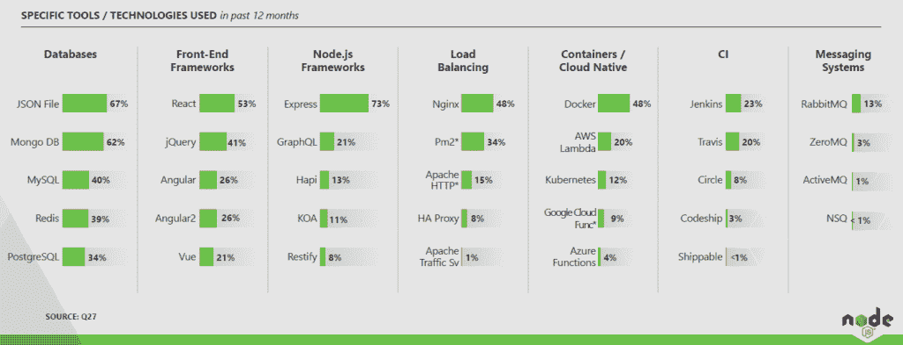

# GraphQL 有了自己的基础

> 原文：<https://thenewstack.io/graphql-gets-its-own-foundation/>

针对围绕 GraphQL 的快速增长的用户群，Linux 基金会已经启动了 GraphQL 基金会，以围绕 API(应用程序编程接口)的查询语言建立一个供应商中立的社区。

“通过 GraphQL 基金会的成立，我希望看到 GraphQL 成为行业标准，鼓励更广泛的团体做出贡献，并在供应商中立的事件、文档、工具和支持方面创造共同投资，”GraphQL 的联合创始人[李·拜伦](https://github.com/leebyron)在一份声明中说。

脸书于 2012 年首次开发 GraphQL 作为内部项目，并于 2015 年开源该技术。转向微服务架构的组织已经发现该规范对于快速开发和部署非常有用，简化了可能跨越多种语言的跨平台开发。

“GraphQL 重新定义了开发人员如何使用 API 和客户端-服务器交互，”Linux 基金会开发人员关系副总裁克里斯·阿尼斯奇克在一份声明中说。

除了作为外部服务的前端，查询语言还可能有助于无服务器技术的日益流行，[为功能即服务提供了一个简单的接口](/serverless-graphql-perfect-match-new-cloud-paradigm/)。

在 2017 年“[JavaScript](https://2017.stateofjs.com/2017/state-management/results)状态”调查中，60%的 JavaScript 调查受访者表示他们想学习如何使用它，另有 18%的人表示他们已经在使用它。在 2017 年的另一项调查中——这是 Node.js Foundation 的调查——21%的节点开发人员在使用 GraphQL。

脸书自己现在每天使用查询语言进行数十亿次 API 调用。据 Linux 基金会称，Airbnb、Atlassian、奥迪、美国消费者新闻与商业频道、GitHub、美国职业足球大联盟、网飞、Shopify、纽约时报、Twitter、Pinterest 和 Yelp 也在使用这项技术。

Linux 基金会建立了 GraphQL 基金会，在开放的治理模型下工作，目的是鼓励参与和技术贡献。它将作为一个独立的基金会运作，并将建立一套治理章程。

TNS 分析师 Lawrence Hecht 对本文有贡献。

Linux 基金会是新堆栈的赞助商。

通过 Pixabay 的特征图像。

<svg xmlns:xlink="http://www.w3.org/1999/xlink" viewBox="0 0 68 31" version="1.1"><title>Group</title> <desc>Created with Sketch.</desc></svg>