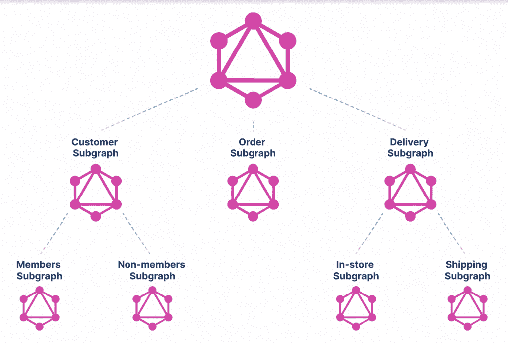

# GraphQL 让数据变得流动——这对数据保护意味着什么

> 原文：<https://thenewstack.io/graphql-makes-data-liquid-what-it-means-for-data-protection/>

做了十多年不同形式的 API 基础设施，我可以有把握地说，从数据消费的角度来看，没有什么比 GraphQL 更强大了。类似于
的查询

```
query  MyQuery  {
 customerByEmail(email:  "john.doe@example.com")  {
      city
      name
      orders  {
      createdOn
      delivery  {
 status
      }
 }
  }
}

```

为 API 消费者提供正确的客户、订单和交付数据，完全抽象出后端协议、密钥、位置和拼接需求。从消费的角度来看，它使企业数据变得“流动”。

## 流动数据

 [阿南特·金格兰

Anant 是 StepZen 的创始人兼首席执行官，step Zen 是一家初创公司，采用新的方法来简化开发人员访问数据的方式，以增强数字体验。](https://www.linkedin.com/in/anantjhingran) 

但是这种流动性也带来了危险。让我以我的亲身经历为例，我在组织中看到了这种持续的斗争。一方面，API 很棒——它们减少了采用服务时的摩擦，增加了收入。但另一方面，它们打开了一个新的脆弱通道。组织可以同时吃蛋糕吗？

我曾经打了个比方:你家有一两扇门。你不可能有一个没有门的房子。你尽力保护那扇门。你锁上它，这样只有授权的人才能进去。你安装安全摄像头来查看是否有未经授权的进入，等等。您平衡了需求(拥有一扇门)和顾虑(安全性)。

GraphQL 提出了类似的挑战。一方面，它通过非常灵活的 API 使企业数据变得容易获得。但另一方面，鉴于它让数据流动变得如此容易，我们必须问一问它带来了哪些需要解决的安全挑战。如果双方携手并进，那么 GraphQL 将兑现成为通用 API 标准的承诺。

在本文中，我们将讨论其中的三个挑战，并描述一些可以缓解这些挑战的机制。

## 数据权利

允许查询访问它所请求的数据吗？有三个明显的地方可以检查这一点:

1.  甚至在执行之前，在**查询结构**级别(“哇，当查询提供的凭证没有给予它许可时，为什么查询要求 john.doe@example.com 的细节？”)
2.  **在后台**(“抱歉伙计，你在向我数据库询问订单状态，但鉴于我所拥有的上下文，我不能为你做这件事。”)
3.  在 **GraphQL 层**(“嗯，你为什么要一个客户的订单；只有具有履行角色的开发人员才能检查这一点。”)

各有利弊。在一个好的系统中，坏的查询在执行之前就被停止了。GraphQL 引擎停止某些子查询，并进一步检查后端收到的数据请求。

查询结构**–**级检查的一个好机制是让每个查询带有一个 JSON web 令牌(JWT)令牌，并让 GraphQL API 端点检查结构有效性。因此，上面的查询连同一个具有条目“`enduser: john.doe@example.com`”的 JWT 令牌一起呈现，可能会被接受，但是带有包含“`enduser: jane.smith@example.com`”的 JWT 令牌的相同查询可能会被拒绝。更复杂的令牌和验证机制可能会指定谁可以要求订单或不可以。

在后端检查权限通常依赖于后端。数据库有很好的访问控制机制，所以在那里使用检查和平衡相对简单。REST 后端通常由 API 键控制，这是一种更粗糙的控制。JWT 和 OAuth 标记要好得多，但是并不是所有的 REST APIs 都实现了它们。当然，GraphQL 层必须能够将上下文传递到后端。

GraphQL 层中的检查和平衡也带来了挑战。通常，GraphQL 实现有一个“解析器”的概念——当需要填充`customer.orders`时执行什么代码。一个关键问题是:#可以对解析器进行哪些检查？在`customer.orders`解析器被调用之前，它是否被允许调用？不同的实现采用不同的解析器方法。在 StepZen 中，它们是基于查询的，将封闭对象中的数据与封闭对象中的查询连接起来。因此有人可能会说，“获取数据`customer.id`并在查询`getOrdersByCustomer`中将它作为参数`customerId`传递，返回的数据成为`customer.orders.`的值”

在这个模型中，查询结构级检查充当了基于解析器的检查——一石二鸟。在其他方法中，基于解析器的检查必须单独实现。

## 数据保护

HIPAA 或 PII(个人身份信息 **)** 控制通常可以防止少量数据无意中泄露(社会安全号码可能会被屏蔽，姓名可能会被匿名，等等)。)然而，在 GraphQL 中，单个位很重要，但它们如何组合才是真正的危险所在。

想象一个产生客户当前雇佣详细信息的后端。另一个后端产生他们的人口统计数据。如果这两者结合在一起，在教育水平上给出了一个强烈的信号，如果这两个信息一起泄漏才是真正的问题，并且单独来说它们都是无害的(假设符合 HIPAA 和 PII)，那又会怎么样呢？在这种情况下，很明显，GraphQL 层必须做一些屏蔽或匿名等魔术。于是一个查询

```
query  MyQuery  {
  customerByEmail(email:  "john.doe@example.com")  {
    name
    age
    employment  {
  company
  position
    }
  }
}

```

不可接受，但是没有年龄或者没有职位的查询可以接受？实现查询结构级控件需要太多的组合。一个更好的方法是添加一些逻辑，即“屏蔽年龄+位置”,允许查询更广泛的数据集。

这种“个别位是好的，但放在一起有些可能是坏的”只能在 GraphQL 层实现。一种常见的机制(StepZen 使用的)是在基于声明性查询的解析器周围启用“前”和“后”逻辑，这种逻辑的一个用途是进行上述屏蔽。

## 数据主权

正如我们在之前的[文章](https://thenewstack.io/a-new-architecture-for-apis/)中所讨论的，GraphQL 有一个内置的联邦机制(或者一个图表)。因此，这种组装在 GraphQL 中很容易实现，而在传统的 REST 实现中却很难实现:



虽然我们已经完成了上面的功能分解，但也可以很容易地进行基于国家或洲的分解(或者地理、云、功能等的任意组合)。).在地理分解中，客户子图可能由两个子图构成:一个北美(NA)子图和一个欧洲(EU)子图。

现在每个子图都可以实现它的数据主权规则。例如，EU 子图可以决定只向链的上游发送聚合信息，而 NA 子图可以发送更多细节。一旦这个概念——graph QL 只是一个图表的图表——被内在化，任何级别的数据主权都可以被建立。

## 结论

如您所见，GraphQL 使数据变得流动。但这给数据权利、保护和主权带来了挑战，仅举三例。这些问题中的每一个不仅是可解的；有时在 GraphQL 中比在其他方法中更容易做到。

现在是迈向基于 GraphQL 的未来 API 架构的时候了。您可以通过这些 API 实现新的业务，并且可以相对容易地确保数据漏洞不会增加新业务的成本。

<svg xmlns:xlink="http://www.w3.org/1999/xlink" viewBox="0 0 68 31" version="1.1"><title>Group</title> <desc>Created with Sketch.</desc></svg>