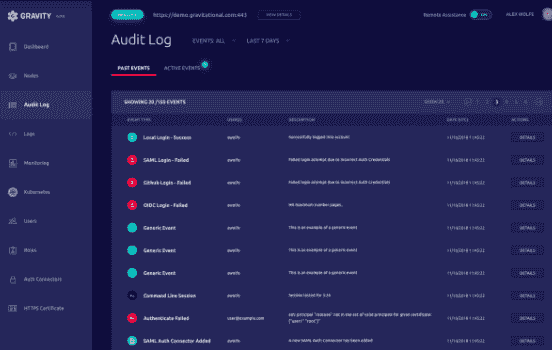

# Gravity 吹捧 Gravity 6.0 的集群管理用户界面

> 原文：<https://thenewstack.io/gravitational-touts-gravity-6-0s-user-interface-for-cluster-management/>

Gravity 6.0 的用户界面(UI)是新功能集的一部分，有助于简化 Kubernetes 针对多云和内部部署的集群管理功能。

此外，[gravity](https://gravitational.com/)负责解决方案工程的副总裁 Abraham Ingersoll 上周在巴塞罗纳[kube con+CloudNativeCon Europe](https://events.linuxfoundation.org/events/kubecon-cloudnativecon-europe-2019/schedule/)上告诉新堆栈，该版本“公开”了新的用户界面，包括应用程序目录、审计日志和监控。

Gravity 背后的想法是允许用户通过单一界面构建、复制和销毁 Kubernetes 集群。该公司在新闻稿中表示，目标用例包括向属于其客户的第三方云提供产品的 SaaS 公司，这些客户通常有严格的合规或安全要求。

英格索尔说，由于 Gravity 6.0 发布时提供的界面，Gravity 变得更容易使用。

“这是价值百万美元的用户界面，因为在很多情况下，人们不会欣赏一个东西是多么[健壮]，除非他们看到漂亮的图形用户界面，”Ingersoll 说。

Ingersoll 说，许多底层数据和应用程序都在“敌对环境中成功运行的集群中，这意味着传统的 IT 环境”。“你不能合理地期望你的客户会有一个连贯的 Kubernetes 战略，”英格索尔说。“因此，在这些情况下，你试图提供一些(有助于简化 Kubernetes 管理的)东西。”

Ingersoll 说，大多数组织更愿意提供带有虚拟机映像的软件解决方案。“现在，他们正在收获好处，因为 Gravity 打包了一切，包括所有的依赖项，”Ingersoll 说。“因此，Gravity 6.0 的发布就是要在顶部提供一个漂亮的界面，让人们可以看到它的价值。这是工程师为其他工程师建造的东西。”

Ingersoll 说，在许多方面，这个想法是为了更好地向“管理层”展示集群管理能力，以便他们能够理解其价值。“你只需要指向并点击，然后立即打开外壳，真正看到集群，这样管理层就可以真正了解云新技术的价值，”Ingersoll 说。“因此，这个界面就像你的冰箱一样增加了价值，突然你就会有一个触摸显示屏，告诉你里面到底有什么。”

《地心引力》在一份新闻稿中称，最新版的《地心引力》包括:

*   一个全新的多云控制平面，使公司更容易发布集群图像和远程管理 Kubernetes 集群；
*   发布集群映像的应用程序目录，包括一些打包成集群映像的流行开源应用程序，这些应用程序提供了一个客户如何为其客户发布类似目录的示例；
*   一个新的审计日志 UI，具有高级安全特性，用于审计通过 Kubernetes API 和 SSH 对集群的访问，这提供了对集群访问和记录的会话的进一步了解。

云原生计算基金会和 KubeCon + CloudNativeCon 是新堆栈的赞助商。

Pixabay 的特征图像。

<svg xmlns:xlink="http://www.w3.org/1999/xlink" viewBox="0 0 68 31" version="1.1"><title>Group</title> <desc>Created with Sketch.</desc></svg>