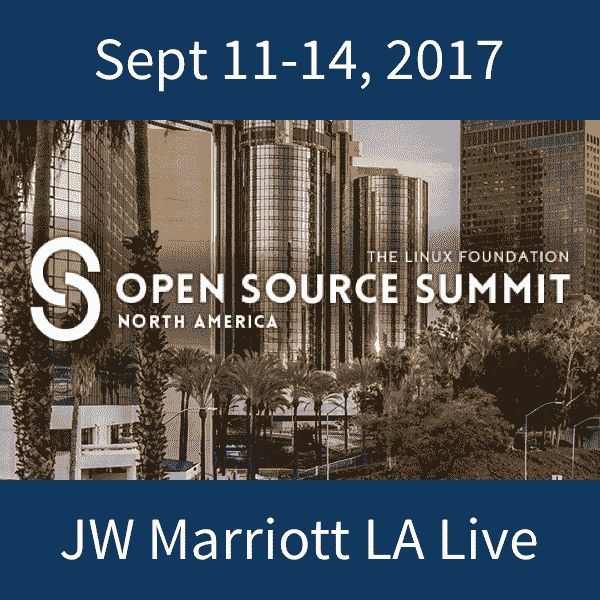

# Greg Kroah-Hartman:Linux 稳定分支的总指挥

> 原文：<https://thenewstack.io/greg-kroah-hartman-commander-chief-linux-stable-branch/>

编者按:以下采访是名为“开源领导者”系列的一部分，在该系列中，我们对开源 IT 社区中的项目领导者进行了描述，以了解他们如何开发自己的软件，以及运行开源项目带来的挑战和好处。

在有时充满争议的 Linux 内核开发人员社区中，温和的巨人格雷格·克罗亚-哈特曼是最友好的面孔。当你把一个设备插入 Linux 系统，它开箱即用，功劳归于克罗亚-哈特曼。他周游世界，与硬件供应商交谈，让 Linux 在他们的设备上运行。

但是 Kroah-Hartman 从一开始就不是 Linux 用户:随着时间的推移，他逐渐成为最有影响力的内核开发人员之一。

克罗亚-哈特曼从很小的时候起就是一名技术人员。他开始在父母购买的家用个人电脑上编程。

几年后，克罗亚-哈特曼开始了他的第一份工作，为打印机开发固件。他参加了一个嵌入式系统会议，看到了一个 Cygnus 的展台，当时 Cygnus 正在为 Stallman 的 [GNU C 编译器集合](https://gcc.gnu.org/) (gcc)提供支持。他的公司刚刚在一个新项目中使用 gcc，所以他开始与那里的开发人员交谈了一段时间。他回忆说，离开那次谈话时，他告诉那些开发人员，“如果你们继续放弃代码，你们都不可能生存下去！”

在他的下一份工作中，Kroah-Hartman 开始在一个大型系统上使用 SCO Unix 作为 Oracle 的数据库服务器。这是一只不断有问题的野兽。最后，其中一名开发人员把盒子擦干净，在上面安装了带有 Oracle 的 Linux。他注意到，同一台机器突然比以前工作得好得多，生产能力更高，不再有稳定性问题。

但是他们不能在最终产品中使用它，因为他们不能以一种让管理层乐于依赖它的方式获得对 Linux 的任何支持，所以他们回到了 SCO。这是在 1996 年，在任何“企业”Linux 支持真正出现之前。但是，与 Linux 的第一次互动让 Kroah-Hartman 对它感到好奇，所以他在家里的 PC 上安装了 Linux，采用双重启动的方式，结果随着时间的推移，启动 Windows 的次数越来越少。

几年后，他为一家条形码公司工作，在那里他为条形码扫描仪编写固件，并处理一种叫做 USB 的全新技术。

## 改变一切的周末项目

Kroah-Hartman 学会了用各种不同的操作系统测试他的固件，以找到固件中的错误，因为当时每家公司都实施了不同的 USB 堆栈。“Linux 没有任何 USB 支持可言，只有一个来自西班牙的正在写硕士论文的开发者提供的巨大的 out-of-tree 补丁集，”Kroah-Hartman 说。“这个堆栈工作得还不错，但并不完美。我饶有兴趣地关注着代码的开发，有一天[Linux 创建者 Linus Torvalds]宣布他正在从头开始编写一个全新的 USB 堆栈，因为那个大的还没有处于可合并的状态。这一下子引发了大量的开发，我用我的设备测试了新代码。我在堆栈中发现了一些错误，并向 linux 内核邮件列表提交了补丁，它们被接受了。”

他分享了一个有趣的故事，他的妻子带着他们年幼的女儿去度周末，她对他说，“你为什么不为你现有的设备编写一个 Linux 驱动程序，你一直在谈论它，现在你将有时间这样做了。”

有了这个想法，她实际上给了这个世界我们今天所知道的 Kroah-Hartman。Kroah-Hartman 花了两天时间拿着一本 [Linux 设备驱动程序](https://lwn.net/Kernel/LDD3/)书，为他拥有的 USB 转串口设备写了一个驱动程序，Linux 根本不支持。

“我紧张地把我的驱动程序的补丁发布到邮件列表上，在似乎仅仅几分钟的时间里，我得到了一堆回复，说‘你忘了这么做了’，以及‘多处理器系统怎么样？’'这样不行，修好这条线和这条线'我惊讶地发现，对于我从未考虑过的问题，我立即获得了如此好的代码评审。我被迷住了，并且知道为了成为一名更好的程序员，我需要继续这样做。"

【T2

克罗亚-哈特曼对这个世界很着迷，在这里人们可以向他提供即时反馈。到目前为止，在他工作的专有领域，情况并非如此。没有即时反馈回路。所以，这次经历对他来说是令人兴奋和鼓舞的。

“几年后，我的驱动程序早就被合并了，我成了那个小驱动子系统的维护者。我意识到，更多的人在晚上和周末免费使用我写的代码，而不是使用我有偿使用的设备(这不是一家非常成功的公司)。当我意识到我可以找到一份全职做 Linux 内核工作的时候，我找到了一份工作，然后就再也不回头了，”他说。

目前，Kroah-Hartman 主要参与 Linux 内核的开发，但他也为其他一些小项目(systemd、LibreOffice、x.org、git)提交了补丁。

Kroah-Hartman 对 Linux 世界的最大贡献之一是，他对硬件供应商增加对 Linux 的支持产生了重大影响。他经常出差，与硬件供应商交谈，说服他们支持 Linux。

“所有公司都在内部的某个地方为他们的设备准备了 Linux 内核代码，只需要一点点努力就可以把它公之于众，并把它合并起来。Kroah-Hartman 说:“通过让公司的开发者自己成为它的所有者和维护者，它扩大了我们的社区，他们感觉更直接地参与了 Linux 的发展，因此它对他们的设备和他们的客户很好。”。

他与这些公司的开发人员一起工作，帮助他们学习如何成为 Linux 内核开发社区的一员。有时，这种接触在本质上并不那么技术性。有时，这可能是一个管理问题。

他回忆起一次经历，一家公司的开发人员抵制将他们的代码合并到主 kernel.org 树中的想法。Kroah-Hartman 不明白为什么他们要这么做，因为他们的代码没有问题，合并代码只会让他们的生活更轻松。这也将为公司节省大量资金和资源，因为这些代码将由更大的开源社区来维护。

“最后，在与几个人共进午餐讨论事情时，我了解到该公司的首席技术官最初编写了第一个代码，成为他们的驱动程序，”他说。“开发人员真的很担心 CTO 剩余的代码会被内核社区重构掉，让 CTO‘看起来很糟糕’"

真正有趣的是，当 Kroah-Hartman 与首席技术官谈论代码时，他非常惊讶地发现他的工作保留了这么久。“他和他的经理们讨论并解决了问题，当代码最终被合并到主 kernel.org 树中时，每个人都很高兴，”Kroah-Hartman 说。

## 指环联盟

现在，克罗亚-哈特曼不用担心工作或编写固件了。2012 年，他以研究员的身份加入了 [Linux 基金会](https://www.linuxfoundation.org/)，就像托沃兹一样。基金会赞助他做他已经做了多年的所有内核开发工作。

基金会和 Kroah-Hartman 之间的合同有点滑稽。他说:“我的正式合同说，Linux 基金会不能告诉我该做什么，我也不能告诉 Linux 基金会该做什么，所以对他们和我来说，这是非常不干涉的。”“也就是说，我确实与许多 Linux 基金会的人和许多 Linux 基金会成员公司直接合作，帮助他们解决内核开发和随着时间的推移出现的社区问题。”

Kroah-Hartman 是最资深的内核开发人员之一，但就像 Torvalds 一样，他最近似乎不怎么写代码。他的大部分工作涉及最新开发内核的代码审查。Kroah-Hartman 还维护稳定的内核版本。这包括获取流入 Linus 开发树的 bug 修复，并将它们合并到一个稳定的内核树中，他大约每周发布一次。托沃兹大约每两到三个月发布一次主要的 Linux 版本。

除了最新的稳定版本，Kroah-Hartman 还管理一些旧的“长期”内核版本，这些版本也修复了错误，他试图每周发布一次。这些较老的内核通常是嵌入式系统所依赖的(Android 就是一个很大的例子)，让它们保持最新的安全和错误修复对这些社区来说很重要。

“我对 Linux 内核社区的责任是多方面的，”他说。“作为几个驱动子系统(USB、串行、staging、驱动核心等)的维护者，我帮助内核的新开发，”他说。这包括阅读其他人提交的代码，并确定它被接受时是否有任何问题。接受率通常是提交的变更的三分之一，所以很多变更在合并之前需要多次修改。

Kroah-Hartman 本质上仍然是一个开发者。他仍然有一些小的内核项目，他每隔一段时间就尝试一下。“通常这些只是对不同内部内核功能的小清理，我认为它们可以做得更好，但偶尔，我也会帮助为新硬件编写新驱动程序。“Greybus”架构就是这样一个最近的作品，它是由谷歌为他们的模块化手机架构赞助的。该设备最终没有发货，但相同的代码和技术现在在其他公司使用的一些手机中，代码被合并到主内核树中，以便其他人也可以使用它，”他说。

## 完全统治世界

今天，Linux 无处不在，它是托沃兹在正确的时间采用正确的方法开发开源模型的正确技术的结果。“当我开始做内核的时候，我们开的玩笑是‘完全统治世界’，没有人把我们当回事。现在看，我们真的做到了！但现在，每个人都依赖我们，所以我们最好不要搞砸了，”克罗亚-哈特曼说。

但是 Linux 会把事情搞砸吗？“我经常说，唯一能阻止 Linux 的是我们对自己做了什么，把它搞糟了。我们有比其他操作系统更多的开发者和公司。Kroah-Hartman 说:“我们支持的设备和不同平台比任何人都多。“我们以一种前所未有的方式完成了这项工作。因此，我担心我们会对我们的发展过程做些什么来伤害这一点，因为没有任何外部力量能够真正直接阻止我们。”

每年，顶尖的内核维护人员都会聚在一起讨论开发过程——什么在起作用，什么需要改变。“我认为，自我反思和基于此的改变是我们能够生存如此之久的原因，”他说。“只要我们继续这样做，我们就会没事。”

谈到从 Linux 赚钱或围绕 Linux 建立职业生涯，Kroah-Hartman 说，“如果没有开源和自由软件，我就不会有现在的职业生涯。我曾为使用 Linux 销售设备的小型初创公司工作过，也曾为像 IBM 这样的大公司工作过，这些公司依靠 Linux 在他们销售给客户的硬件上运行良好。我还为 Novell 和 SuSE 工作过，他们的业务模式是向企业用户销售 Linux 支持，以及在惠普和三星等大公司销售的新电脑上预装 Linux。”

“为了赚钱和生存，所有这些公司都以不同的方式使用 Linux。他说:“这是非常独特的，因为有太多不同的商业案例来实现开源的‘货币化’。”

<svg xmlns:xlink="http://www.w3.org/1999/xlink" viewBox="0 0 68 31" version="1.1"><title>Group</title> <desc>Created with Sketch.</desc></svg>