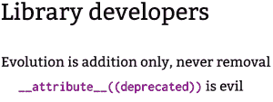

# Greg kro ah-Hartman:20 年 Linux 内核工作给开发者的教训

> 原文：<https://thenewstack.io/greg-kroah-hartman-lessons-for-developers-from-20-years-of-linux-kernel-work/>

[Greg Kroah-Hartman](https://twitter.com/gregkh) ，目前负责稳定的 Linux 内核版本[的 Linux 基金会研究员，在今年的](https://git.sr.ht/~gregkh/presentation-application_summit/tree/main/keep_users_happy.pdf) [Linux 应用峰会](https://linuxappsummit.org/)上分享了他作为内核开发者所学到的适用于其他开发者的经验。

Kroah-Hartman 已经帮助开发 Linux 内核超过 20 年了——他开玩笑说“时间太长了”——但他提醒观众，他已经完成了一些用户空间工作，并维护了一些小型 Linux 用户空间包。他首先展示了如何将演讲的精髓简洁地浓缩成一张五个字的幻灯片:

“不要让你的用户抓狂。”

“不过，让我们再深入一点细节，”他笑着补充道。“我会试着解释为什么你不想让用户抓狂，当你这么做的时候会发生什么。”

"所以，所有这些东西归结为一件非常简单的事情:你为谁写代码？"

这很重要，因为你应该做什么取决于你为什么要做，他解释道，从最简单的场景开始。如果你是为自己写代码，“把它扔过墙去，尽情享受吧。”

但是如果你是为别人写的，“现在你必须关心用户。”

“在情理之中，”他补充道，并分享了一个他称之为臭名昭著的 [XKCD 漫画](https://xkcd.com/1172/)中的角落案例，说明用户可以抱怨甚至是最重要的修复——比如“当你按住空格键时，CPU 不再过热。”

“我在这里说的一切都是‘在情理之中’，因为总有一些用户你永远无法取悦，无论如何。还有那些你可以放心忽略的人。”

Kroah-Hartman 解释说，这是 Linus Torvalds 最根深蒂固的信念之一:不要破坏用户空间。

“其他操作系统也有这条规则，这是一条非常可靠的规则，因为我们总是希望您升级。我们希望您可以无忧无虑地升级。我们不想让你感到害怕。如果你看到一个新的版本，我们说，‘嘿，这解决了一堆问题’，我们不希望你担心接受它。这非常非常重要，尤其是在安全性方面。”

这导致了克罗亚-哈特曼所说的格雷格的规则#1:“如果用户害怕你会打破他们当前的系统，他们就不会更新。”

“我们经历了惨痛的教训…”

## 与用户一起发展

很明显，这是改变最终实现的方式。克罗亚-哈特曼解释说:“诀窍是你只要支持一切，直到没有用户为止。”。"判断什么时候有用户，什么时候没有用户取决于你."

Kroah-Hartman 讲述了一个引人注目的故事，当时 Linux 内核开发人员意识到一个特定的架构只被现有的两台机器使用。“其中一个坏了，另一个——我们实际上付钱给开发商更换了它，因为我们不想再支持那个东西了。”

“但除此之外，我们必须继续支持用户。因为我们签了合同。我们签订了合同，给他们一个功能。我们不能删除它。”

他指出，Linux 仍然可以支持 25 年前的二进制文件，所以“人们认为 Linux 已经停滞不前了。但事实上，我们在旧功能的旁边创造了新功能，你可以做不同的事情，你可以利用这些东西。”

他提供了另一个应用程序发展缓慢的突出例子:KDE。

## 在现实世界中

给应用开发者的另一条建议是:不要拿走有用的东西。“如果有人在使用这个功能，就把它放在那里。就这么简单……不要以为移除它就是在帮他们的忙。”

当他把注意力转向库开发者时，他的第一张幻灯片上简单地写着:“我可怜你。”

> “你永远不知道一个 API 是否真的有用，直到有太多的人在使用它，以至于你无法改变它。”——格雷格·克罗亚-哈特曼

“这是有史以来最难的工作，”他笑着说。“我真的真的为你感到难过……这是最难做的事情之一。”

“除非有很多人在使用你的 API，否则你永远无法知道它是否真的有效。当你有很多人使用它的时候，你就会意识到其中的所有问题——然后你就无法改变它了。”他笑着说。"第一次就做对几乎是不可能的。"

有一个替代方案——但是它仍然涉及到尊重那些仍然在使用您想要废弃的旧库的用户。如果你真的需要一个新的开始，他建议说:“把它作为一个全新的图书馆来做”。

“然后你就没有用户了！然后你不知道是否有人在使用你的 API，你不知道你是否做对了，直到你有了用户，然后它就坏了，这个循环还在继续。”

他还为那些真正希望用户转向新库的开发人员提供了一个重要的技巧。“你需要很好地记录它——因为如果你不堆栈溢出就会尝试这样做。”他会意地笑了，想起了大量糟糕的驱动程序和提交的内容，这些内容显然是受一个 10 年前的堆栈溢出帖子的启发。“您不希望堆栈溢出成为您的主要文档。提供良好的文档。”

但随后他又严肃地补充道，“如果你违反了那些东西，你就导致了人们失去信任。如果我重新构建，看到到处都是“弃用的”或者 API 发生了变化，那就太可怕了。你不会想这么做的。如果你违背了这种信任，你将不再拥有那个用户。”

如果你真的要做出改变，确保确实有一个令人信服的理由。“你必须提供足够的理由和足够的善意来迫使某人花时间去学习做别的事情。那是非常难得的。”

他的例子是 [systemd](https://thenewstack.io/systemd-vs-linux-kernel/) ，它统一了各种服务配置和初始化过程。“他们做得对。他们提供了所有的功能，解决了一个真正的问题。他们统一了所有这些现有的工具和问题，以这样一种方式，它只是更好地使用，它提供了足够的动力，每个人都愿意做工作来修改他们自己的东西，并转移到新的模式。

“成功了。人们仍然抱怨它，但它确实有效。每个人都换了…效果很好。它解决了一个实际问题。

“这是一个如何提供令人信服的理由继续前进并做出改变的例子。”

[https://www.youtube.com/embed/CUifDVMHUXw?list=PL3sxxpspw7FEWjFsZUT7LMULeWzNK0Eu2](https://www.youtube.com/embed/CUifDVMHUXw?list=PL3sxxpspw7FEWjFsZUT7LMULeWzNK0Eu2)

视频

<svg xmlns:xlink="http://www.w3.org/1999/xlink" viewBox="0 0 68 31" version="1.1"><title>Group</title> <desc>Created with Sketch.</desc></svg>