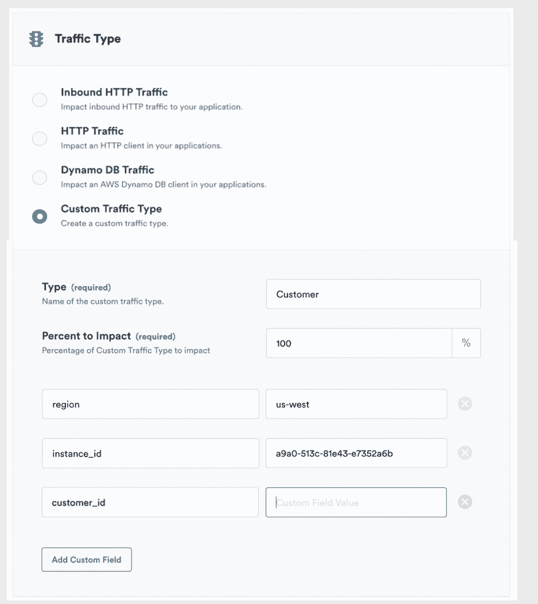
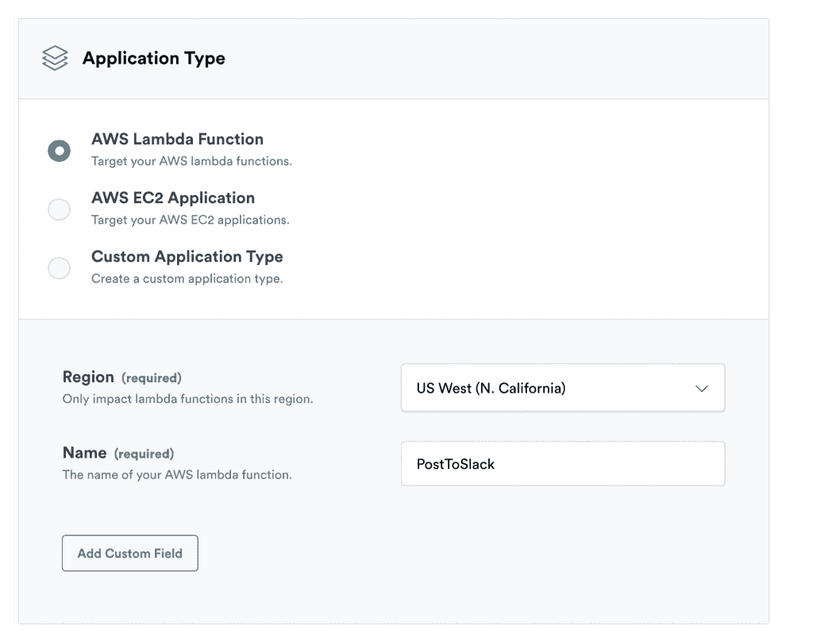
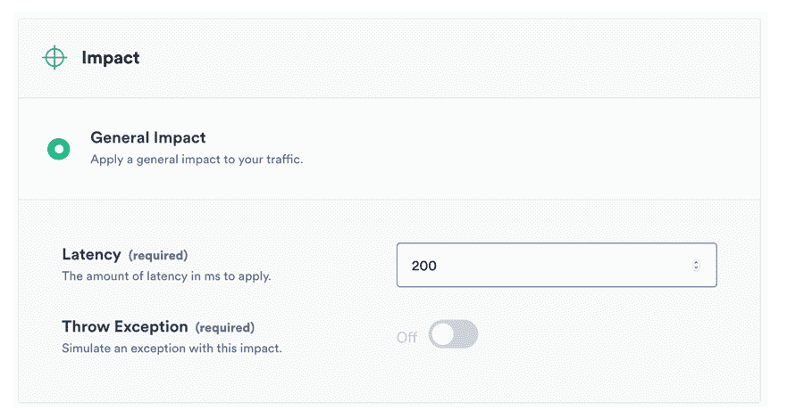

# Gremlin 对无服务器应用混沌测试

> 原文：<https://thenewstack.io/gremlin-applies-chaos-testing-to-serverless/>

在其故障即服务平台的基础上， [Gremlin](https://www.gremlin.com/) 现在提供了在无服务器服务中引发故障的能力，目的是，像所有的[混沌工程](https://thenewstack.io/netflix-linkedin-and-gremlin-engineers-talk-chaos-engineering/)一样，让管理员更好地了解现实生活中系统故障的影响。

该功能来自该公司新的[应用级故障注入](https://www.gremlin.com/the-next-step-application-level-fault-injection/) (ALFI)技术，该技术通过将断点插入开发人员的代码本身，提供了一种在应用级进行故障测试的方法。

Gremlin 首席技术官兼联合创始人 Matthew fornacari 在即将播出的 [TNS Context](https://thenewstack.io/podcasts/context) 播客中表示，ALFI 是先进的混沌测试工具，因为它“将失败注入提升到应用程序中”。他解释说，现有的混乱工具从操作系统或基础设施层面进行破坏。

这种方法对故障提供了更加细致入微的控制。故障的范围只能影响特定的属性，如客户 id、位置、设备类型。Fornaciari 说，有了这种特异性，用户可以将测试限制在“真正受到故障影响的范围内”，从而允许他们快速测试和重新测试。

ALFI 与所有主要的无服务器平台兼容，包括 AWS Lambda、Azure 函数和谷歌云函数。“您可以像使用任何其他基础设施一样，将它用于无服务器服务。这真的没什么不同，”福纳恰里说。“你定义那个实验和它的影响，然后 Lambda 的每一个实例都将获取它的实验，并实施它们。”

ALFI 还可以模拟特定服务的延迟和故障。当一个速度较慢的组件会导致大量拥塞，而依赖于该组件的其他服务会通过重试和超时来进行补偿时，该功能对于微服务环境来说具有独特的价值。在行业中，这通常被称为级联故障。

ALFI 提供了两种有助于复制这种失败的失败:延迟和异常抛出。有了这些工具，你可以观察一个微服务在它周围的所有组件都失效的时候做了什么。如果身份服务消失，服务的弹性如何？或者如果推荐加载缓慢怎么办？

混沌工程是一门新兴学科，它故意将故障引入系统，以更好地预测更大的故障。网飞通过自己的实践引起了人们对这种做法的关注，它使用了大量开源工具来破坏云原生系统。

除了 ALFI，Gremlin 的平台本身可以执行 11 种基于基础设施的故障模式，如数据包丢失和延迟，跨服务器的时钟偏差，并显示它们对整个系统的影响。Gremlin 也是第一套打包了可以在容器环境中使用的混乱诱导工具的软件。八月份，该公司扩展了工具集，使其能够瞄准码头集装箱。用户可以关闭特定的容器，或者耗尽它们的 CPU 周期或内存空间。该软件还具有自动修复功能，当一个容器被标记为不健康时，它将被一个副本替换。

Gremlin 最近宣布，它已经筹集了由 Redpoint Ventures 牵头的 1800 万美元 B 轮融资，这笔钱将用于推进企业中弹性工程的范围。Fornaciari 说，随着资本的流入，该公司计划聘请工程师，除其他外，调查将失败注入扩大到其他目标，如 Kubernetes。

专题图片:Gremlin 首席执行官 Kolton Andrus。

<svg xmlns:xlink="http://www.w3.org/1999/xlink" viewBox="0 0 68 31" version="1.1"><title>Group</title> <desc>Created with Sketch.</desc></svg>