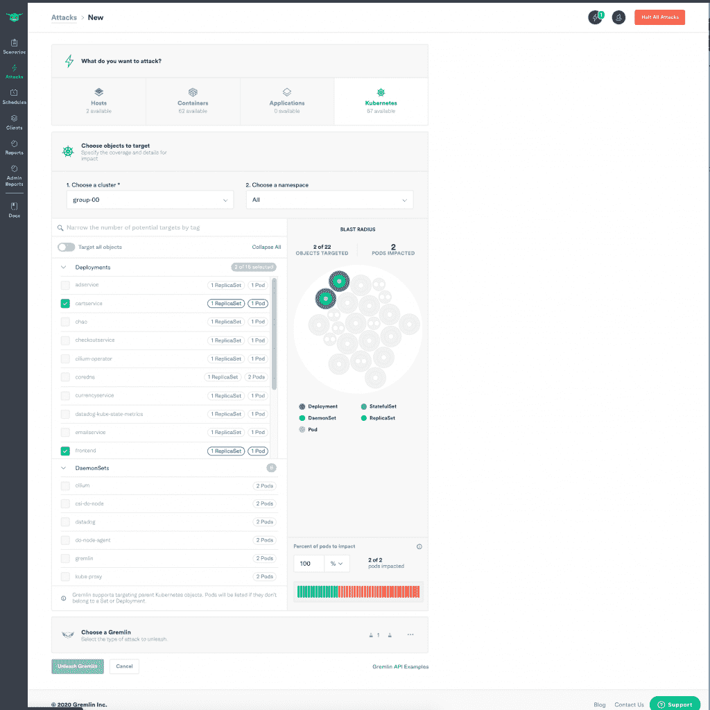

# Gremlin 启动混沌工程的“健康检查”,控制力更强

> 原文：<https://thenewstack.io/gremlin-launches-health-checks-for-chaos-engineering-with-greater-control/>

混沌工程是工程是一门科学的最真实的标志之一。像科学方法一样，这种弹性实践让工程师们进行假设、实验、测量、旋转(或不旋转)和重复。这种“如果这样，那么那样”的有条件游戏将一个系统推到了极限，以建立对其抵抗生产中意外粗糙的能力的信心。

但是你不想给已经虚弱的免疫系统注射疫苗。护士检查你的体温，并在注射前问你感觉如何。同样，当您的系统已经在处理巨大的流量高峰时，您也不想管理混乱。

Gremlin 的混沌工程师 Ana Margarita Medina 说:“如果系统不健康，现在就不是引入混沌的时候。

考虑到这一点，今年 6 月， [Gremlin](http://Gremlin.com) ，一个混沌工程平台的提供商，发布了一个名为“健康检查”的新功能，在每次释放混沌之前自动检查你的系统是否健康。它集成了其他 It 监控软件，如 New Relic、Datadog 和 PagerDuty 提供的软件。

Medina 表示，这是关于从被动到主动的转变，确保您可以在不造成不必要伤害的情况下为系统建立弹性。“混沌工程的重点不是增加不必要的混沌。你想要控制你系统中的混乱，”麦地那继续说。

Gremlin 基于三个价值观——简单、安全和可靠。该功能强调安全目标。

Gremlin 健康检查通过 API 与您现有的监控系统连接，以验证您的系统是否真正健康。Gremlin 检查的内容包括:该系统是否有任何未解决的事件？流量负荷怎么样？网站是否返回 200 OK 响应状态？

如果一切顺利，Gremlin 会在您的系统上运行一个混沌工程实验，然后进行另一次健康检查。

为什么不干脆把混乱堆在混乱之上？因为这种做法是关于控制混乱的，所以你可以更多地了解你的基础设施和查明弱点。

Medina 表示，这些护栏是 Gremlin 的财富 500 强客户要求的，他们希望对将他们的混乱实验投入生产更有信心。

“您希望实现自动化，但又不想让客户感到不安。大公司没有时间手工操作，但又害怕自动化，”Medina 说。

允许在实验之前、之中和之后进行这些自动检查，从而关闭混沌工程反馈回路。

这与 Gremlin 的一个原始功能配合得很好——屏幕顶部的一个红色大按钮，用大写字母大喊:“停止所有攻击。”

Medina 解释说，“如果你手动运行攻击，并且它实际上以你不希望的方式影响了系统，那么一旦按下红色按钮，它就会[系统]自动返回到攻击前的状态”。

她将这些健康检查称为“主动停止按钮”

麦地那说这也不仅仅是关于系统。是关于人的。“我们看到越来越多的人意识到，他们不想总是救火。这导致工程师精疲力尽，并为随叫随到的工程师留下太多“不可操作的页面”。

她进一步建议，这些自动检查和 chaos 部署应该从周一到周五朝九晚五地进行，这样你就完全不需要在非工作时间使用 chaos 页面了。如果周一上午 9 点发生事故，那么混乱不会发生，直到问题得到解决。这项检查将于星期二再次进行。如果这一事件得到解决，那么混乱就会降临。如果不是这样，混乱将暂停，等待周三的健康检查。

就像你连续运行健康检查一样，麦地那也建议连续运行混沌。

“避免滑向失败。你知道云是非常动态的，一切都在变化。一直进行攻击。确保你对同样的失败仍有弹性。以安全的方式实现自动化，”她说。

来自 Pixabay 的 bdyczewski 的特写图片。

目前，新堆栈不允许直接在该网站上发表评论。我们邀请所有希望讨论一个故事的读者通过 [Twitter](https://twitter.com/thenewstack) 或[脸书](https://www.facebook.com/thenewstack/)访问我们。我们也欢迎您通过电子邮件发送新闻提示和反馈: [feedback@thenewstack.io](mailto:feedback@thenewstack.io) 。

<svg xmlns:xlink="http://www.w3.org/1999/xlink" viewBox="0 0 68 31" version="1.1"><title>Group</title> <desc>Created with Sketch.</desc></svg>