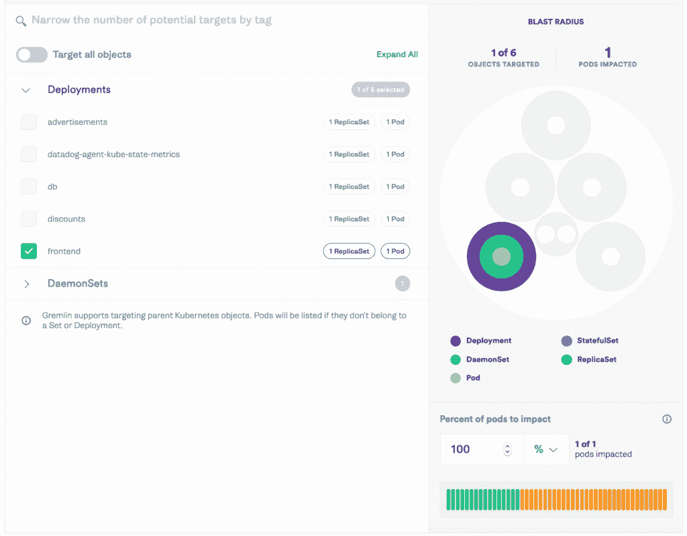

# 小妖精的声音证明了 Kubernetes 星团中的混乱豆荚

> 原文：<https://thenewstack.io/gremlin-sound-proofs-chaotic-pods-in-kubernetes-clusters/>

[蜂巢](https://www.honeycomb.io/)赞助了新栈对 Kubecon+CloudNativeCon 北美 2020 的报道。

Kubernetes 已经成为一种神话。“Kubernetes”一词源自希腊语，意为舵手或飞行员，在科技高管中，它以某种神奇的方式引导和加速他们的集装箱化工作负载。严酷的事实是，Kubernetes 仍然需要很大的努力才能朝着正确的方向安全飞行。

围绕着让 Kubernetes 更容易、更安全地驾驶，IT 行业的整个领域已经建立起来。你实际上必须做大量的实验来理解你的系统，以确保它按照你期望的方式工作。它绝不仅仅是你在复杂的配器中的一部分。数百个不同的短期服务可能在一个集群中发生冲突，共享 CPU、内存和安全权限。它制造了大量的噪音，可以坦率地说是混乱的。

本周对于 [Kubecon+CloudNativeCon 北美](https://events.linuxfoundation.org/kubecon-cloudnativecon-north-america/)， [Gremlin](https://www.gremlin.com/) 系统混沌测试提供商已经更新了其[混沌工程平台](https://www.gremlin.com/)，以在孤立的对象上部署有针对性的混沌工程，以确保整个 Kubernetes 环境能够处理一个对象发生的问题，允许工程师围绕他们的 Kubernetes 部署建立信心和理解。

实际上，Gremlin 可以隔离单个 pod，因此如果一个服务与另一个团队的相邻服务发生冲突，性能不会受到影响。另一方面，混乱下降的开发者可以专注于他们正在测试弹性的特定服务。除了能够主动了解 Kubernetes 在生产中的行为之外，该平台还提供了对特定服务执行更细粒度攻击的能力。

Gremlin 的高级产品总监 Lorne Kligerman 告诉 New Stack，Gremlin 的采用通常始于组织内的一个团队。在此之前，Kubernetes 中的共享资源意味着当您以 Kubernetes 部署为目标时，混乱也可能会影响到其他容器。虽然在整个集群上运行实验有时间和地点，但工程团队通常希望在不影响相关服务或应用程序的情况下进行具体的实验。

正如 Kligerman [在博客文章](https://www.gremlin.com/blog/secure-chaos-engineering-on-kubernetes-clusters-without-being-a-noisy-neighbor/)中解释的:

*Kubernetes 允许将多个单元打包到一个节点上，并在不影响相邻单元的情况下单独扩展每个单元。横向扩展单元自动扩展(HPA)通过仅横向扩展已达到其资源限制的单元，帮助从您的基础架构中挤出更多的利用率，从而与横向扩展整个应用程序相比节省了成本。资源限制可以防止容器过度利用资源和破坏共享一个节点的其他服务。但是，如果应用程序没有针对 HPA 和资源限制进行测试，则很难确定您的应用程序是否足够解耦以独立地向外扩展单元，也很难知道嘈杂的邻居是否仍然能够中断共享同一节点的服务。*

“客户现在可以在多租户集群中一次试验一项服务，并确信只有该服务会受到影响，这样他们就可以确保他们正在诊断他们正在寻找的问题，而不仅仅是未知的问题，”Kligerman 说。

> “失败是要发生的。重要的是:您的系统能否为您认为重要的事情减少故障？”——洛恩·克利格曼，小鬼

Gremlin 在被称为 [cgroups](https://en.wikipedia.org/wiki/Cgroups) 的隔离控制组中做这件事，作为一种基于进程而不是机器将资源联系隔离到容器的方法。通过能够变得非常精细，您实际上可以确保您已经以某种方式构建了 Kubernetes，例如，这意味着一个应用程序的 CPU 或内存使用高峰不会影响同一集群上的其他应用程序。

一个常见的用例可能是两个团队，每个团队有 20 个服务，但没有意识到他们在同一个集群中。一个队在用 Gremlin，而另一个队没有。他们可能会大吃一惊。

Kligerman 表示，这一功能在金融领域最活跃的客户中特别受欢迎，他们看到集群越来越大，在其集群和节点上有数百种服务。

他说，“混沌工程的很大一部分不仅仅是盲目地释放混沌。混沌工程的实践是关于深思熟虑的实验，这样，当你注入失败时，你可以观察发生了什么，你是否可以减轻失败，这样你就可以确保当失败发生时，你为你的客户提供了最好的体验。”

[混沌工程](https://thenewstack.io/chaos-engineering-can-give-distributed-systems-stability/)是对你的系统的受控部分进行精确攻击的科学应用，这样你就能知道他们会如何反应。这种控制对于找出事情发生的原因和控制爆炸半径至关重要，同时不会影响客户的生产体验。

虽然这个新功能允许团队一次测试一个服务，但这并不意味着你应该总是对邻居隔音。你应该警告他们——比如提前告诉他们你将举办一个派对，并让你知道这是否会打扰他们。如果你事先考虑周全，他们更有可能不会抱怨。当一个或多个服务受到影响时，仍然有一个引人注目的测试案例来查看单个集群中的所有服务如何反应和交互。现在，有了这个新的 Gremlin 功能，你可以在没有同意的情况下防止混乱。

Gremlin 现在允许你随着你的混沌工程实践的增长，尝试扩大影响——包括对其他团队的影响。

Kokaleinen de Pixabay 的特写图片。

<svg xmlns:xlink="http://www.w3.org/1999/xlink" viewBox="0 0 68 31" version="1.1"><title>Group</title> <desc>Created with Sketch.</desc></svg>