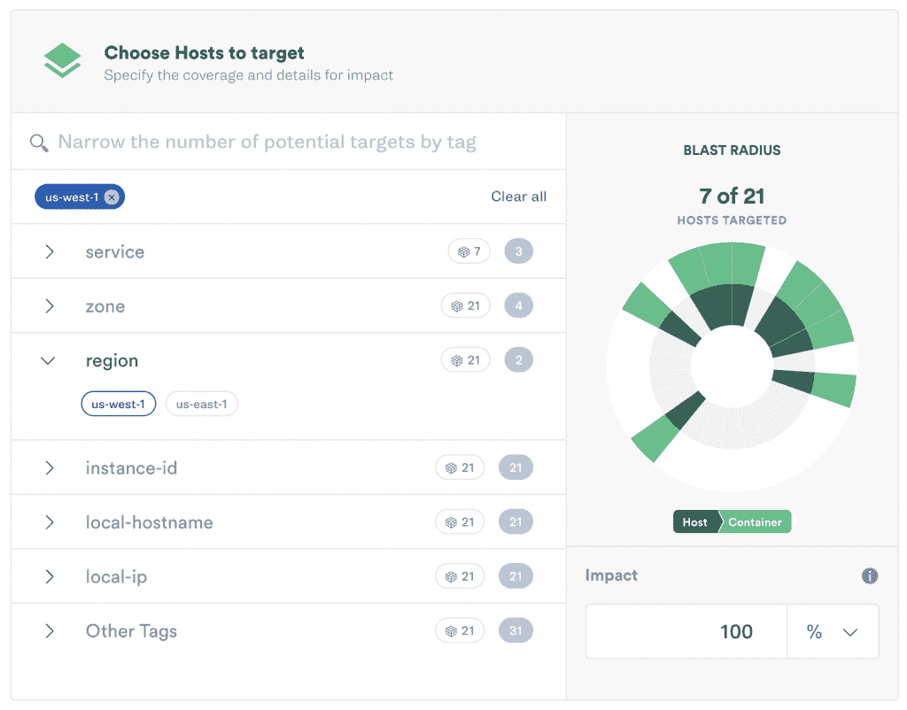
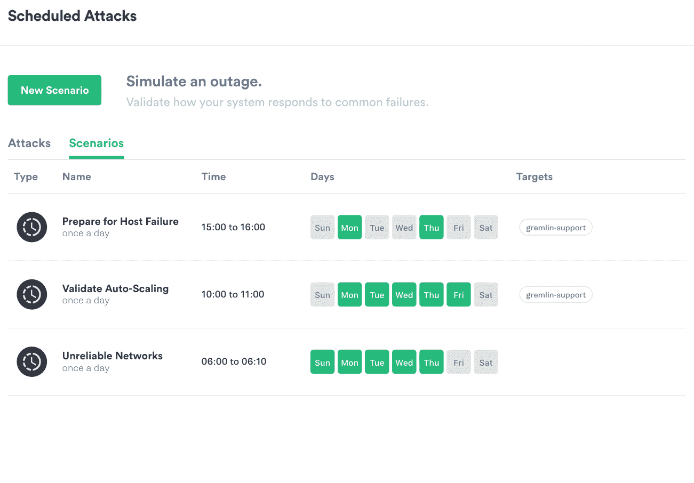

# Gremlin 的场景模拟了混沌工程的常见中断

> 原文：<https://thenewstack.io/gremlins-scenarios-simulate-common-outages-for-chaos-engineering/>

有两件事似乎可以激励开发人员——快速、不言自明的入职体验和一点友好的竞争。当然，Gremlin chaos 作为一个服务的新场景功能似乎勾选了两个框。

周四在该公司的 [Chaos Conf](https://www.chaosconf.io/) 用户会议上推出的场景功能，允许客户测试他们的系统承受常见云中断场景的能力。网站可靠性工程师的六个“推荐场景”运行在该公司的混沌测试托管服务上，模拟真实世界的网站和软件故障。从流量峰值到不可靠的网络，每个模板都基于一个非常公开的真实世界的中断。

### 混沌工程入门

[混沌工程](/chaos-engineering-can-give-distributed-systems-stability/)有工程师模拟应变注入分布式系统。这种为最坏的情况做准备的最佳实践允许团队了解系统的弱点并做好准备。

Gremlin 的产品总监 [Lorne Kligerman](https://twitter.com/lKlig) 说，不断增长的 Gremlin 团队现在有近 100 人，由前 FAANG(脸书、苹果、亚马逊、网飞和 Alphabet 的谷歌)工程师组成，他们曾经在亚马逊、谷歌和网飞等公司进行混沌测试。

场景的想法来自他们以前混乱的生活，以及客户成功和开发人员的支持。“我们知道今天事情会失败。我们知道事情在未来会失败——系统是如此复杂。但你知道它会怎样失败吗？”克利格曼说。"工业正从为什么混沌工程转向我们如何去做？"

场景的出现是为了给 Gremlin 客户提供即时价值，包括那些免费增值层的客户。这是一种开始混沌工程的方式，专注于“真正影响你公司的事情”

“有了 Gremlin 功能，你可以做很多定制的事情——但我们的许多客户刚刚开始使用混沌工程，他们希望立即获得价值，并以一种简单的方式开始，”Kligerman 说。

这六个用例是团队成员在他们以前的工作中最常发现的增强系统用例，它们困扰着他们的客户，尤其是在电子商务领域。

对于每个场景，您可以编写描述和假设，如果检测到事故，还可以编写笔记和观察结果。每个场景都有一个复选框，记录:

*   预期的结果是什么？
*   是否检测到事故？
*   事件是否得到缓解？

您运行所有推荐的错误，发现问题，修复它们，然后再次运行。通常，您会将场景设置为每天或每周运行，以避免回归。

### 头条新闻中断

Kligerman 说，构建场景是为了“能够防止您的业务和应用程序发生真正常见的停机，这样您的客户就不会受到影响。”

这个版本提供的六个模板是真实世界的中断，您可能已经在新闻中看到过。每篇文章都聚焦于公司向云或分布式系统迁移时所面临的共同挑战。

1.  **不可用依赖**——早在六月美国百货巨头[塔吉特百货公司就遭遇了这种情况，当时所有的收银机都停机了。这个场景在 API 调用停止响应时复制了这个错误。](https://edition.cnn.com/2019/06/15/business/target-register-outage-trnd/index.html)
2.  **不可靠的网络**——微服务架构的日益流行意味着对频繁且响应迅速的 API 调用的依赖。当您的系统所连接的 API 需要更长时间来响应时，您的系统会如何响应？
3.  交通高峰也被称为网络星期一的噩梦。还是[去年的质数日](https://www.theverge.com/2018/7/16/17577654/amazon-prime-day-website-down-deals-service-disruption)。该场景允许开发运维团队在选定的主机上将 CPU 负载从 10%逐步增加到 100%。它帮助您规划异常高的流量、微调阈值和测试故障转移架构。
4.  **区域疏散** —当你依赖于谷歌云平台或亚马逊网络服务等托管服务，而网络连接被切断时，你的服务会故障转移到最近的区域吗？最近这种情况发生在劳动节，AWS 美国东部 1 区的[停电不仅烧毁了一些硬件，还导致一些客户数据丢失。](https://www.theregister.co.uk/2019/09/04/aws_power_outage_data_loss/)
5.  **主机故障** —如果您的一台主机变得不健康，或者您正在缩减规模并且不再使用它，会发生什么情况？这个场景将自动执行失败，这样您就可以了解您的系统如何对向上和向下扩展做出反应。
6.  **混乱场景#6: DNS 中断**——很多互联网只是有时不可用。Kligerman 说，许多公司没有二级 DNS 提供商，也没有将 DNS 缓存在任何地方。

目标主机故障。

许多这样的停机例子都与财富 100 强企业有关，但是 Kligerman 警告说，小公司和大公司一样需要自动化的混沌工程。

“一切都是如此相互关联。每个人都在使用如此多的托管服务，如此多的 SaaS 产品。"

他接着说，较小的公司通常会依赖分布式产品来提供每项服务。无论他们使用的是身份认证、存储、流等，他们自己都没有构建很多，这可能会使他们更容易受到这些中断的影响。

### 混沌共享

除了今天发布的六个推荐场景，Gremlin 还提供定制场景，公司可以在其他中断后进行建模。

场景还可以让你将攻击连接成一个链，鼓励增量增长，并结合爆炸半径和任何攻击或失败的规模。Kligerman 说:“我们教授的实践是逐渐增加爆炸半径——增加更大的攻击强度。

他说许多人——可能是因为名字的缘故——认为混沌工程实验是随机的。没有什么比这更偏离事实了。

“我们相信一种更深思熟虑的方法，包括创建一个假设，从小处着手，逐渐增加爆炸半径，直到你觉得你的系统对特定的故障模式或场景具有弹性，”Kligerman 解释说。

未来，Gremlin 可能会为用户建立一个共享自定义场景的机制。Kligerman 说，最终目标是建立“一个完整的生态系统，在这个系统中，每个人都互相帮助，变得有弹性。”

<svg xmlns:xlink="http://www.w3.org/1999/xlink" viewBox="0 0 68 31" version="1.1"><title>Group</title> <desc>Created with Sketch.</desc></svg>