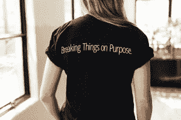
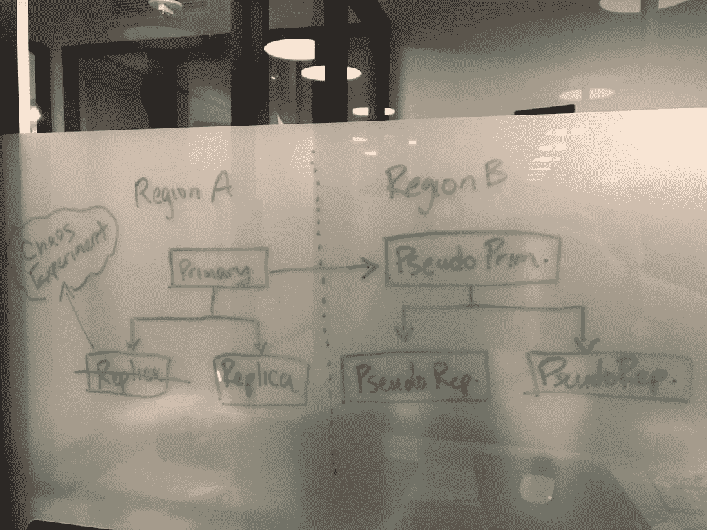

# Gremlin 的 Tammy Bütow 在混沌工程的商业方面

> 原文：<https://thenewstack.io/gremlins-tammy-butow-on-the-business-side-of-chaos-engineering/>

早在网飞和它的[扔便便猴子](https://github.com/Netflix/chaosmonkey)给它命名之前，塔米·比托就在做[混沌工程](https://thenewstack.io/chaos-engineering-can-give-distributed-systems-stability/)。大约十年前，她在一家银行的一个团队中工作，该团队执行灾难恢复测试。但是，不是连续的自动化测试，而是四分之一的时间里数百人挤在一个房间里，用厨房的水槽砸他们的系统。这在过去和现在都是对大多数银行执照的要求。

过去十年发生了很多变化，当 Bütow 坐下来与新的堆栈交流时，她有很多智慧可以传授。首先，在我们分享更多来自《混乱女王》的建议之前，让我们总结一下她丰富的“一劳永逸”的经历。

> “它(你的系统)会崩溃。你不能认为它永远不会断。不如在受控混乱中先破之。”—塔米·布图

2009 年，Bütow 第一次有目的地打破了澳大利亚国家银行(NAB)的抵押贷款系统，对此他非常激动。

“通过打破系统，你很快就会知道你需要修复什么，”她说。“你知道学习是可以的——这并不可怕”,或者试图摧毁你已经建立起来的东西太冒险了。

事实上，混沌工程——对你的分布式系统进行实验，找出并修复它的弱点——是增加你发布的软件的正常运行时间、可靠性、速度和安全性的最好方法之一。

2014 年，NAB 部署了 Chaos Monkey，然后全天候杀死他们的服务器，这[成为了科技新闻](https://www.itnews.com.au/news/nab-deploys-chaos-monkey-to-kill-servers-24-7-382285)，因为[随叫随到的开发人员](https://thenewstack.io/call-rotations-best-wake-devs-middle-night/)开始睡个好觉。从网飞借来的开源混沌猴(Chaos Monkey)工具给了他们信心，因为他们大规模迁移到亚马逊网络服务，并且仍然实现了警报的减少。

2015 年，Bütow 前往美国，加入了数字海洋的一个名为 Tank 的特别任务小组，以减少事故。然后，她加入 Dropbox，担任站点可靠性工程(SRE)经理，负责混沌工程，五名工程师管理着 6000 多台运行 SQL 的数据库机器。

Bütow 说:“你在很大程度上自动化了一切，但你也真的想减少事故的发生。”在实施混沌工程后，事故减少了十分之一。

最后，去年她加入了第一家致力于混乱即服务的公司 [Gremlin](http://gremlin.com) 。它比混沌猴更进一步，混沌猴只是随机测试一次终止一个系统，gremlin 释放 Gremlin 代理在您的机器上或您的容器内。

“那些小淘气的实验会帮助你发现你系统中的弱点，”她在制作中解释道。

## 采用混沌工程前*要做什么*

我们已经写过[混沌工程是如何在分布式系统中建立稳定性的有效方法](https://thenewstack.io/chaos-engineering-can-give-distributed-systems-stability/)。但是如何开始呢？Bütow 警告不要直接跳入这个闪亮的东西，并为你在跳跃攻击之前需要做的事情提供建议。

从一个专门构建可靠系统的人的角度来看，她已经确定了在采用混沌工程之前你需要做的一些事情。

> “我认为每个人都应该使用混沌工程，但他们需要提前做好准备。”—塔米·布图

### 混沌工程必备#1:一个非常好的事故管理程序

如果你没有一个真正好的事故管理计划，你将会发现你不能发现的事情。Bütow 曾在许多没有这种能力的地方工作过，他说，这种能力必须包括“检测、诊断和减轻影响客户的严重事故的能力。”

她继续说，“我的整个目标是，如果你有一个非常好的方法来管理事故，你应该有一个非常快[平均时间来检测(MTTD)](http://kpilibrary.com/kpis/mean-time-to-detect-mttd-2) 。”

这只能通过自动化来实现，在你的团队最熟悉的工具集中用一个工具来检测和通知，通常集成在 Slack 和吉拉中。

“你需要某种警报，知道正在发生的事情，以便能够在不到五分钟的时间内检测出为什么会发生这种情况，这真的很难，除非你自动化它，”Bütow 说。

### 混沌工程必备#2:真正好的监控到位

有一些好的监控。这应该是符合逻辑的，但是您不仅需要知道问题何时发生以及谁将修复它，还需要知道到底发生了什么。

Bütow 说，没有监控“你就没有办法跟踪弱点，你的混沌工程可能会显示你有问题，但如果没有良好的监控，你实际上不会知道问题正在发生。

### 混沌工程必备#3:对业务(和财务)影响的好主意

在进行任何混乱测试之前，要知道它对业务的影响。这触及了我们在新堆栈中所写的许多事情的症结所在— [文化、技术和商业目标在这里相遇](https://thenewstack.io/author/jennifer-riggins/)。混沌工程不能孤立于开发者。在采取这种恢复行动之前，尝试找出不这样做的风险，特别是停机时间的成本，直到违反服务级别协议和失去客户。

“我注意到人们发现很难做到的另一件事是能够显示事件的业务成本和客户相关成本，”Bütow 解释说。

如果停电八小时，真实成本是多少？停电两天？

她说这完全取决于你的公司。你有免费增值模式还是付费模式？如果你提供的服务是你的客户付费的，他们希望这项服务能够正常运行。你有多少顾客？如果发生这种情况，服务会中断多长时间？那又怎么样？

Bütow 举了一个航空订票系统的例子。这不仅仅是新门票销售的损失，而是重新预订每个人的成本，住宿，食品和饮料券，以及对一个受损品牌的信任的损失。去年英国航空公司停机 10 小时——他们估计这意味着[800 亿英镑的收入损失](https://uk.reuters.com/article/uk-iag-ceo/british-airways-ceo-puts-cost-of-recent-it-outage-at-80-million-pounds-idUKKBN1961GQ)。

“困难的是没有快速简单的方法来衡量停机的成本，”Bütow 承认。

首先，也是最重要的，是让财务部门和你的 SRE 团队坐在一起。

她还呼吁行业分享如何衡量影响的故事。她甚至监控着致力于混沌工程的松散社区[。](http://gremlin.com/slack)

> "从混沌工程中获得最大价值的公司明白停机时间的代价."—塔米·布图

“当你做混沌工程时，最重要的是专注于你的客户所面临的关键服务，”她说。“我真的认为，公司应该首先将它推广到他们最重要的面向客户的服务中。”

使用混沌工程所做的一切都是为了减少停机和事故。当你发现这些事情的商业影响时，Bütow 说，你将开发分类——她称之为 SEV-Zeros，首先关注最严重的灾难性事件，然后，一旦你解决了这些事件，就转向 SEV-2，这使你的公司花费更少，但可能仍然让开发人员夜不能寐。

## 混乱的白板

Gremlin 组织新客户的游戏日，包括技术和金融客户。Bütow 说，花一个小时在一个有白板的房间里——画出你的系统，然后问如果这个或那个坏了会发生什么，然后问下游会发生什么——是可视化你的系统和规划你的混沌工程的一个好方法。

她说要遵循爆炸半径——从小处开始，逐渐扩大。

“只要花一个小时试着坐在那里把它画出来，你就能对一个系统了解很多，”Bütow 补充道。

## 接下来，持续的混乱

去年 12 月推出的 Gremlin 软件比网飞的混沌猴走得更远。它仍然检查事情是否发生，但它也允许您攻击其他可能损害您的系统和底线的常见问题，如延迟和固件错误。Gremlin 的“混沌即服务”持续不断地向您的系统发起 11 种不同类型的攻击，从资源攻击到状态攻击和网络攻击，因此您可以创建有效的备份计划。在 Gremlin 中，您可以自定义时间和通话量，默认为每 60 秒打一次电话。您可以使用预先构建的模板攻击或创建自己的攻击。

Bütow 将 CPU 资源消耗称为混沌工程的“Hello World”。她声称这比关机攻击要好，因为人们可能会发现这种攻击势不可挡，而且人们通常没有自动替换实例的能力。

她举了一个在数据库上使用混沌工程的例子，就像她在 DropBox 工作时一样。那家公司有一张母版，下面有三张复制品。如果她关闭一个数据库，一个新的副本被创建，一个克隆作为一个副本出现，所以同样会有一个主服务器和两个副本。如果关闭主服务器，副本服务器将升级为主服务器。

“人们只习惯于关闭来自混沌猴的攻击。有各种各样的攻击，这就是为什么我们为人们预先构建了这些攻击，以便他们可以进入并运行它们，并查看对基础架构的影响。”Bütow 说。

> "设计系统时，从一开始就要考虑到失败."—塔米·布图

通过自动化这种持续的混乱，您可以持续地改进系统。Bütow 说，这是通过优先考虑安全和安保的价值来实现的，只有这样，你才能以可控和优雅的方式推出混沌工程，你才能真正确保你在测试正确的东西。

<svg xmlns:xlink="http://www.w3.org/1999/xlink" viewBox="0 0 68 31" version="1.1"><title>Group</title> <desc>Created with Sketch.</desc></svg>