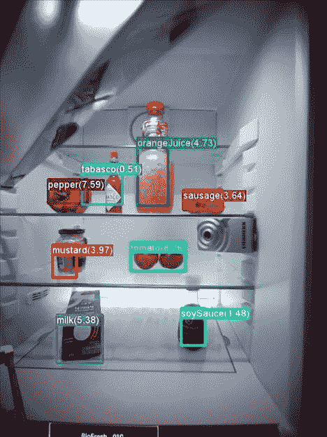

# 杂货观察冰箱加入物联网

> 原文：<https://thenewstack.io/grocery-watching-refrigerators-join-internet-things/>

微软是一项新计划的一部分，该计划旨在制造一种能监控你的食物的联网冰箱，这样它就能自动建议更新你的购物清单。瑞士设备制造商利勃海尔正在为冰箱开发一种通过互联网通信的模块。但它是微软的深度学习技术，将识别里面储存的杂货…

冰箱内置的摄像头将会监视你的食物，让你最终使用云的力量来访问你的杂货快照。但更重要的是，微软的技术也将使用这些相同的照片来自动生成你冰箱中当前储存的食品清单，这在你创建下一个购物清单时是特别有用的信息(利勃海尔也为此创建了一个应用程序)。微软的数据科学家已经使用数百万种不同的通用食品，使用该公司开源的[计算网络工具包(CNTK)](https://www.cntk.ai/) 的算法，训练了他们的杂货识别算法。

“微软系统可以从示例图像中学习识别新类型的物体——牛奶盒、番茄酱瓶、泡菜罐等等……”[在微软的“机器学习和 Cortana 智能”博客](https://blogs.technet.microsoft.com/machinelearning/2016/09/02/microsoft-and-liebherr-collaborating-on-new-generation-of-smart-refrigerators/)中解释道。

“虽然当前的系统是一个原型，但它使用的深度学习技术已经非常强大，并且正在迅速成熟，”该网站解释道。

“其他冰箱有能力让你远程窥视内部，但微软的数据科学团队直接与利勃海尔合作开发了这款原型，制造了一款学习型冰箱，它不会强迫你在购物时依靠你可怜的人眼通过不良的蜂窝连接看着模糊的图像来掷骰子，”TechCrunch 断言，警告不要太兴奋。“冰箱现在只是一个原型，所以你现在只能用你那没受过教育的白痴产品冷却箱了。”

这款冰箱在柏林的 IFA 消费电子展上进行了演示，它带有一个内置在前门的 27 英寸 Windows 10 平板电脑，它还可以变成半透明的，这样你就可以偷看里面的杂货了。(这样你就不用麻烦*开门*了……)

三星实际上已经在 5 月展示了一款类似的设备，它带有一个内置在门上的巨大触摸屏——和一个万事达卡应用程序，可以让你直接从冰箱门上订购新鲜食品(或通过智能手机上的应用程序)。它还在冰箱门上安装了摄像头，可以在门上显示冰箱内的图像*。当然，它也运行所有标准的平板电脑应用程序——所以你可以通过 Pandora 听音乐，看视频，甚至用指尖在冰箱门上画画。它甚至对语音命令做出反应。*

[https://www.youtube.com/embed/LgJlJmrhQMY?feature=oembed](https://www.youtube.com/embed/LgJlJmrhQMY?feature=oembed)

视频

但是，消费者将如何应对这个勇敢的厨房电器新世界呢？一位 TechCrunch 的评论者想象了一个虚拟现实杂货店(没有线)，在那里，食品杂货由一辆自动驾驶汽车运送，该汽车由家庭库存系统自动订购。另外两位评论者对这款冰箱的实际“智能”程度仍持怀疑态度。“当它变成各种颜色的绒毛时，它能分辨出冰箱后面被遗忘的意大利面容器是什么吗？”

网络上也有类似的反应，有富有远见的新想法，也有最坏的情况。在 Reddit 的“微软”论坛上，有人想知道这是否会最终导致一个电器成为下一个主要平台的世界。“如果有足够多的硬件运行相同的生态系统，那么如果第三方开始发布使所有硬件更具吸引力的应用程序，我不会感到惊讶……”

但是 Reddit 技术论坛的评论者想象了一个更加反乌托邦的未来。
 *冰箱:“嗨！看起来你的牛奶快没了？你想要我为你多订购一些吗？冰箱:“你想要多少加仑？
(狗又叫了起来)
冰箱:“我已经按你的要求多点了牛奶。2147483648 加仑牛奶明天会送到。您的美国运通卡已被扣款！”*

* * *

# WebReduce

<svg xmlns:xlink="http://www.w3.org/1999/xlink" viewBox="0 0 68 31" version="1.1"><title>Group</title> <desc>Created with Sketch.</desc></svg>