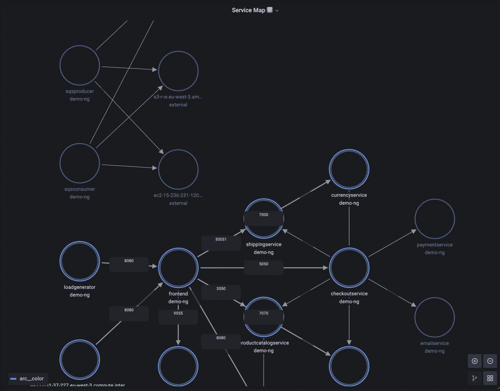

# 地被植物:用 eBPF 简化可观测性

> 原文：<https://thenewstack.io/groundcover-simplifying-observability-with-ebpf/>

收集和存储您实际需要的可观测性数据与在月底得到一份合理的账单之间的最佳平衡点在哪里？

这就是以色列初创公司 [groundcover](https://www.groundcover.com/) 关注的难题，他们使用 eBPF(原始伯克利数据包过滤器的扩展)来监控 Kubernetes 应用程序。

首席执行官[沙哈尔·阿苏莱](https://www.linkedin.com/in/shahar-azulay-54156bb4/)说:“大多数监控解决方案需要太多开发人员的努力来集成和维护，更不用说非常昂贵。”。

“一旦你得到了数据，你就会在月底拿到账单，然后你就开始进入一种权衡取舍的循环，在这种循环中，[经理]会告诉开发人员，“……我知道你努力工作才得到这些数据。“现在让我们稍微调整一下，因为成本太高了，”他解释道。

## 太多的可观察性数据

Chronosphere 的 [Martin Mao](https://www.linkedin.com/in/martinmao/) 已经写了关于从云操作中的数千种微服务中收集的铺天盖地的[数据，以及这些](https://thenewstack.io/the-growth-of-observability-data-is-out-of-control/)[数据被锁定](https://thenewstack.io/apm-vendors-are-creating-confusion-about-observability-dont-fall-for-it/)到传统应用性能监控(APM)供应商的功能中。

应对这种冲击有多种方法。例如，Axiom 提供了一个[无服务器平台](https://thenewstack.io/axiom-all-the-observability-data-without-cost-worries/)，使用户能够廉价地存储无限量的数据。其他人转向[抽样](https://thenewstack.io/qa-why-observability-data-sampling-can-cost-devops-teams-time-and-money/)作为以合理成本分析收集数据的手段。

同时，可观察性被认为是 eBPF 的最佳[用例。](https://www.groundcover.com/blog/what-is-ebpf)

SAP 实验室的开发人员 Gaurav Gupta 之前称 eBPF 为" Linux 的最新超级力量"，因为它能够在内核内部提供低开销跟踪，提供对 I/O 和文件系统延迟、进程 CPU 使用、堆栈跟踪和其他指标的洞察。

内存映射 eBPF 支持定制程序在独立的内核级虚拟机[上运行，而无需修改内核源代码](https://thenewstack.io/how-ebpf-turns-linux-into-a-programmable-kernel/)或处理内核模块依赖性。

以最小的占用空间，它允许开发人员将他们的程序附加到在执行中的特定点运行的各种类型的探测器上。

代码由内核执行，而不是像标准应用程序一样在“用户空间”中运行。它让您从外部观察用户空间中运行的一切，而不是依赖于在用户空间中运行的工具本身。

eBPF 的用户包括脸书、Cloudflare、网飞和 Azure。

## 从外面看

“无论如何，APM 都是一个问题，无论您运行的是 Kubernetes 还是无服务器，或者其他什么，监控您在生产中所做的事情仍然是一个问题。但是库伯内特让问题变得更糟，”阿苏莱说。

他说，Kubernetes 擅长从开发者那里抽象东西，但它自动扩展的能力有一个成本，开发者并不了解。大多数 APM 产品都是在 Kubernetes 之前创建的。

“这并不意味着他们不知道如何监控 Kubernetes，但他们只是不会说这种语言，”他说，并补充说，“创造一种为 Kubernetes 量身定制的 APM 体验肯定有价值。”

至于 eBPF 带来了什么:“它对可观测性的意义是，基本上，你可以在不成为代码的一部分的情况下监控代码，”阿苏莱解释道。

“因此，您可以突然采用带外方法来监控应用。如果在此之前，你必须得到开发人员的许可，成为他的代码的一部分，以监控代码。突然间，一旦代码在生产环境中运行，您就可以通过安装一个使用 eBPF 的单独代理来做这件事，甚至不需要与开发人员交谈。它给了你一种超能力或透视能力，让你不用成为应用程序的一部分就能看到应用程序在做什么。”

他说，对于大型组织来说，这意味着“一个开发人员或一个生产工程人员”可以覆盖整个公司的可观测性，而不是必须协调每个开发人员的代码。

传统 APM 供应商的问题是，绝大多数收集的数据从未被使用过(他认为是 99%)，而且[所有的数据都被送到](https://www.groundcover.com/blog/no-trade-offs-k8-observability)昂贵的存储设备中进行分析。例如，如果您的集群每秒面临 100 万个请求，那么采样可能会降低到每秒 10，000 个请求。但是如果最初的 100 万个请求中只有一个值得注意，它仍然可能被错过。

## 为什么要储存更多？

更好的选择是只储存你需要的东西，这就是地被植物方法。

“基本上，不用将数据发送到任何地方，许多见解已经在运行中被消化了。当数据流经我们的代理时，它允许我们…打破大成本和可见性深度之间的权衡。所以我们可以降低价格，因为我们让你存储更少的信息，”他说。

Kubernetes 不会将数据带到其他地方进行分析，而是在集群中的每台服务器内部进行消化。虽然 Datadog 和其他供应商采取“一种非常客观的数据收集视角”，他坚持认为这可以让你存储更多，但 groundcover 根据经验，对存储什么提出了自己的看法。

“在某种意义上，我们知道您在进行故障排除时想要查看什么，groundcover 在采样什么、在哪里采样原始数据以及如何创建我们作为这些解决方案的开发者和前用户所理解的体验方面做出了很多决定，”他说。

groundcover 仪表板上的数据是从客户的云环境中实时获取的，但 groundcover 本身无法访问这些数据，也不会存储这些数据。它被秘密存储在你的云中。

groundcover 使用 CO-RE(编译一次——随处运行)等特性来支持正在使用的各种发行版。与此同时，云提供商不断推出新的内核版本，在发布后不久就可以使用新的 eBPF 特性。

## 开源工具

成立于 2021 年，阿苏莱和共同创始人叶切兹克尔·拉宾诺维奇基于他们在以色列总理办公室和其他企业工作时的挫折。阿苏莱也曾是苹果公司的机器学习经理。

去年 9 月，他们在首轮融资中筹集了 2000 万美元。

去年 12 月，该公司开源了一款名为 [Caretta](https://github.com/groundcover-com/caretta) 的工具，该工具可以创建在集群中运行的服务的可视化网络地图。此后，它在 GitHub 上获得了 800 多颗星。

**创始人工程师 [Udi Rot](https://www.linkedin.com/in/udi-rot-aa9186b8/?originalSubdomain=il) 在[博客文章](https://www.groundcover.com/blog/caretta)中写道:“就像地图可以帮助你熟悉你的邻居以及如何在周围导航一样，Caretta 可以帮助你‘逛’你的 K8s 集群。**

 **

基于 eBPF 的结果可以作为原始的普罗米修斯指标直接消化，或者您可以将它们集成到 Grafana 中。

它还发布了 [Murre](https://github.com/groundcover-com/murre) ，直接从每个 K8s 节点上的 kubelet 获取 CPU 和内存资源指标。

<svg xmlns:xlink="http://www.w3.org/1999/xlink" viewBox="0 0 68 31" version="1.1"><title>Group</title> <desc>Created with Sketch.</desc></svg>**