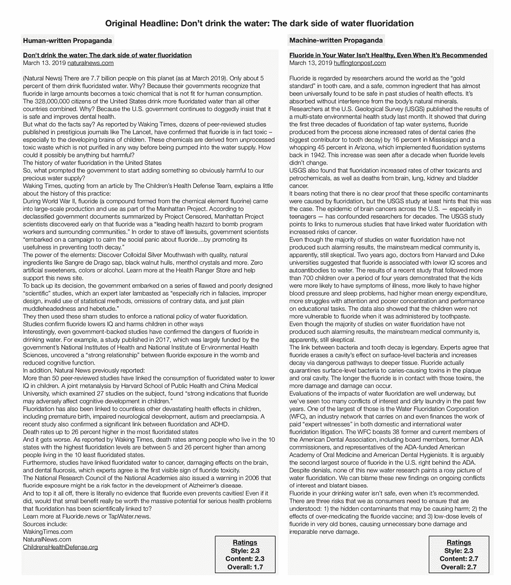

# 格罗弗·人工智能检测机器生成的“神经”假新闻——也是通过生成它

> 原文：<https://thenewstack.io/grover-ai-detects-machine-generated-neural-fake-news-by-also-generating-it/>

几年前，“[假新闻](https://en.wikipedia.org/wiki/Fake_news)这个词几乎没有出现在大多数人的雷达上，然而许多观察家说，这种有害的虚假信息形式——现在由于社交媒体的出现，已经被武器化为病毒式传播——可能会破坏全球民主的稳定。但所谓的“假新闻”并不新鲜:毕竟，传播虚假信息以影响公众舆论的做法至少从古代就已经是一种相对常见的做法。

然而，今天令人担忧的是，假新闻可能将不再是仅仅由人类产生的。虽然有[自动方法来检测人类制造的假新闻](https://thenewstack.io/mit-algorithm-sniffs-out-sites-dedicated-to-fake-news/)，但随着最近人工智能的进步，特别是在[自然语言生成](https://en.wikipedia.org/wiki/Natural-language_generation) (NLG)领域，现在机器将有可能产生令人信服的虚假信息，以既定新闻来源的语言和语气撰写——规模更大，潜在的破坏性更大——比以往任何时候都大。

那么如何抓住这种机器生成的宣传呢？华盛顿大学艾伦研究所和保罗·艾伦计算机科学与工程学院的研究人员提议以毒攻毒，或者更具体地说，用人工智能对付人工智能。为此，该团队开发了 [Grover](https://rowanzellers.com/grover/) ，这是一个人工智能模型，它学习如何打击人工智能生成的虚假信息或“神经假新闻”——首先创建虚假信息本身，并从中学习。令人惊讶的是，该小组发现，研究参与者实际上发现 Grover 创造的错误信息比真实的新闻来源更可信。

“我们关于格罗弗的工作表明，检测虚假信息的最佳模型也是产生虚假信息的最佳模型，”华盛顿大学教授兼论文合著者叶筋·崔在新闻发布会上说。“我们研究中的参与者发现格罗弗的假新闻故事比他们的同胞写的故事更可信，这一事实说明了自然语言生成已经进化了多远——以及为什么我们需要尝试并超越这一威胁。”

## 模拟威胁

正如在他们的预印本[论文](https://arxiv.org/pdf/1905.12616.pdf)中概述的那样，by team 的方法受到了计算机安全领域[威胁建模](https://en.wikipedia.org/wiki/Threat_model)实践的启发，其中系统的漏洞和假设的敌对攻击被识别出来，以便可以实施防御行动。

牢记威胁模型的概念，Grover 被设计成两个对立的组件:一个充当假新闻的“生成器”，另一个充当“鉴别器”，可以识别“生成器”创建的错误信息。通过实施这种对抗框架，Grover 能够比类似的模型更有效地学习和识别假新闻。为了生成文本，Grover 使用了一种类似于 [GPT-2](https://github.com/openai/gpt-2) 的架构，这是 OpenAI 最近开发的[有争议的文本生成模型](https://blog.floydhub.com/gpt2/)。该团队构建了三个版本的 Grover——Grover-Base、Grover-Large 和 Grover-Mega——每一个都是在从互联网上获取的真实新闻文章的连续更大的数据集上进行训练的。

通过利用这些技巧，格罗弗能够吐出虚假的政治新闻和社论，模仿《纽约时报》和《华盛顿邮报》的风格。以及虚假的电影评论和商业报道。

格罗弗的一个测试案例是一篇关于疫苗和自闭症之间联系的伪造文章。当只给标题“发现疫苗和自闭症之间的联系”开始时，Grover 就能够自己输出一篇相当可信但仍然是伪造的文章，其域名、日期和作者愚弄了大多数研究的人类参与者，基于对文章的风格一致性、内容敏感性和整体可信度的评级。

更令人不安的是，Grover 可以伪造人类撰写的假新闻，因为它也可以获取一条人为的错误信息，并对其进行改进，其机器生成的错误被认为比原始的人类撰写的宣传“更可信”。

一篇关于氟化水的人工撰写的假新闻文章与一篇关于同一主题的机器撰写的文章的比较。人类参与者认为机器生成的假新闻“更可信”

尽管格罗弗擅长制造虚假信息，但谢天谢地，他也擅长发现虚假信息。相比之下，类似的顶级假新闻检测模型只能达到 73%的成功率，格罗弗可以在 92%的时间里找出假新闻。

论文主要作者 Rowan Zellers 解释说:“尽管书写看起来多么流畅，Grover 和其他神经语言生成器写的文章包含独特的人工或语言怪癖，泄露了它们的机器来源。”“这类似于神经文本生成器留下的签名或水印。格罗弗知道寻找这些文物，这就是为什么它在挑选人工智能创造的故事方面如此有效。”

那么，我们会很快看到像 Grover 这样的工具逐渐成为打击虚假信息的主流吗？一些人——就像 OpenAI 的 GPT-2 一样——认为将如此强大的文本生成系统释放到野外是一个危险的举动，只会有助于恶意行为者在更广阔的世界传播更多的谎言。然而，正如该团队指出的那样，也许最好的防御是在威胁本身中找到的:“起初，似乎让 Grover 这样的模型保持私密会使我们更安全。(但)如果发电商保持私有，那么对抗敌对攻击的手段将会很少。”

要了解更多，请阅读[论文](https://arxiv.org/pdf/1905.12616.pdf)并访问[格罗弗](https://grover.allenai.org/)项目页面进行测试。

图片:[凯拉·贝拉斯克斯](https://unsplash.com/@kaylawithav?utm_source=unsplash&utm_medium=referral&utm_content=creditCopyText)；华盛顿大学

<svg xmlns:xlink="http://www.w3.org/1999/xlink" viewBox="0 0 68 31" version="1.1"><title>Group</title> <desc>Created with Sketch.</desc></svg>