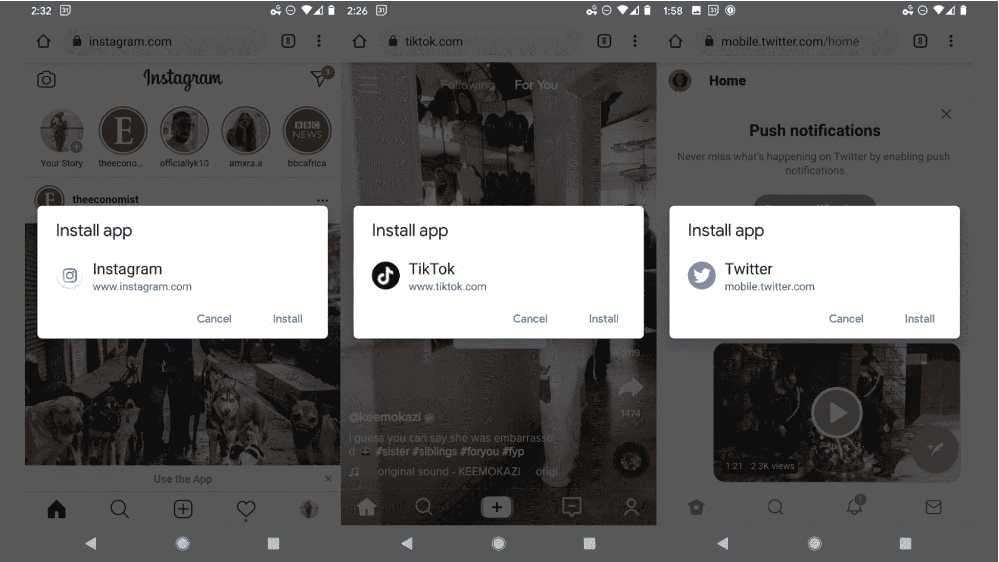
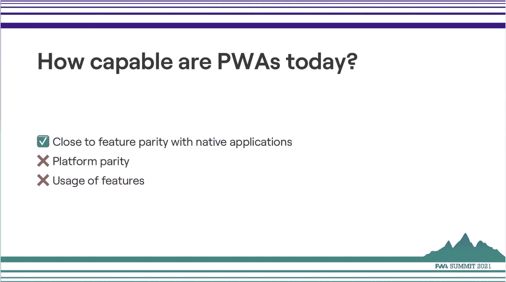
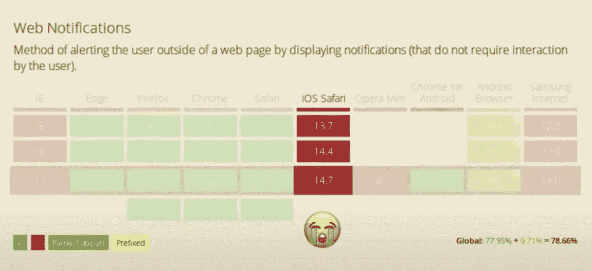

# 网络应用与本地应用:渐进式网络应用的发展

> 原文：<https://thenewstack.io/growth-of-progressive-web-apps/>

 [理查德·麦克马努斯

理查德是 New Stack 的高级编辑，每周撰写一篇关于网络和应用程序发展趋势的专栏文章。此前，他在 2003 年创立了读写网，并将其打造为全球最具影响力的科技新闻和分析网站之一。在 Twitter @ricmac 上关注他。](https://twitter.com/ricmac) 

本月早些时候，PWA 峰会作为一项为期一天的在线活动播出。尼日利亚公司 Helicarrier Studio 的联合创始人兼首席运营官 Ire Aderinokun 在[的一次演讲中表示，PWAs(渐进式网络应用)在过去几年中取得了重大进展。Aderinokun 认为，就其功能、可靠性和可安装性而言，pwa 已经可以被视为本地应用的可行替代方案。](https://www.youtube.com/watch?v=qbh_u2hvIjg&t=880s)

正如我在一月份的专栏[中解释的那样](https://thenewstack.io/was-parler-really-a-progressive-web-app/)，术语 PWA 是由 Google 在 2015 年创造的[，用来描述可以在现代网络浏览器上运行的增强型网络应用。从技术上讲，PWA 只是一个网站，但它经过优化，在浏览器中运行时看起来和感觉上都像一个原生应用程序。PWA 可以跨桌面和移动浏览器工作(例如，我在我的桌面电脑上使用 Twitter 的 PWA 版本)，但该技术在移动设备上尤其强大。为什么？因为安装一个 PWA 会绕过 App Store 模型和所有围绕它的问题(苹果 30%的分成，等等。)](https://developers.google.com/web/updates/2015/12/getting-started-pwa)

发明 pwa 的原因是，在 2015 年，原生应用远远超过了移动浏览器功能。那时，网络有可能在主流智能手机平台(iOS 和 Android)上变得无关紧要。谷歌尤其担心这一点，因为它曾经(现在仍然)拥有市场领先的网络浏览器 Chrome。因此，从某种意义上来说，本地应用确实阻碍了网络的发展——正如 Aderinokun 的一张巧妙的幻灯片所示。

## 能力

正如 Aderinokun 解释的那样，浏览器的功能赶上 PWAs 的梦想需要几年时间。PWAs 早期的问题包括缺乏对[服务人员](https://developers.google.com/web/fundamentals/primers/service-workers)的支持(你的浏览器在后台运行的脚本，以实现推送通知和后台同步等功能)，无法将 PWAs 添加到你的主屏幕(就像你可以使用原生应用一样)，以及与 Angular 和 Next.js 等框架的兼容性

但是 Aderinokun 说，到 2021 年，“每个主要的应用程序现在都有一个进步的网络应用程序版本。”

在能力方面，Aderinokun 列举了过去一年来[项目 Fugu](https://www.chromium.org/teams/web-capabilities-fugu) 取得的进展。和很多 PWA 相关的项目一样，Fugu 是在 Google 内部开始的。然而，开源项目现在包括来自微软、英特尔、三星和其他公司的贡献。

Aderinokun 说，也许最令人印象深刻的新功能是 PWAs 可以“真正访问设备”示例包括使用您喜欢的颜色方案、访问您的电话联系人列表，甚至对您设备的本地文件系统具有读/写权限。后者目前仅在桌面版 Chromium 中得到支持，但它仍然相对较新。

Aderinokun 指出，虽然浏览器支持(有一个明显的例外，我很快就会谈到)到目前为止对 PWAs 的支持很好，但对开发人员的支持却很慢。她把这归因于开发者还没有跟上网络的最新能力。“我们对网络的看法需要一个重大转变”，她补充道。

## iOS 问题

关于 pwa 现在的最大担忧是最大的移动平台之一不支持它们:苹果的 iOS。根据 Aderinokun 的说法，iOS 对 PWAs 的支持与五年前相比并没有太大的改善。

pwa 在基于 Chromium 的浏览器上工作得最好，尤其是在桌面上:谷歌的 Chrome，微软的 Edge，以及 Brave 等较小的播放器。Mozilla 的 Firefox 也支持 PWAs，但一般来说没有 Chromium 支持来得快。真正的问题是苹果的 WebKit 浏览器引擎，它不仅是桌面和移动设备上 Safari 的基础，也是其他所有 iOS 浏览器的基础。正如我在上个月的一篇专栏文章中提到的，苹果禁止在 iOS 上使用其他浏览器引擎的决定是[阻碍了网络应用创新](https://thenewstack.io/apples-browser-engine-ban-is-holding-back-web-app-innovation/)——特别是 PWAs 的进步。

## 可靠性和可安装性

Aderinokun 说，可靠性的一个关键问题是服务人员是否为生产做好了准备？她说，答案是肯定的。她引用了一个服务工作者库 [Workbox](https://developers.google.com/web/tools/workbox) 作为对开发者的巨大帮助。近年来，顶级框架也改善了对服务人员的支持。因此，与几年前相比，今天服务人员周围的工具有了很大的改进。

作为一个例子，她指出了 Airbnb 的 PWA 的离线功能，这对于你到达一个地方，但还没有连接到 WiFi 是至关重要的。这是可能的，因为开发人员现在可以使用存储 API。

她还指出，公共福利援助现在更快、更有弹性、更容易获得。

至于可安装性，这已经得到了改进——尽管围绕这一点的用户体验可能会让用户感到困惑。例如，我仔细阅读了说明书，才知道如何在我的 iMac 上安装 Twitter PWA。然而，正如 Aderinokun 指出的,“添加到主屏幕”功能至少现在得到了很好的支持。

## 圣杯:到处都是一样的网

正如 Aderinokun 在她的演讲中所展示的，在过去的几年中，PWAs 在功能、可靠性和可安装性方面都有了显著的提高。如果您仍然希望利用原生应用分发渠道，现在甚至可以将您的 pwa 带到某些应用商店。

与原生应用的功能对等是 PWAs 的最终目标，事实上，现在一些 PWAs 与原生应用的接近程度相当惊人——Twitter 是最明显的例子。正如 Aderinokun 在她的结论中指出的，PWAs 目前面临的最大问题是，iOS 和所有其他平台之间的 PWAs 功能奇偶性明显不同。

“为了让渐进式网络应用程序真正做到两全其美，”Aderinokun 总结说，“网络需要在任何地方都是同一个网络。”

不幸的是，在这一点上，球在苹果的球场上。但至少我们现在知道，PWAs 可以提供本机应用程序的大多数关键功能，并且在分发和可访问性等方面，比本机应用程序有明显的优势。因此，如果 PWAs 最近的进展有任何迹象的话，网络现在处于一个很好的位置。

<svg xmlns:xlink="http://www.w3.org/1999/xlink" viewBox="0 0 68 31" version="1.1"><title>Group</title> <desc>Created with Sketch.</desc></svg>