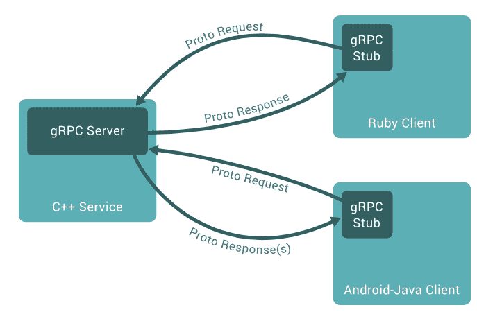

# Google 的 gRPC:一个精简的微服务通信协议

> 原文：<https://thenewstack.io/grpc-lean-mean-communication-protocol-microservices/>

## 首先，远程执行的简短历史

自从工业界发现通过互连机器进行联网以来，对最佳远程通信机制的探索就已经开始了。虽然像 Unix、Windows 和 Linux 这样的操作系统有用于远程通信的内部协议，但挑战在于向开发人员公开一个框架。

在 20 世纪 90 年代，当 TCP/IP 协议成熟成为网络的黄金标准时，焦点转移到跨平台通信，于是一台计算机可以通过某种网络在另一台计算机上发起动作。CORBA、DCOM 和 Java RMI 等技术在核心网络基础设施上创建了一个开发人员友好的抽象层。这些技术还试图促进对客户机/服务器体系结构至关重要的语言无关的通信。

21 世纪初见证了网络的发展，HTTP 逐渐发展成为事实上的通信标准。HTTP 与 XML 的结合为远程通信提供了一个自描述的、语言无关的和平台无关的框架。这种结合导致了 SOAP 和 WSDL 的标准化，保证了各种运行时和平台之间的互操作性。

冲击互联网的下一个浪潮是可编程网络。许多开发人员发现定义为 SOAP 标准的 HTTP 和 XML 的组合限制太多。这是 JavaScript 和 JSON 开始流行的时候。在 Web 2.0 现象中，API 扮演了关键角色，JSON 取代 XML 成为首选的有线格式协议。HTTP 和 JSON 的致命结合产生了一个新的非官方标准，叫做 [REST](http://www.restapitutorial.com/lessons/whatisrest.html) 。SOAP 仅限于要求严格遵守标准和模式定义的大型企业应用程序，而 REST 在当代开发人员中非常流行。

## HTTP、REST 和微服务

由于 JavaScript 框架、Node.js 和文档数据库的兴起，REST 在 web 开发人员中变得非常流行。许多应用程序甚至开始依赖 REST 进行内部序列化和通信模式。但是，对于在相同的上下文、相同的网络、甚至可能是相同的机器上运行的服务之间交换消息来说，HTTP 是最有效的协议吗？HTTP 的便利性伴随着巨大的性能权衡，这将我们带回为微服务寻找最佳通信框架的问题。

进入 [gRPC](http://www.grpc.io) ，谷歌的现代轻量级通信协议。这是一个高性能、开源的通用[远程过程调用](https://www.cs.cf.ac.uk/Dave/C/node33.html) (RPC)框架，可以跨十几种语言在任何操作系统上运行。

在推出的第一年，gRPC 就被 CoreOS、网飞、Square 和蟑螂实验室等公司采用。分布式键/值存储库 CoreOS 的 Etcd 使用 gRPC 进行对等通信。Cisco、Juniper 和 Arista 等电信公司正在使用 gRPC 传输来自其网络设备的遥测数据和网络配置。

## gRPC 是什么？

第一次遇到 gRPC，让我想起了 [CORBA](http://www.corba.org) 。这两个框架都用与语言无关的接口定义语言(IDL)来声明服务，然后生成特定于语言的绑定。



CORBA 和 gRPC 都被设计成让客户机相信服务器在同一台机器上。客户端调用存根上的方法，该方法由底层协议透明地处理。但相似之处也仅限于此。

gRPC 的秘密在于序列化的处理方式。它基于[协议缓冲区](https://developers.google.com/protocol-buffers/docs/overview)，一个用于序列化结构化数据的开源机制，它是语言和平台中立的。类似于 XML，协议缓冲区是冗长的和描述性的。但它们比其他有线格式协议更小、更快、更有效。任何需要序列化的自定义数据类型都将被定义为 gRPC 中的协议缓冲区。

协议缓冲区的最新版本是 proto3，支持 Java、C++、Python、Java Lite、Ruby、JavaScript、Objective-C 和 C#的代码生成。当为特定语言编译协议缓冲区时，它会为每个字段定义提供访问器(setters 和 getters)。

与 REST+JSON 组合相比，gRPC 提供了更好的性能和安全性。它大力提倡使用 SSL/TLS 对服务器进行身份验证，并对客户机和服务器之间交换的所有数据进行加密。

微服务开发者为什么要用 gRPC？它使用 HTTP/2 来支持高性能和可伸缩的 API。使用二进制而不是文本保持了有效负载的紧凑和高效。HTTP/2 请求在单个 TCP 连接上被多路复用，允许多个并发消息在不影响网络资源使用的情况下传输。它使用报头压缩来减少请求和响应的大小。

## gRPC 入门

创建 gRPC 服务的工作流程很简单:

1.  在协议缓冲区中创建服务定义和有效负载结构。原型)文件。
2.  从。原型文件。
3.  用一种支持的语言实现服务器。
4.  创建通过存根调用服务的客户机。
5.  运行服务器和客户端。

为了熟悉 gRPC，我们将用 Python 创建一个简单的计算器服务。它将由 Python 客户端和 Node.js 客户端使用。这些步骤在 Mac OS X 中进行了测试。

您可以克隆 [GitHub 库](https://github.com/janakiramm/gRPC-Tutorial)来访问源代码并在您的机器上构建示例。

## 设置 gRPC

### 配置 Python

```
python  -m  pip install virtualenv
virtualenv venv
source venv/bin/activate
python  -m  pip install  --upgrade pip

```

### 安装 gRPC 和 gRPC 工具

```
python  -m  pip install grpcio
python  -m  pip install grpcio-tools
npm install grpc  --global

```

### 为协议缓冲区、服务器和客户端创建目录

```
mkdir Proto
mkdir Server
mkdir  -p  Client/Python
mkdir  -p  Client/Node

```

### 在 Proto 目录中创建协议缓冲区(Proto/Calc.proto)

```
syntax  =  "proto3";

package calc;

service  Calculator  {

rpc Add  (AddRequest)  returns  (AddReply)  {}
rpc Substract  (SubstractRequest)  returns  (SubstractReply)  {}
rpc Multiply  (MultiplyRequest)  returns  (MultiplyReply)  {}
rpc Divide  (DivideRequest)  returns  (DivideReply)  {}
}

message  AddRequest{

int32 n1=1;
int32 n2=2;
}

message  AddReply{

int32 n1=1;
}

message  SubstractRequest{

int32 n1=1;
int32 n2=2;
}

message  SubstractReply{

int32 n1=1;
}

message  MultiplyRequest{

int32 n1=1;
int32 n2=2;
}

message  MultiplyReply{

int32 n1=1;
}

message  DivideRequest{

int32 n1=1;
int32 n2=2;
}

message  DivideReply{

float f1=1;
}

```

### 生成 Python 客户机和服务器代码，并将其复制到目录中

```
python  -m  grpc.tools.protoc   --python_out=.  --grpc_python_out=.  --proto_path=.  Calc.proto
cp Calc_pb2.py  ../Server
cp Calc_pb2.py  ../Client/Python
cp Calc.proto  ../Client/Node

```

### 创建服务器(Server/Calc_Server.py)

```
from concurrent import futures
import time

import grpc

import Calc_pb2

_ONE_DAY_IN_SECONDS  =  60  *  60  *  24

class Calculator(Calc_pb2.CalculatorServicer):

 def Add(self,  request,  context):
   return Calc_pb2.AddReply(n1=request.n1+request.n2)

 def Substract(self,  request,  context):
   return Calc_pb2.SubstractReply(n1=request.n1-request.n2)

 def Multiply(self,  request,  context):
   return Calc_pb2.MultiplyReply(n1=request.n1*request.n2)

 def Divide(self,  request,  context):
   return Calc_pb2.DivideReply(f1=request.n1/request.n2)

def serve():
 server  =  grpc.server(futures.ThreadPoolExecutor(max_workers=10))
 Calc_pb2.add_CalculatorServicer_to_server(Calculator(),  server)
 server.add_insecure_port('[::]:50050')
 server.start()
 try:
   while True:
     time.sleep(_ONE_DAY_IN_SECONDS)
 except KeyboardInterrupt:
   server.stop(0)

if __name__  ==  '__main__':
 serve()

```

### 启动服务器

### 创建 Python 客户端(Client/Python/Calc_Client.py)

```
from __future__ import print_function

import grpc

import Calc_pb2

def run():
  channel  =  grpc.insecure_channel('localhost:50050')
  stub  =  Calc_pb2.CalculatorStub(channel)
  response  =  stub.Add(Calc_pb2.AddRequest(n1=20,n2=10))
  print(response.n1)
  response  =  stub.Substract(Calc_pb2.SubstractRequest(n1=20,n2=10))
  print(response.n1)
  response  =  stub.Multiply(Calc_pb2.MultiplyRequest(n1=20,n2=10))
  print(response.n1)
  response  =  stub.Divide(Calc_pb2.DivideRequest(n1=20,n2=10))
  print(response.f1)

if __name__  ==  '__main__':
  run()

```

### 启动 Python 客户端

上面的命令将显示 30、10、200 和 2.0 的输出，确认客户机能够调用服务器上的方法。

### 创建 Node.js 客户端(Client/Node/Calc_Client.js)

```
var PROTO_PATH  =  'Calc.proto';

var grpc  =  require('grpc');
var calc_proto  =  grpc.load(PROTO_PATH).calc;

var params={n1:20,  n2:10};

function main()  {
 var client  =  new calc_proto.Calculator('localhost:50050',
                                      grpc.credentials.createInsecure());

 client.divide(params,  function(err,  response)  {
   console.log(response.f1);
 });

 client.multiply(params,  function(err,  response)  {
   console.log(response.n1);
 });

 client.substract(params,  function(err,  response)  {
   console.log(response.n1);
 });

 client.add(params,  function(err,  response)  {
   console.log(response.n1);
 });

}

main();

```

### 启动 Node.js 客户端

注意，Node.js 客户机不需要生成存根。假设协议缓冲文件是可访问的，它可以直接与服务器对话。

只要网络端口是开放且可访问的，客户端和服务器就可以在不同的机器上运行。

在接下来的文章中，我将带您浏览在 [Kubernetes](/category/kubernetes/) 中运行的微服务使用 gRPC 的步骤。敬请期待！

<svg xmlns:xlink="http://www.w3.org/1999/xlink" viewBox="0 0 68 31" version="1.1"><title>Group</title> <desc>Created with Sketch.</desc></svg>