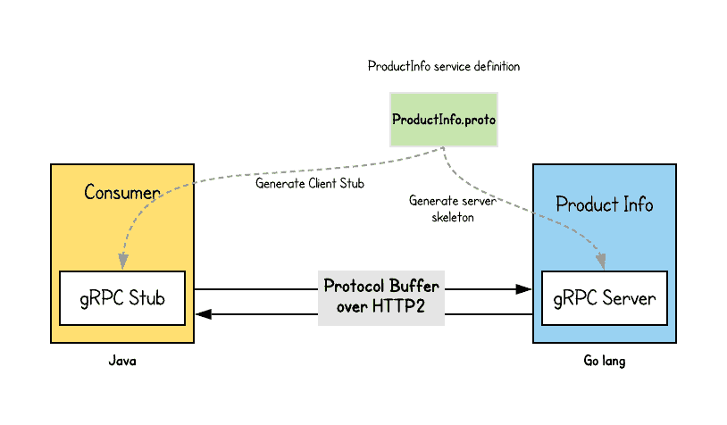
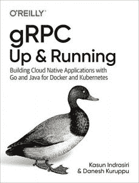

# 简单地说，gRPC 远程过程调用

> 原文：<https://thenewstack.io/grpc-remote-procedure-calls-in-a-nutshell/>

[Kasun Indrasiri](https://www.linkedin.com/in/kasun-indrasiri/)

[Kasun 是 WSO2 的集成架构总监，也是微服务架构和企业集成架构的作者/传道者。他已经为 Enterprise 和 *Beginning WSO2 ESB* 编写了*微服务。他是 Apache 委员会成员，曾担任过 WSO2 Enterprise Integrator/ESB 的产品经理和架构师。*](https://www.linkedin.com/in/kasun-indrasiri/)

我们很高兴地宣布我们的新书 *[**gRPC:启动并运行**](https://www.amazon.com/gRPC-Running-Building-Applications-Kubernetes-ebook/dp/B0845YMM37)* 由奥赖利传媒出版。gRPC (gRPC 远程过程调用)是现代微服务和云原生时代最流行的进程间通信协议之一。随着 gRPC 越来越多地被采用，我们认为有必要写一本关于 gRPC 的书，并分享我们用它构建云原生微服务应用的经验。

所以，在我们深入本书的细节之前，让我给你一个 gRPC 是什么的简要概述。

gRPC 是一种现代进程间通信技术，它可以克服传统进程间通信技术(如 RESTful 服务)的大部分缺点。由于 gRPC 的好处，大多数现代应用程序和服务器越来越多地将它们的进程间通信协议转换为 gRPC。

基于 gRPC 的应用程序的基础是服务和服务接口定义。当您开发一个 gRPC 应用程序时，您要做的第一件事就是定义一个服务接口——它包含关于如何消费您的服务的信息，您允许消费者远程调用什么方法，调用这些方法时使用什么方法参数和消息格式，等等。

我们用来指定服务定义的语言被称为接口定义语言(IDL)；gRPC 使用协议缓冲区作为 IDL。因此，如图 1 中的例子所示，您将服务接口定义为协议缓冲区定义( *ProductInfo.proto* )。

图 1:gRPC 服务和客户端应用程序之间的交互。

一旦设计了服务定义，就可以生成服务器端代码——称为**服务器框架**——它通过提供底层通信抽象简化了服务器端逻辑。此外，您可以生成客户端代码，称为**客户端存根**，它通过抽象简化了客户端通信，以便隐藏不同编程语言的底层通信。客户端可以远程调用您在服务接口定义中指定的方法，就像调用本地函数一样简单。默认情况下，gRPC 使用 HTTP2 作为网络通信协议，并基于 HTTP2 之上的协议缓冲区对二进制数据进行分层。

## 为什么选择 gRPC？

那么，当有许多其他选择时，为什么有人会选择 gRPC 作为通信协议呢？让我们仔细看看 gRPC 的一些关键优势。

*   **高效**:与 RESTful 服务等其他常见技术不同，gRPC 不基于 JSON 等文本格式。相反，它使用基于协议缓冲区的二进制协议。因此，这是非常有效的。
*   **简单且定义良好的服务接口和模式:**由于设计应用程序的契约优先方法，服务接口和模式不是事后才想到的。在开发任何东西之前，您需要有一个定义良好的服务接口和需要交换的消息的相应模式。
*   **强类型**:拥有定义良好的模式有助于克服您在构建跨多个团队和技术的云原生应用程序时会遇到的大多数运行时和互操作性错误。
*   **Polyglot** :该协议鼓励使用您选择的编程语言，以开发不受底层协议限制的应用程序。
*   **双工流** : gRPC 具有对客户端或服务器端流的本地支持，它被嵌入到服务定义本身中。这使得 gRPC 在与 REST 等其他技术的竞争中遥遥领先。
*   **内置的商品特性** : gRPC 提供了对商品特性的内置支持，例如身份验证、加密、弹性(截止时间和超时)、元数据交换、压缩、负载平衡、服务发现等等
*   **成熟和采用** : gRPC 正被广泛采用并经过实战检验。它正在成为微服务或云原生应用程序的服务间通信的事实上的通信协议。

我们希望这能让您对 gRPC 有一个基本的了解，以及它作为服务间通信协议的重要性。现在让我们看看是什么激励我们写一本关于 gRPC 的书。

## 为什么我们编写 gRPC 并运行

 随着 gRPC 的日益普及，我们觉得开发人员需要一本全面的 gRPC 书籍。这本书可以作为 gRPC 应用程序开发周期每个阶段的最终参考指南。到处都有很多 gRPC 的资源和代码示例(文档、博客、文章、会议演讲等等)，但是没有一种资源可以用来构建 gRPC 应用程序。此外，没有任何关于 gRPC 协议内部及其如何工作的参考资料。

我们写这本书是为了克服这些挑战，并让您全面了解 gRPC 的基础知识，它与传统的进程间通信技术有何不同，gRPC 的真实通信模式，使用 Go 和 Java 构建 gRPC 应用程序，它是如何工作的，如何在生产中运行 gRPC 应用程序，以及 gRPC 如何与 Kubernetes 和生态系统的其他部分一起工作。

所以，我希望这篇文章能让你对 gRPC 有一个高层次的理解，同时也能让你对我们的新书有所了解。请查看并尝试[示例](https://github.com/grpc-up-and-running/samples)。

<svg xmlns:xlink="http://www.w3.org/1999/xlink" viewBox="0 0 68 31" version="1.1"><title>Group</title> <desc>Created with Sketch.</desc></svg>