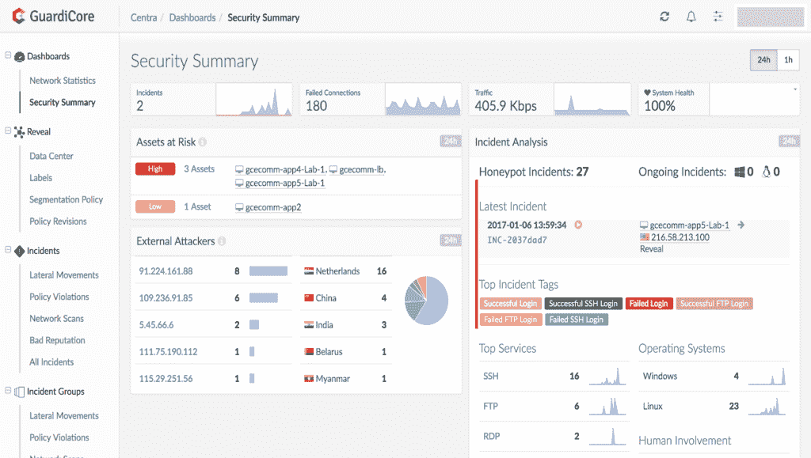

# GuardiCore 专注于保护“粘性内部”

> 原文：<https://thenewstack.io/guardicore-focuses-securing-gooey-interior/>

在去年的 Enigma 会议上，美国顶级黑客,[美国国家安全局](https://www.nsa.gov/)网络战部门负责人[Rob Joyce](https://en.wikipedia.org/wiki/Tailored_Access_Operations)说，进入任何系统的关键是比建造和运行它的人更好地理解网络。

显然，黑客们做到了，因为根据威瑞森的最新统计，他们平均能够在不被发现的情况下漫游超过六个月，这表明企业必须更好地了解他们正在运行的堆栈和应用程序。

正如 Redpoint Ventures 的[Lenny Pruss 向新堆栈描述的那样，企业安全模型正在超越“坚硬、易碎的外壳，内部粘粘的”，内部几乎没有控制措施，但重点仍然主要放在预防上。](https://thenewstack.io/the-devopsification-of-security/)

SANS 研究所的一份报告发现，访问和身份验证、高级恶意软件防御和终端安全是三大安全支出重点。受访者对应用安全、网络威胁情报服务和安全情报平台在支出优先级和感知有效性方面的排名较低。

安全公司 [GuardiCore](https://www.guardicore.com/) 认为边界会被突破——这不是是否会被突破的问题，而是何时被突破的问题。然而，根据 GuardiCore 的营销副总裁戴夫·伯顿的说法，大多数组织都没有在内部安全上投入太多，所以他们发现很难确定他们是否被攻破了。

“随着应用越来越分散，数据中心和云环境高度虚拟化，客户越来越难以跟踪和控制内部流量。它曾经是一个信任区，现在真的不再是了，”他说。“我们正在帮助客户将这些控制、监控和检测功能应用到他们的内部流量中。”

GuardiCore 提供控制，以极高的粒度在流量和应用程序之间进行分段，将可见性提高到流程级别，并帮助组织更快地检测和响应违规行为。

Burton 解释说，GuardiCore Centra 安全平台可归结为五项重要功能:

*   **所有流量的可视化**，不仅在网络层面，而且在应用层面，提供了哪些流程与谁通信以及如何通信的可见性。

*   **设置和监控微细分策略的能力**。它使客户能够在流程之间设置细粒度控制，而不仅仅是在虚拟机或容器之间，从而更好地处理东西向流量。

*   **检测**使用三种不同的方法:欺骗，其中可疑的行动者被引诱到隔离的蜜罐环境中，在那里他们的行动被监控和分析；偏离政策；以及对通信流中的可疑域名、IP 地址和文件散列的信誉分析。

*   **自动化分析**提供清晰、简明的实时活动报告摘要，并附有详细的取证信息，从而简化优先级划分。

*   **自动响应**帮助客户快速隔离虚拟机或服务器，例如，如果您有自我传播的蠕虫病毒。它还提供了一些关于自动化的建议，例如删除作为事件一部分的已知坏文件。

GuardiCore 的联合创始人 Pavel Gurvich 和 Ariel Zeitlin 在以色列国防军的网络安全部门工作了十多年。

该公司成立于 2013 年，已经筹集了 3300 万美元，其中包括去年夏天来自 83 North、Battery Ventures 和思科的 2000 万美元。它在特拉维夫和旧金山设有办事处。它的客户包括总部位于荷兰的商业技术公司 schubergphilis；以色列无线通信公司[Cellcom](https://en.wikipedia.org/wiki/Cellcom_(Israel))；以及 [OpenLink](https://www.openlink.com/en/) ，一家位于马萨诸塞州的风险管理、运营和财务软件公司。

GuardiCore 使用一个轻量级代理来扫描进程级活动和网络事件，然后关联信息并构建可视化地图。从这里，客户不仅可以使用来自来宾操作系统和虚拟机管理程序的数据，还可以使用来自编排工具的数据深入了解各个应用和工作负载，以定义组和设置策略。

伯顿说，该技术的设计对性能几乎没有影响，因为分析和欺骗活动都是在生产之外进行的，无论是作为 SaaS 产品还是作为内部的虚拟设备。他说，多个分析引擎可以同时运行，因为它的设计是为了处理大规模的 it 环境。

它集成了其他安全管理工具和票务系统。事件和分析数据可以通过系统日志和 [STIX](https://stixproject.github.io/) 导出。

[欺骗技术](http://www.csoonline.com/article/3113055/security/deception-technology-grows-and-evolves.html)和微分段都是安全市场中快速增长的细分市场。 [VMware](https://thenewstack.io/microsegmentation-how-vmware-addresses-the-container-security-issue/) 将其 [NSX 网络产品](http://www.networkworld.com/article/3117625/security/vmware-nsx-gains-traction-as-a-security-tool.html)定位为微细分工具。GuardiCore 最接近的竞争对手包括 [vArmour](https://www.varmour.com/) 和 [Illumio](https://www.illumio.com/home) ，尽管 Burton 保持其自动化分析和响应，使其有别于它们。

它最初专注于虚拟机，也是 Docker 的合作伙伴。它与包括 Cisco、VMware、OpenStack、CheckPoint 和 RedHat 在内的合作伙伴一起在多供应商环境中工作，并支持 Microsoft Azure 和 Amazon Web Services 公共云。

专题图片:[眼看着你俩](https://www.flickr.com/photos/chrisbrenschmidt/1831955837/in/photolist-3MTfDt-4zgA2-79hvX1-79dFXB-6xru2C-7sTm1R-6tme8C-dFMVW9-7eoLtc-dRXibH-7vUYBJ-7vRatk-5xbKT8-btmWpu-6VaWfU-o2uLgN-8XvfbC-2uR6a-dRHsPX-5JDJrd-6swuFU-58ZbEh-n2GKC-8hawRk-7XaYCT-7yzT34-btCADk-hjCQjT-jZJrX-btCAxD-6qcYhK-nAt18d-dywiFP-mWbHC-cv688A-7Sgofb-bzbP66-s8y1RY-66BVjW-4UokrH-qQTe4J-dpwoEq-8Dz4nS-7oAk1U-z67gb-5bEW2y-4WN3zg-gDqtze-72MxS6-pRwmWv)由[chrisbb@prodigy.net](https://www.flickr.com/photos/chrisbrenschmidt/)制作，授权于**CC BY-SA 2.0。**

<svg xmlns:xlink="http://www.w3.org/1999/xlink" viewBox="0 0 68 31" version="1.1"><title>Group</title> <desc>Created with Sketch.</desc></svg>