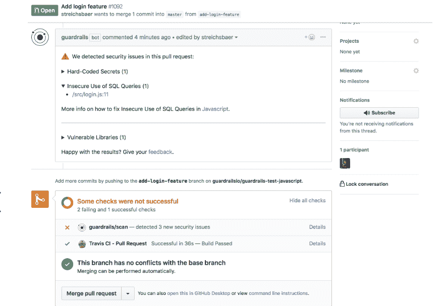

# 护栏:DevOps 时代的安全

> 原文：<https://thenewstack.io/guardrails-security-for-the-devops-age/>

[GuardRails](https://www.guardrails.io/)的首席执行官兼联合创始人 Stefan Streichsbier 认为，随着 DevOps 的兴起，安全行业忽视了开发者。

他说，从一年发布几次到一天发布多次意味着安全性必须成为开发人员工作流程的一部分，而不是传统的“拒绝部门”。

Streichsbier 是欧洲的一名前职业黑客，他将 DevOps 带来的变化视为游戏规则的改变者。他说，开发人员开始绕过安全部门，企业可用的工具已经完全过时了。

“我认为未来的安全将与我们现在看到的大不相同。这就是 GuardRails 从第一天起真正发挥作用的地方，它改变了安全工具和平台如何成为开发人员工作流程的一部分的范式，”他说。

Streichsbier 于 2018 年 1 月在新加坡创立了这家公司，这是他参与通过该地区的会议推进 [DevOps](https://thenewstack.io/category/devops/) 概念的结果。

## 安静的安全

GuardRails 旨在成为一种“安静”的安全工具，不是专注于每一个漏洞，而是那些最有可能被黑客利用的问题——这些问题可能导致应用程序停止工作，允许攻击者访问用户数据，或允许攻击者接管应用程序。

否则，就会有太多的噪音，他说，并指出他所知道的一个应用程序的最长安全报告是 15000 页打印的 PDF 文件。没有任何组织有能力处理这种情况。

GuardRails 集成了开源和商业安全工具，以确定需要进行的最紧急的修复。

Streichsbier 指出了护栏的四大优势:

*   **与现代版本控制系统的集成** —它支持 GitHub、GitLab 和 BitBucket，并且将知道代码何时以及由谁进行了更改。必须启用专用存储库。接下来，它只扫描变更，并直接在开发人员工作流程中报告结果。
*   **安全工具** **编排** — GuardRails 识别编程语言和框架，自动运行匹配的安全工具。它支持包括 Python、Ruby、PHP、JavaScript、Go、Solidity、Java、Elixir、Terraform 和 C/C++在内的语言，并协调超过 25 种不同的工具。如果关联的安全工具有重复的规则，它会为您删除重复的规则。
*   **安全规则监管** —涵盖平台中近 700 条规则，它筛选规则以仅识别需要采取行动的相关问题。另一种“噪音”被隐藏起来，但如果你想潜得更深，它就在那里。
*   **误报检测** —它使用机器学习来不断提高对需要解决的真实漏洞发出警报的准确性。

SaaS 运行在亚马逊网络服务上，该公司还提供了一个用于内部部署的版本。这个平台是免费提供给那些只想专注于公共代码库的人的。初创公司的付费版本起价为每月 39 美元。

其客户包括[亚航](http://airasia.com)、订阅计费平台 [Recurly](https://recurly.com/) 、数据平台 [Mode Analytics、](https://mode.com/)日本移动提供商[乐天移动](https://corp.mobile.rakuten.co.jp/english/)和软件供应商 G2.com。

“事实证明，GuardRails 是我们数字化工作中的一个基础工具，它安装快捷、易于设置，并能有效地让开发人员和信息安全团队鸟瞰我们众多新旧回购的当前安全状况。安全基线的实施变得轻松、顺畅、主动且有意义。”

[Fabrice A. Marie](https://www.youtube.com/watch?v=8APvj0r0yio)

，亚航集团 CISO。

该平台对源代码进行静态分析，以检测潜在的漏洞，如 SQL 查询的不安全使用、正则表达式、危险的函数、管理不善的身份验证、文件管理或危险的配置。它还分析已知漏洞的依赖性，跟踪硬编码的秘密，并提供 OWASP(开放 Web 应用程序安全项目)映射。

它会在每次请求时扫描您的存储库，对于付费团队计划，每次提交到任何分支时都会扫描。

“它实际上与版本控制系统紧密集成，知道正在发生的一切，”Streichsbier 说。“因此，您实际上不必装载任何存储库、任何应用程序。但是，一旦您安装到这种环境中，GuardRails 就会知道所有的存储库的存在，从而准确地知道任何新的代码更改何时实现。我们也确切地知道这些变化是什么。我们知道是谁引入了这些变化，我们几乎可以立即说，‘好了，现在该扫描了。’我们在工作流程中直接向开发人员提供所有扫描结果。"

扫描结果显示为该 PR 的注释，或者显示在每个存储库的“分支”选项卡中。

“结果会呈现给开发人员，这样他们就可以真正专注于什么是重要的，什么应该是软件，只有当某个东西被确定为问题时，他们才会在正确的时间获得正确的信息，只需实际修复它，而不必涉及任何外部安全专家，”他说。

根据 Streichsbier 的说法，传统的应用程序安全测试工具往往已经过时，是为瀑布开发而不是敏捷和 DevOps 创建的。

更现代的竞争对手包括 [Snyk](https://thenewstack.io/snyks-gareth-rushgrove-on-how-visibility-is-driving-security/) ，它帮助开发者在开源库中找到漏洞。Streichsbier 坚持认为 GuardRails 做得更多:它可以识别客户组织开发的定制代码中的漏洞。它还可以检测 API 密钥和 AWS 安全凭证等秘密，并支持云集成扫描。

第三个竞争领域来自代码质量解决方案，如 [SonarQube](https://www.sonarqube.org/) ，它们正在进入安全领域，尽管它们只关注代码，而不是容器或基础设施安全。

## 更多深度学习

展望未来，该公司将在现有工具的基础上扩大深度学习的使用，以提高漏洞报告的准确性。虽然它不能自动修复问题，但这是未来路线图的一部分。

在第三季度，它计划增加对动态扫描的支持，即在运行时扫描应用程序；对于移动安全扫描、基础设施安全扫描和容器安全，Streichsbier 说这主要是自动更新到最新版本的库和图像。

它还想推广定制引擎，这些引擎可能与整体市场无关，但与信用卡支付等特定行业相关。它计划建立一个用户可以分享他们创作的市场。

“GuardRails 的目标不仅仅是整体解决方案中的一块拼图，而是实际上提供来自不同类别的所有相关安全见解的 360 度视图，”他说。

Snyk 是新堆栈的赞助商。

专题图片:[理查德·史密斯](https://www.flickr.com/photos/smith/)的[蓝色混凝土护栏](https://www.flickr.com/photos/smith/12484221524/in/photolist-k2bU7G-25hfnkD-2j5Sckb-ehRoem-PXQDau-2j9e4VL-5RGtmK-W61rLT-DmgcFC-oNaAJS-YxHbmj-JnUpGH-PDcSso-fDh1Ep-2ixaPLv-2ehrkLp-2itM8j8-6adDhU-8JvjJe-7m5Jw8-pSqKPo-r22s2n-c64qcb-nEq3MT-v8QDUd-FWqFUG-qD5zUW-GTiWCV-rYehyj-9SqKY2-jxsrJ8-2gyYHvQ-FRKYbQ-dt7jxV-6jhqG8-WQmDqw-m5fEH2-ufTgaJ-CBMDHg-uTBKqW-vbv17K-RWd4e8-bzoXUG-buBUdZ-m5i5Pz-aFWztR-jLTkK5-aiVzy3-2ixdp1R-5YBT6c)。根据 [CC BY-SA 2.0](https://creativecommons.org/licenses/by/2.0/) 获得许可。

目前，新堆栈不允许直接在该网站上发表评论。我们邀请所有希望讨论某个故事的读者通过推特(Twitter)或脸书(T2)与我们联系。我们也欢迎您通过电子邮件发送新闻提示和反馈:[反馈@thenewstack.io](mailto:feedback@thenewstack.io) 。

<svg xmlns:xlink="http://www.w3.org/1999/xlink" viewBox="0 0 68 31" version="1.1"><title>Group</title> <desc>Created with Sketch.</desc></svg>