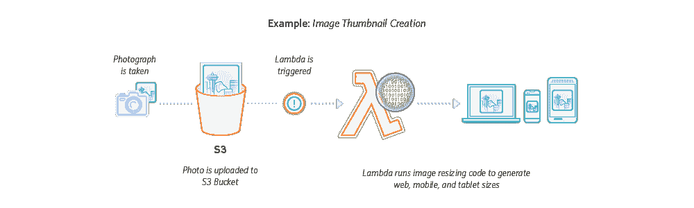
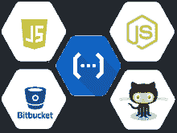
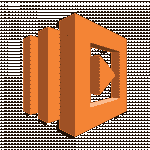
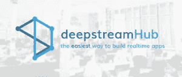
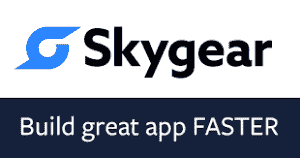

# TNS 无服务器技术指南:FaaS 和 BaaS 的精华

> 原文：<https://thenewstack.io/guide-serverless-technologies-functions-backends-service/>

本文是收集新兴技术和服务的两部分系列文章的第一部分

[serverless](http://www.thenewstack.io/tag/Serverless)

生态系统。本期文章涵盖了功能即服务(FaaS)和后端即服务(移动提供商的 BaaS 或 mBaas)的提供商。请稍后回来阅读第二部分，它将涵盖我们所知道的关于无服务器平台和框架的一切。

就像之前的“微服务”和“容器”一样，“[无服务器](/category/serverless/)”是一个负载词。无数的博客都在讨论它的意义和重要性。

每个人的第一个显而易见的说法是，是的，在系统的某个地方有服务器或某种硬件。但是“无服务器”的意义不在于服务器没有被使用；只是开发人员和管理员不用去想它们。

无服务器架构指的是严重依赖第三方服务的应用程序。“这种架构消除了对应用程序背后的传统‘永远在线’服务器系统的需求，”软件开发人员[迈克·罗伯特](https://twitter.com/mikebroberts)在马丁·福勒的[网站](http://martinfowler.com)上的[一篇文章](http://martinfowler.com/articles/serverless.html) 中说道。将无服务器技术插入系统[可以降低需要管理的复杂性](http://techbeacon.com/essential-guide-serverless-technologies-architectures#.V_u0JMbdj0M.twitter)，还可能节省资金。

然而，作为行业中的新生事物，这种技术往往还不成熟，许多技术会将用户锁定在某个供应商身上。为了了解情况，我们编制了一份最著名的无服务器供应商和服务列表。希望它能让你对自己在这个主题上做研究时会遇到的公司和技术有一个大致的了解。(特别感谢 [Philipp Müns](https://twitter.com/pmmuens) 提供的[令人敬畏的无服务器](https://github.com/JustServerless/awesome-serverless)列表和 [Peter Sbarski](https://twitter.com/sbarski) 提供的[列表](https://github.com/ServerlessHeroes/serverless-resources)，这两个列表都被用于汇编本系列)。

粗略地说，无服务器技术可以分为两类，后端即服务(BaaS)和功能即服务(FaaS)。FaaS 提供了计算能力来执行用户设计的功能，只需要代码本身，服务在被触发时就可以执行。FaaS 越来越多地用于实时数据处理。

AWS Lambda 无服务器服务的工作流程。

BaaS 起源于移动 BaaS (MBaaS)，这是一套为移动应用提供后端支持的技术，比如脸书的 Parse。虽然 FaaS 只提供执行用户代码的服务，但 BaaS 提供完整的在线服务。例如，谷歌的 Firebase 提供了一个完全托管的数据库。

## 作为服务发挥作用

[Azure Functions](https://azure.microsoft.com/en-us/services/functions/) (微软):无服务器事件驱动的体验，扩展了现有的 Azure App 服务，Azure Functions 可以运行 JavaScript、C#、Python 和 PHP 代码，可以集成到基于 Visual Studio Team Services、GitHub 或 BitBucket 构建的持续部署工作流中。

[云功能](https://cloud.google.com/functions/) (Google):一个轻量级的、基于事件的异步计算解决方案，允许你创建小型的、单一用途的功能来响应云事件，而无需管理服务器或运行时环境。目前只支持 Node.js。

IronWorker (Iron.io):有了 IronWorker，你可以从防火墙内部运行[类似 AWS Lamba 的无服务器功能](https://www.iron.io/aws-lambda-vs-ironworker/)。IronWorker 是一个平台，它隔离了在容器化环境中按需处理的各个任务的代码和依赖关系。它预集成到许多云原生平台中，如 Cloud Foundry、Kubernetes、Mesos 等。

[Manta Functions](https://www.joyent.com/manta)(Joyent):Joyent 托管平台上的服务，Manta Functions 在 Joyent 的 Manta 对象存储服务内提供函数执行。它将按需在 Joyent 的 Manta 对象上执行，而不必将数据转移到单独的计算环境中。

Lambda 是迄今为止最广为人知的无服务器产品，Lambda 是一种无服务器计算服务，它运行你的代码来响应事件，自动管理底层计算资源。作业[可以由其他 AWS 服务如 S3、DynamoDB 或 Kinesis 触发](https://aws.amazon.com/lambda/faqs/)，可以用 Python、JavaScript (Node)和 Java 编写。

[open whisk](https://new-console.ng.bluemix.net/openwhisk/)(IBM):[open whisk](https://thenewstack.io/ibm-launches-bluemix-openwhisk-event-driven-program-service/)是现在开源的无服务器软件，IBM 将其用于其 Bluemix 平台服务集，其本身基于 Cloud Foundry 平台软件。作为一种事件驱动的架构，OpenWhisk 允许开发人员用 Swift 或 JavaScript for Node.js 编写代码。或者，他们可以将他们的自定义代码打包在 Docker 容器中。

[pub nub BLOCKS](https://www.pubnub.com/)(pub nub):BLOCKS 将无服务器计算引入到 [PubNub 数据流网络](https://thenewstack.io/pubnub-makes-network-programmable/)中，并使其易于向移动应用程序提供实时功能。

[无服务器 Docker](https://github.com/bfirsh/serverless-docker) (Docker):目前是一个演示项目，无服务器 Docker 将为 Docker 容器提供一个基础，以便在其他容器中用作函数。

## 后端即服务

[Amazon API Gateway](https://aws.amazon.com/api-gateway/)(Amazon Web Services):一个完全托管的服务，让开发者可以轻松创建、发布、维护、监控和保护任何规模的 API。

[Amazon Cognito](https://aws.amazon.com/cognito/)(Amazon Web Services):这项服务提供了一种将用户注册和登录添加到移动和 Web 应用程序的方法。

any presence:any presence 提供了一个企业平台，融合了移动应用开发、API 管理和后端管理的功能。

Appery.io (Exadel): Appery 是另一个 MBaaS，它也有 API 服务和开发者工具。

AWS DynamoDB (AWS):一种快速灵活的 NoSQL 数据库服务，适用于任何规模下需要一致的单位数毫秒延迟的所有应用程序。

baas il . io(baas il . io):baas il 将自己描述为一个自动扩展的云原生实时堆栈，由开源 SocketCluster 提供支持，这是一个用于 Node.js 的 WebSocket 框架，仍处于私有测试阶段。

【T2

[BaaSBox](http://www.baasbox.com/) (BaaSBox):基于 Java 的[开源](http://opensource.baasbox.com/) mBaas 软件，带有面向 iOS、Android 和 JavaScript 的软件开发套件，处理用户和内容管理、社交网络、数据库管理、推送通知等任务。

Back& (Backand): Backand 是专门为 AngularJS 和 ReactJS 设计的 BaaS，与社交媒体服务进行了许多集成，可以轻松访问数据库，以及安全和用户管理工具。

back endless(back endless):back endless[将其软件](https://thenewstack.io/backendless-badass-baas/)描述为“API 服务平台”。该软件自动为每个客户端生成基于 REST 的 API，在方法级别将您的移动应用程序连接到您的服务。

Baqend:Baqend 是关于性能的，声称自己是最快的后端服务，能够以两倍半的速度加载你的网站和应用程序。数据库和后端逻辑自动缩放，并且该服务还提供了 DevOps 友好的工具来加快开发过程。

[build . io 流](https://www.built.io/products/flow/overview)(build . io):build . io 的流是独特的，它以支持容器为中心，允许用户将他们的代码插入 Docker 实例中，并上传到 build . io 的服务器上运行。

[云数据库](https://cloud.google.com/datastore/)(谷歌):一个高度可扩展的 NoSQL 数据库，用于你的应用程序。

Deepstream . io(Deepstream . io):Deepstream 提供服务器软件，可以在数百万个客户端之间同步数据和发送事件。

[Deployd](http://deployd.com/)(Deployd):Deployd 是一个构建实时 API 的工具包。可以用 JavaScript 事件定制部署的后端。

[Firebase](https://firebase.google.com/) (谷歌):一个开发和部署移动应用的平台。Firebase 实时数据库[存储数据](https://thenewstack.io/google-firebase-trims-middle-tier-faster-app-dev/)并与你的 NoSQL 云数据库同步。数据在所有客户端之间实时同步，并且在您的应用离线时仍然可用。

Hook Platform(开源项目):一个用于 PHP 的 BaaS 包，Hook 提供用户认证、数据存储和持久化、包管理和实时通信。

Kii:一家日本公司，Kii 一直致力于为新兴的物联网市场提供 mBaaS，帮助开发者为可穿戴设备开发应用，提供适当的服务，如地理定位和推送通知。

[Kinvey](https://www.kinvey.com/) (Kinvey):专注于为企业提供 MBaaS，Kinvey 提供了大的业务友好型功能，如 [HIPAA 合规性](https://www.kinvey.com/hipaa/)，这应该可以让希望参与移动应用革命的医疗行业服务提供商松一口气。

[OAuth.io](https://oauth.io/home) (OAuth.io):毫无疑问 [OAuth](https://oauth.net/) 是一个正义的想法:一个开放的认证标准，可以跨多个平台使用。但是设置它可能会很麻烦。OAuth.io 旨在减轻这一负担，承诺在 90 秒内将 OAuth 与您的平台集成，并为 JavaScript、Node.js、PHP、iOS、Android 和 PhoneGap 提供 SDK。

[Parse Server](http://www.parse.com/) (开源项目):Parse 后端的开源版本，最初由脸书开发，可以部署到任何可以运行 Node.js 的基础设施上，Parse Server 与 Express.js web 应用框架协同工作。它可以添加到现有的 web 应用程序中，也可以自己运行。

Skygear(sky gear):作为一款基于 [Go](/tag/golang/) 编程语言的 BaaS，Skygear 可以被视为 Google Firebase 的开源替代品，拥有数据库和实时数据同步，以及对推送通知和自定义代码的支持。与 Firebase 不同，Skygear 提供了对关系数据类型的支持。

strong loop API Gateway(IBM):strong loop API Gateway 充当 API 消费者(客户端)和后端提供者(API 服务器)之间的中间网关，它外部化、保护和管理 API。

[stream data . io](http://streamdata.io/)(stream data . io):该服务提供了一种通过可伸缩服务从任何 API 缓存和推送数据的方式。

用户网格(user grid)(Apache Software Foundation):一个开源的 BaaS，由集成的分布式 NoSQL 数据库、应用层和带有 SDK 的客户端层组成，面向希望快速构建 web 和/或移动应用的开发人员。这是一个多租户系统，旨在部署到公共云环境或运行在传统的服务器基础架构上，以便任何人都可以运行他们的私有 BaaS 部署。

<svg xmlns:xlink="http://www.w3.org/1999/xlink" viewBox="0 0 68 31" version="1.1"><title>Group</title> <desc>Created with Sketch.</desc></svg>