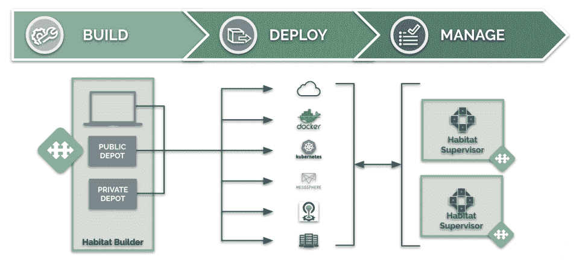
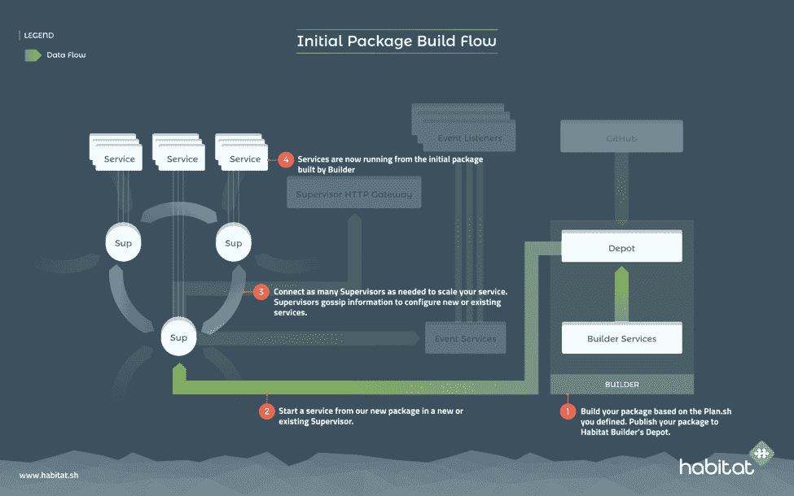

# Habitat 如何支持云原生应用

> 原文：<https://thenewstack.io/habitat-enables-cloud-native-applications/>

 [塔莎德鲁

塔莎德鲁是人居产品经理。她之前推出了 Chef Automate 的分析功能，是 Rentlytics 的产品负责人，并负责 Engine Yard Cloud 的产品。](https://www.habitat.sh/) 

[Habitat](https://github.com/habitat-sh/habitat) 是由 [Chef](https://www.chef.io/) 开发的应用自动化框架，旨在支持应用开发人员和运营团队在云原生世界中构建、部署和管理软件。它通过将自动化重点放在应用程序(真正的业务价值单位)而不是基础架构上来实现这一点。这是因为基础架构是一个最好由功能特性完整的配置管理和集群管理生态系统来管理的空间。

Habitat 的应用程序自动化完全依赖于云原生操作的四大支柱。这些形成了企业运营团队所需的框架，以使他们的开发人员能够跟上最新的云原生技术:**应用程序组件的可组合性**；**灵活性**选项多；**可编程性**采用 API 优先的方法；以及**无摩擦**对应用团队隐藏了基础设施和操作的复杂性和细节。

## 栖息地概述

让我们仔细看看栖息地。Habitat 提供了一个构建、部署和运行应用程序的框架。它的端到端功能涵盖并自动化了整个开发生命周期。同时，它的设计方式允许团队逐步采用解决当前问题的部分，并在以后需要时考虑采用额外的功能。

更重要的是，Habitat 的构建方式能够为传统应用程序和全新应用程序提供构建、部署和运行功能(这一点已经在拥有真正复杂的应用程序和架构的大型企业合作伙伴中经过了实战检验)。该框架足够灵活和强大，它可以为您的应用程序提供原生编写的 [12 因素应用程序](https://12factor.net/)的许多功能和保证，而无需从头重写遗留应用程序。

## 这个计划走到了一起

在栖息地的世界里，每一个建筑都从一个计划开始。在一个简单的声明性 Bash(用于 Linux 构建)或 PowerShell(用于 Windows 构建)格式中，您编写一个计划文件来告诉 Habitat 关于您的应用程序源代码的信息，您的应用程序需要构建什么库和服务，以及您的应用程序需要运行什么库和服务。

您还可以声明应用程序所依赖的其他服务，以便在部署和运行时发现或等待这些服务的出现。例如，我的应用程序需要一个 Postgres 数据库，或者，我的应用程序可能连接到一个 Postgres 数据库或一个作为服务的 Postgres。您的应用程序和它在运行时所依赖的服务的这种内置的**可组合性**被预先声明，因此您的应用程序构件被提供了它成功运行所需的所有信息，无论它最终被部署在哪里。

一旦你写好了你的计划，你就可以为你的应用程序列出其他选项。使用 [Habitat Builder](https://www.habitat.sh/demo/) ，你可以将你的 GitHub repo 连接到 Builder，并上传你的计划文件。然后单击一个按钮开始初始构建，指定是否要将构建自动导出到 Docker 容器中，然后将其发布到您选择的容器注册表(Dockerhub、AWS ECS、Azure ACS 等)。或者，您可以使用 Habitat Studio 在本地构建您的包，这是一个干净的房间构建环境，允许您构建您的 Habitat 工件(*。hart ),而不会无意中获得任何偏离的局部相关性。然后，您可以将该包上传到 Habitat Builder 以与合作者共享，或者直接部署它。

这个构建过程的结果是一个不可变的工件，它是用应用程序本身成功运行所需的包和库创建的 **only** ，由于构建的声明性，它静态地链接到每个依赖项的单个版本。实际上，这意味着当您不可避免地需要更新您的应用程序时(无论是由于代码的变化、依赖项的更新，还是新的安全补丁的可用性)，您可以保证您将始终拥有一个只有最新版本的更新软件的构建，而没有隐藏在表面之下的挥之不去的可传递的依赖项。

不变性的栖息地概念超越了应用程序工件本身，延伸到了应用程序的运行时。它为您的应用程序提供了一个不可变且稳定的基础，具有可配置的可调元素。

## 随处部署

不可变的栖息地工件(*。hart <3) that is created by Habitat can be exported to a wide array of formats and runtimes depending on what’s right for your application and services, and the specific environments you’re running it in. This gives you **在选择运行应用的位置和方式方面的灵活性**,并有效地从技术投资和决策中验证应用的未来:如果您决定今天迁移到托管的 Kubernetes 和 Docker 产品，明天迁移到基于云的虚拟机，然后迁移到内部裸机基础架构以实现某些状态服务，您仍然可以使用 Habitat 工具链，不需要更改代码或管道——您只需更改导出格式和部署目标，一切都已准备就绪。

Habitat 目前集成了裸机、虚拟机、Docker 容器、AWS EC2 容器注册表、Mesos ACI、CloudFoundry 优化的 Docker 容器、Kubernetes 等。这意味着现代应用程序团队拥有一种**无摩擦**的体验，使用他们偏好的技术将应用程序部署到各种环境中。

## 栖息地监督员

一旦 Habitat 服务被部署到机器或容器中并开始运行，它们就由提供一系列健壮运行时功能的流程[监控器](https://www.habitat.sh/tutorials/get-started/)管理。

主管将遵循他们的计划文件来理解它正在运行的服务的需求。部署完成后，监管人员组成服务组，这些服务组具有明确的拓扑结构、更新策略，并遵循一系列可编程的应用程序生命周期挂钩，以在应用程序的生命周期中自动执行应用程序的行为。

Supervisor 内置的自动化功能不仅为运行单个应用程序进程提供了一个通用接口(这本身就很有用),而且更有趣的是，它还为运行复杂的分布式应用程序进程系统提供了一个通用接口，这些应用程序进程可以根据应用程序的需要进行扩展，而无需额外的高成本工作。这是一项扩展的自动化工作，每一个大获成功的应用程序都需要团队开发定制的解决方案，现在从应用程序的生命周期开始就作为开源框架的一部分提供。

管理器在其本地网络中寻找对等体，并使用从它们收集的信息来了解其他管理器是健康的还是不健康的，何时需要领导选举，执行服务发现，以及当有新的构建可用时协调服务更新。

在这个应用程序生命周期自动化中进行烘焙——同时允许对暴露的可调参数进行运行时配置——意味着分布式操作团队从共享的 Habitat 工件本身获得了他们需要的所有信息，以便在各种环境中成功地管理和部署应用程序和服务。他们可以这样做，而不需要他们所支持的应用程序开发团队进行深入的移交或沟通。

## 完成应用程序生命周期

随着上游依赖项和应用程序代码的更新，Habitat Builder 不断地重建和更新您的应用程序和服务构件——所有这些新构建将自动发布到该构件的`unstable`通道。您可以创建任意多的其他通道，例如`development`、`qa`、`pre-prod`、`production`(对于更简单的部署，Habitat 还会自动提供一个`stable`通道)。

Habitat Supervisors 可以连接到 Habitat Builder 并订阅特定的频道，以查看是否有新的应用程序版本需要部署，使用他们服务组的更新策略。

然后，用户可以自动地(或者手动地，取决于他们的业务流程和需求)，将构建从“不稳定”提升到更稳定的渠道。订阅该频道的主管将看到一个更新，根据他们的更新策略协调下载它，通过相关的应用程序生命周期挂钩运行新的工件，然后安装并开始运行它。栖息地构建者和栖息地主管之间的端到端连接提供了一个无缝的工作流，使团队能够快速移动，并根据需要在两次提升之间保持尽可能多的安全性。

## 看看吧！

Habitat 为应用程序团队提供了一个强大的端到端框架，以云本地的方式构建、部署和运行应用程序——但是您可以试一试，逐步采用能够解决您当前需求的方法！开始使用 [Habitat Builder 演示](https://www.habitat.sh/demo/)来构建和更新 Node.js 应用程序，并将其发布到您的 DockerHub 帐户(总共需要大约 10 分钟)。或者在 Slack 上与 Habitat 核心团队聊天(欢迎在#通用频道提出各种级别的问题。)

[厨师](https://www.chef.io/)赞助了这个故事。

<svg xmlns:xlink="http://www.w3.org/1999/xlink" viewBox="0 0 68 31" version="1.1"><title>Group</title> <desc>Created with Sketch.</desc></svg>