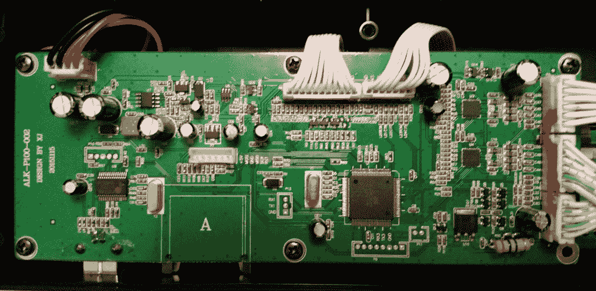

# 破解煎饼栈:PancakeBot 里面有什么？

> 原文：<https://thenewstack.io/hack-pancake-stack-whats-inside-pancakebot/>

重要的是要熟悉你打算黑掉的部分。我喜欢检查一个小工具，有时甚至用放大镜，这样我就可以了解所有部件是如何走到一起并相互作用的。有人称之为逆向工程，适用于你正在拆开，想要改装的东西。它还通过收集所有部件，将它们放在工作台上，然后在一个从头开始构建的设备上摆弄它们，看看它们将如何装配在一起。

在这一版中，我将带领读者了解一款煎饼打印机的各个部分，这款打印机在《新书库》的全球“煎饼早餐播客”中有时被用作促销工具。PancakeBot 可以用面糊“[打印](https://youtu.be/o2j2Rr-zi7U)，并创建一个煎饼设计，[可以在它的绘图工具](https://youtu.be/2fhc1v0OhMI)上完成。开始思考你自己感兴趣的领域，看看你是否能发现潜在的明显的“可攻击”点。

## 对 PancakeBot 进行逆向工程

看看 PancakeBot 里的主控制板。它拥有 ATMega 2560 微控制器，该微控制器也用于需要大量输入和输出的 Arduino 项目。2560 有 54 个数字输入/输出引脚。其中 15 个引脚可以用作脉宽调制(PWM)输出。它还有 16 个模拟输入和 4 个 UARTs(硬件串行端口)。最后，2560 有 256 KB 的内存。这允许比典型的 32 KB 程序空间的 Arduino 大得多的程序。在下面的照片中，它是右下角的一英寸见方的芯片。

PancakeBot 微控制器板。

电路板右侧是步进电机控制器(两个大电容正下方和中间的小方形芯片)和连接 X 轴和 Y 轴电机的连接器。电路板顶部是键盘和 LCD 显示器的连接器。左下角是 USB/SD 卡电路。主板的电源在左上方。

键盘 LCD 板位于微控制器板上方(当 PancakeBot 直立时),包含控制按钮、LCD 屏幕、电源按钮和压力调节电位计。背面没什么可看的。

液晶显示器、电位计和按钮控制板。

这是键盘 LCD 板的顶部，有按钮、LCD 和压力旋钮。

PancakeBot 前面板

接下来是电源，它被巧妙地藏在这个机器人的一只脚上。考虑到部件的尺寸，这是相当充足的供应。这并不奇怪，因为机器有一对夫妇体面大小的步进电机。您需要在电源中加入一些牛肉来处理电机的停止和启动脉冲，同时还向 ATMega 2560 提供无尖峰电压。我还注意到较长的电源和电机控制器电线周围有几个铁氧体环。这些有助于降低噪声，噪声可能会导致微控制器出现问题。

电源的前侧。

电源的背面。

## 发动机

长轴步进电机也位于一个 PancakeBot 足中。齿形带附在马达的滑轮上。这是一个你可以通过任何正常渠道得到的标准马达。移动负载时，它们会消耗几安培的电流。同时运行一对需要一个合适的电源，这是我们之前讨论过的。一端有一个限位开关，作为位置指示器。当 PancakeBot 启动时，它将步进器循环到限位开关，作为精确运动的起点。

长轴步进电机。

横轴电机与气泵和面糊分配器控制阀一起位于横臂的一端。

横轴的步进电机。

## 泵、阀门

有一个小空气/真空泵和阀门，藏在交叉轴步进电机旁边，用于控制煎饼面糊流出面糊分配器。气泵是下图左上方的黑色和银色圆柱形物体。你可以看到透明的软管从底部伸出来。PancakeBot 初始化后，泵打开，似乎在分配器上拉一个非常温和的真空。我怀疑当面糊分配器没有在烤盘上铺设面糊线时，真空可以防止面糊分配器滴水。

用于控制面糊流量的气泵。

下面是将泵/真空动作切换到面糊分配器的控制阀的特写。正如你所料，在铺设面糊线时，泵会向面糊分配器提供轻微的压力。我再次渴望压力传感器的到来，这样我就可以验证我对 PancakeBot 的加压和真空面糊分配操作的怀疑。

面糊分配器真空/压力空气阀。

泵和阀都通过主微控制器板和相关电路进行电气控制。

## **下一步是什么**

我认为 PancakeBot 是当前 DIY/Maker 运动思维的一个非常有趣的例子。这是一种液体的 2D 打印机，在煎锅上凝固。不惊天动地，但肯定有趣和发人深省。幸运的是，开发者和制造商似乎是开放的，并支持社区黑客设备。

寻找后续 PancakeBot 黑客信息，在未来现成的黑客和黑客煎饼栈专栏。

<svg xmlns:xlink="http://www.w3.org/1999/xlink" viewBox="0 0 68 31" version="1.1"><title>Group</title> <desc>Created with Sketch.</desc></svg>