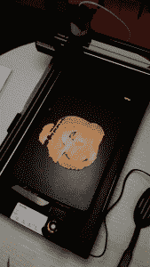
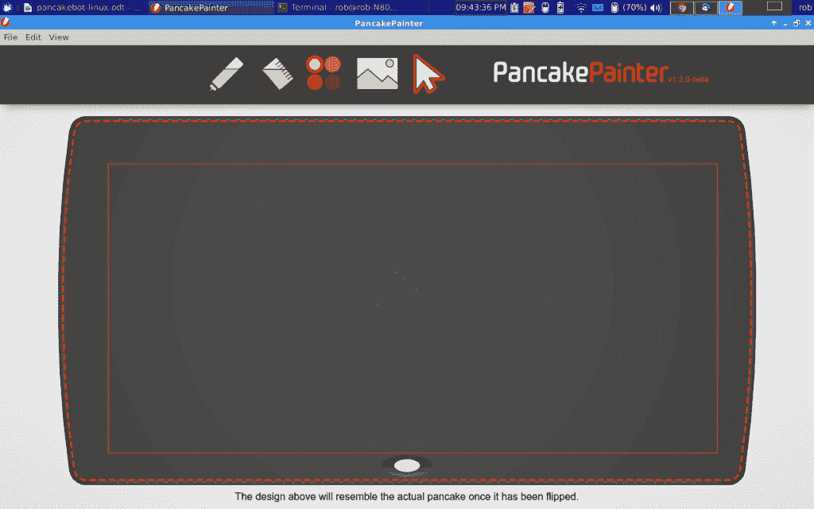
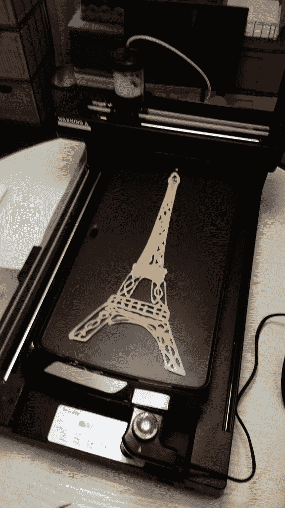
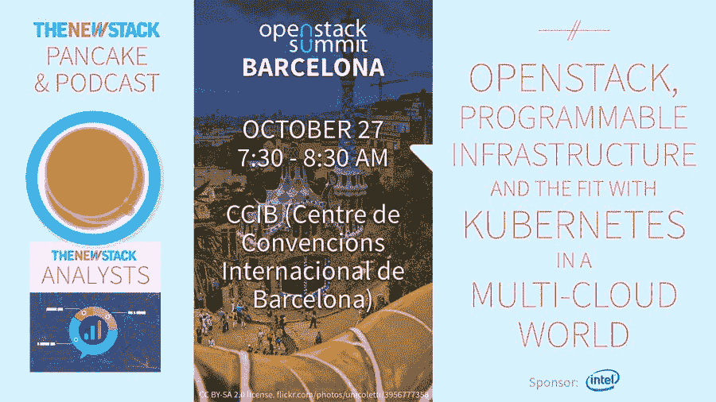

# 黑掉煎饼栈:在 Xubuntu Linux 下运行 PancakeBot

> 原文：<https://thenewstack.io/hack-robot-stack-pancakebot-running-xubuntu-linux/>



煎饼机器人代表了最新的煎饼制作技术。它本质上是一个煎饼面糊的 3D(嗯，2D)打印机。它使用一个微控制器、步进器、一个小型真空/压力泵、阀门和一个 X-Y 机构。这是一个机器人和物理计算设备。

新的堆栈在供应商/公司早餐会上使用 PancakeBot 进行促销。在活动期间运行机器有助于打破与与会者的僵局，并作为一个注意力抓取器。它还促进了新兴技术、打印煎饼和我们在新堆栈中涵盖的主题的软件/硬件堆栈之间的隐喻联系。

打印煎饼是不是惊天动地，革命性的科技？可能吧。你必须承认这的确很有创意，发人深省。

我的编辑认为找出破解 PancakeBot 的方法会很有趣。作为新堆栈的常驻[硬件黑客首领](/tag/off-the-shelf-hacker/)，你的真的得到了这份工作。自然，首要任务是在 Linux 下测试它的性能。这就是我们今天要做的。我们将把 PancakeBot 放在 Linux 之上，Linux 有它自己的古怪的层次，如果不是可食用的话。

未来的文章将探讨我为 PancakeBot 设计的附加功能、修改和破解。也许有一种方法可以制造一个自动化的煎饼机。或者，我们可以将 g 代码文件从煎饼画家程序无线传输到煎饼机器人吗？如果我们把树莓 Pi、Arduino 或 ESP8266 连接到 PancakeBot，我们会发明什么有趣的功能？自由联想对于发明和改造小玩意至关重要。

这台机器就在我的实验室里，我已经获得了破解它的许可。

首先，让我们看看如何让 PancakeBot 在 Linux 上运行。

## Linux 设置

我近乎古董的华硕双核笔记本运行 [Xubuntu](http://xubuntu.org/) 14.04。这几乎是一台标准的 14 英寸机器，有 4 GB 内存和 750 GB 硬盘。

使用 Windows 或 Mac 下载一个煎饼设计或甚至绘制自己的设计并将其复制到 SD 卡上并不是什么大的壮举。然后你可以将 SD 卡插入 PancakeBot，打印出你的煎饼。

遗憾的是，Linux 还没有得到 PancakeBot 的官方支持。这意味着，如果你想创建你的煎饼设计，你必须[去 GitHub](https://github.com/PancakeBot/PancakePainter) ，克隆程序到你的 Linux 机器上，然后从源代码运行煎饼画家程序。

好消息是，一旦你知道怎么做，开始工作并不困难。我们将使用命令行。

首先，确保你的系统上安装了 [node.js](https://nodejs.org/en/) 和 [npm](https://github.com/npm/npm) 。我使用了 [Synaptic](http://www.nongnu.org/synaptic/) 软件管理器，尽管你可以使用 apt-get 轻松安装它。

```
rob%  sudo apt-get update
rob%  sudo apt-get install nodejs

```

安装 node.js 时会加载 Npm。

接下来，从 GitHub 到您的 Linux 机器，克隆 PancakeBot Painter 程序库。

```
rob%  git clone https://github.com/PancakeBot/PancakePainter

```

将存储库克隆到您的机器上之后，将 cd 放入 PancakePainter 目录。

使用 sudo 执行带有 force 选项的 npm install 命令，因此它会获取所有依赖项。

```
rob%  sudo npm install  --force

```

安装完成后，使用 npm 从 Pancake Painter 目录运行程序。

### 使用煎饼画家



在 Xubuntu Linux v.14.04 下运行的 Pancake Painter 程序

一旦画师程序启动，您将能够加载现有的照片或创建新的照片。现有的印刷品可以在 PancakeBot 网站的“印刷品设计”标签下找到。我从“字符”菜单项下载了一些照片。

如果你想画自己的图案，只需抓住“挤压瓶”图标，用鼠标左键放下你的面糊。还有一个面糊填充图标。从四个颜色按钮中选择一个来改变面糊的阴影，从亮到暗。

你也可以用面糊描图。使用“导入图像进行描摹”图标(大箭头旁边)将一张图片放在烤盘上。抓住突出显示框来缩小或扩大图片，或沿其轴旋转图片。

使用大箭头，抓取线条或形状，并在屏幕上四处移动。如果你在屏幕上高亮显示某个东西，按 Del 键会让它消失。

尽管 Painter 程序非常基础，但它提供了足够的功能，使你能够创作出一些非常有趣的印刷品。只要稍微研究一下，你就会掌握它的窍门。

一旦你对你的画满意了，在你能在 PancakeBot 上打印它之前，它将需要被翻译成 g 代码。使用“文件”选项卡下的“导出用于打印”选项，并选择要保存 g 代码文件的目录。给它起一个有意义的名字。

## g 代码文件到 SD 和打印机

g 代码文件生成后，将其复制到标准 SD 卡上。使用空白卡片使事情简单，并且容易在 PancakeBot 的 LCD 屏幕上找到打印内容。

接下来，加热热板，按下电源按钮启动 PancakeBot，将 SD 卡插入插槽。

使用|| >按钮，然后使用向上和向下箭头按钮滚动浏览文件。再次按下|| >按钮开始打印。小进度条会从左向右移动，显示打印还需要多少时间。当进度条变成空白时，将薄饼翻过来，在背面完成。

## 提示和技巧

用户手册有很多关于使用 PancakeBot 的信息。

打印一个煎饼当然是一种黑色艺术，需要一点练习才能获得很好的效果。例如，我女儿和我做的第一个打印出来的是一个大斑点，因为我们在薄的一面混合了一点面糊。我们第二次将普通商店购买的煎饼面糊重新混合得更稠一点，结果好了很多。

三个变量影响煎饼的细节。

*   面糊的厚度。
*   热板的温度。
*   压力刻度盘上的设置。

你必须同时处理这三张照片。以埃菲尔铁塔为例，这是一幅相当简单的图画，很容易就能调到合适的位置。当连续多次打印相同的图像时，结果相当一致。



简单的埃菲尔铁塔印花

我打印了几张大/多层图像的薄饼，结果还不错。印刷越复杂，你可能需要做的调整就越多。

如果你想看看 PancakeBot 的运行情况，请关注我们的 Twitter feed，了解你附近的活动或我们可能参加的会议。接下来: [OpenStack 峰会](https://www.openstack.org/summit/barcelona-2016/)，巴塞罗那，10 月 27 日:

【T2

<svg xmlns:xlink="http://www.w3.org/1999/xlink" viewBox="0 0 68 31" version="1.1"><title>Group</title> <desc>Created with Sketch.</desc></svg>