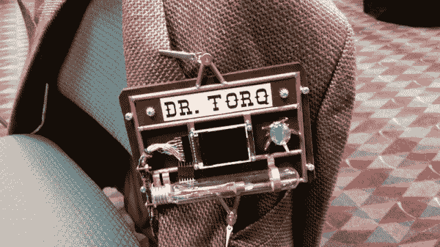

# 现成的黑客:Arduino vs. Raspberry Pi

> 原文：<https://thenewstack.io/hackable-hardware-throwdown-arduino-vs-raspberry-pi/>

关于何时使用 Arduino 或 T2 树莓 Pi 仍然有很多困惑，尤其是在“不经意的”或未来的 T4 现成黑客中。这个问题是几年前在 OSCON 我的微控制器趋势讲座上提出来的。上个月，在我的未来教育技术大会演讲中，一位观众问了我同样的问题。

可以理解。渴望学习这种令人惊叹的物理计算技术的教师、软件开发人员、管理人员和外行人，可能没有成堆的电路板或时间来广泛比较和对比这两者。人们很容易将 Arduino、Raspberry Pi 和其他小尺寸计算设备混为一谈，认为它们都可以互换。毕竟，它们是微控制器。

记住所有这些，今天我们将关注结果差异，而不是重复典型的超级漂亮、极客印象深刻和令人眼花缭乱的硬件规格。

## **专一或复杂的性格**

在微控制器的世界里，Arduino 只有一种思维。它通常读取一些输入，可能做一些计算，然后设置一些输出。它能够极其快速地循环这一过程，精确到毫秒。它不担心网络流量，也不担心是否必须在一天中的特定时间备份文件。它也没有足够的注意力和记忆力来监控数百个不同的过程和任务。程序很小而且用途单一。

例如，观察电机轴的转速，然后调节功率，使电机以恒定速度旋转，而不管负载如何。Arduino 也没有像 Windows、iOS 或 GNU+Linux 这样的操作系统。程序被称为固件，因为它们是在另一台机器上开发的，如 GNU+Linux 笔记本电脑，然后被上传或“刻录”到 Arduino 的 EEPROM(电可擦除可编程只读存储器)中。一个很好的理解是，程序被“牢牢地”上传到 Arduino 有限的内存中，这就是它所做的一切。一旦通电，Arduino 就会运行该程序。

是的 Arduino 只是读取一些输入，也许做一些计算，然后设置一些输出，非常非常快。

相比之下，树莓派是社交型的，可以同时处理很多事情，而且永远不会忘记约会。

首先，Raspberry Pi 确实有一个操作系统，它叫做 GNU+Linux。它类似于 Windows 或 Mac 的 iOS。它启动，将硬件置于稳定状态，启动网络和用户界面，然后坐在那里，在后台做一大堆其他事情。你不需要另一台机器来编写 Pi 程序。将设备连接到 HDMI 大屏幕，插入键盘和鼠标，您就可以拥有一个漂亮的彩色桌面，其中包含所有您喜欢的应用程序，耐心等待您的下一次召唤。

连接到网络，是树莓派的特色。Pi 上的标准 GNU+Linux 安装有一个完整的网络堆栈。你不仅可以与服务器、接入点和云交互，开启加密、建立防火墙或从另一台机器远程登录对一个 Pi 来说也是轻而易举的事情。

想要对 Pi 进行编程以读取一些输入，或许进行一些计算，然后设置一些输出？

哈！有十几种不同的语言和框架可供您使用。加载 Arduino IDE，你甚至可以使用 Pi 本身对 Arduino 进行编程。这个主意怎么样？

回到输入和输出，所有这些用户界面和多任务的好处需要一些，我们应该说，妥协？

不可能保证读取您的输入或设置您的输出会在您希望它们发生的时候发生。虽然 Pi 具有四核处理能力和 1 GB 内存(在 Pi 2 中)，但它的通用输入/输出引脚控制注意力与它同时进行的所有其他事情共享。

跟踪一个快速转动的电机轴对于一个普通的 Pi 及其程序来说是一个巨大的挑战。更好的办法是将这项任务留给一个特别专注的 Arduino，偶尔向 Pi 发送一条消息，它可以在桌面程序上显示，说明轴实际上正在以平均速度 x 旋转，或者相反，改变 Pi 桌面界面上的一个旋钮，向 Arduino 发送一条消息，将电机的速度提高 100 RPMs。你明白了。

不要误会我的意思，Pi 绝对是可靠的，非常能够控制它的通用输出引脚，只是不是在一个非常受时间限制的方式。

一个很好的例子是我最先进的 4.0 版蒸汽朋克徽章上跳动的蓝色“臭氧管”。我使用 Python 程序，通过改变 LED 相连输出引脚的信号脉冲宽度，来改变灯管中蓝色 LED 的亮度。随着程序使脉冲宽度变大，LED 变得更亮。

随着脉冲宽度的缩小，LED 的亮度也随之降低。当程序上下循环时，这给了“臭氧管”一个有点怪异的圆形特征。来自其他 Pi 程序的偶尔需求会导致脉冲宽度有序变化的滞后，并添加不可预测的闪光或从显像管中掉出，以获得一种很酷的随机效果。换句话说，不要指望通用输入/输出引脚事件的时序会非常精确。

哦，与此同时，Pi 正在徽章的小彩色液晶屏幕上播放 MP4 宣传片，并让我通过 WiFi 从我的 Galaxy 手机远程连接，但还需要电池供电。

矛盾的是，尽管其引脚缺乏毫秒级精度，但 Pi 具有实时时钟功能，使得在两分钟或两年内开始一项工作变得轻而易举。在 cron 调度器中设置您希望程序执行的时间，您可以打赌它会在时间到的时候发生。一两分钟之内。它肯定不会推迟一小时、一天或一个月。制作执行 100 个作业的列表也很容易，因为 Pi 可以将文件写入和保存到它的文件系统中。虽然你肯定可以使用实时时钟模块在 Arduino 上设置输出，但要求它在未来某个时候跟踪 100 个单独的任务，如发送文本或备份一堆文件，实际上没有多大意义。

## **数字或模拟**

Arduino 和 Pi 之间的另一大区别是它的通用输入和输出是如何工作的。

我已经提到过 Pi 引脚的脉冲宽度能力。Arduino 还可以进行脉冲宽度输出。

Arduino 有一个有趣的功能，可以读取其一个引脚上的电压，并将该电压映射为与该电压对应的 10 位整数。这被称为模数转换或 ADC。因此，0 伏将是 0，2.5 伏将是 512，5.0 伏将是 1024。您在程序中使用这些值。Arduino 不仅可以读取电压，而且速度足够快，可以实时跟踪波形等信息。您可以进行计算，并设置与模拟输入上出现的特定值相对应的输出。想要根据引脚读取的值动态调制模拟音频信号。Arduino 上的 ADC 模拟引脚可以做到这一点。更妙的是，在你的日常生活中，至少有六个 ADC 坏家伙的频道。

遗憾的是，Pi 根本没有任何模拟输入。都是纯数字的。为了用 Pi 读取模拟值，您必须使用外部 ADC 板将数值发送到通用输入/输出引脚。对于 Pi 来说，读取模拟输入并不是优先考虑的事情。

不要对圆周率模拟感到气馁。Pi 2 上有 17 个通用输入/输出引脚。别忘了，当 Pi 连接到互联网时，你可以从任何地方控制这些 pin。拿着，阿杜伊诺。

## **挑一个**

选择 Arduino 还是 Raspberry Pi 完全取决于您的需求。

如果您想要简单、快速的输入/输出引脚控制和读取模拟电压的能力，请使用 Arduino。

如果你想要一个微型的 nano-GNU+Linux 机器，它可以同时完成一系列计算任务，有一个像你的笔记本一样熟悉的桌面，可以以中等速度控制十几个数字输入/输出引脚，甚至可以通过网络远程控制，那么就去树莓 Pi 吧。

当然，我的官方“【Torq 博士”建议是购买几套这些现成的技术奇迹，并为你的项目疯狂。

<svg xmlns:xlink="http://www.w3.org/1999/xlink" viewBox="0 0 68 31" version="1.1"><title>Group</title> <desc>Created with Sketch.</desc></svg>