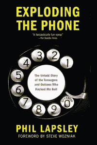
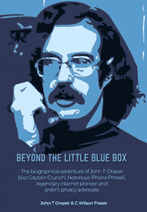
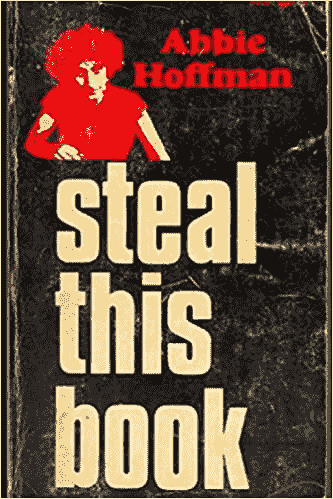

# 黑客们在 20 世纪 70 年代从电话网络上的秘密聚集点建立了他们自己的俱乐部

> 原文：<https://thenewstack.io/hackers-built-their-own-clubhouse-in-the-1970s-from-secret-gathering-spots-on-phone-networks/>

俱乐部会所应用程序正在重新引入一屋子声音的刺激感。但是，近半个世纪前，同样现象的草根版本震撼了电话公司。媒体科技博客 OneZero 上的一篇[文章回忆了地下社区是如何在纵横交错的电话线上涌现的，他们在电话网络上发现的秘密公共聚会场所聚会。他们“开拓了社区，分享了知识，并沉浸在更大的探索精神中”，一起发现事物的兴奋使他们团结在一起。在消费者互联网服务出现的几十年前，它可能是最接近上网的东西。](https://onezero.medium.com/the-prototype-for-clubhouse-is-40-years-old-and-it-was-built-by-phone-hackers-71389d117cad)

但更值得注意的是，这些年来他们的记忆是如何保存下来的。分散在网上的书籍和网站记录了让这一切发展起来的人和先驱的传奇和故事，拯救了在时间中丢失的秘密时刻的一瞥，一个发现的前沿在电话系统升级到更安全的系统时完全消失了。总的来说，也许它还提供了一个奇怪而珍贵的安全教训——从另一个方面来说，技术社区已经有机地萌芽了。

OneZero 将其描述为“一代无聊的青少年、修补匠、盲童和激进分子在他们那个时代占主导地位的技术基础设施——电话网络——的边缘相互联系。”

## 年轻又好奇

2014 年，[Edge AI 和 Vision Alliance 的业务发展副总裁 Phil Lapsley](https://www.linkedin.com/in/plapsley) 出版了[一本书](https://groveatlantic.com/book/exploding-the-phone/)记录了一群“不适合的技术爱好者、失明青少年、嬉皮士和不法分子”，他们找到了进入电话系统秘密场所的方法。拉普斯利在 2012 年纽约市举行的地球黑客(HOPE)会议上的一次演讲中解释了这些基础知识:随着美国人口的增长，通过电话线发送的可听音已经允许电话公司自动完成直播电话转接操作员一直在处理的工作。

[https://www.youtube.com/embed/cUDRuS2inEY?feature=oembed](https://www.youtube.com/embed/cUDRuS2inEY?feature=oembed)

视频

拉普斯利的书讲述了哈佛大学 1962 级学生查尔斯·派恩的故事，他的兴趣使他进入了大学广播电台，然后进入了校园电话系统。很快，他就发现了如何利用电台的音频振荡器来模拟电话线的相同音调。与另外两名哈佛学生(第四名在麻省理工学院)一起，他们录下这些音调，然后以适当的组合将它们拼接在一起，成功地欺骗了自动电话交换机。但这仅仅是他们手机相关探索的开始。

他们探索了各种电话前缀，拨打号码直到手指酸痛，有时甚至与现场接线员聊天。(有一次，他们甚至试图用长笛来模拟至关重要的 2600 兆赫的音调。)他们最终汇集了一百多页潦草的笔记，一度确定了一个导弹防空基地的控制中心。在 1956 年的电话手册的帮助下，他们组装了可能是世界上第一个“蓝盒子”，一种产生所有必要音调的机制，以欺骗电话系统，允许无限制的免费长途电话。一名学生告诉 Lapsley，它的创建花了比预期更长的时间，因为“我们不认为他们会愚蠢到设计我们可以进入信号的系统。”

他们的错误是与一名电话公司修理工交朋友——这名修理工最终向他的上司通风报信，后者带来了联邦调查局。这最终导致每个学生被不同的两个穿着风衣的联邦调查局人员采访，他们确信他们发现了一个间谍网，然后被 AT & T 的一名愤怒的安全官员采访。但大学生也有有影响力的朋友——一个叔叔认识宾夕法尼亚州贝尔实验室的负责人，而 Pyne 父母的一个老朋友认识新英格兰电话电报公司的总裁。没有提出任何指控。

拉普斯利写道，其他高中生和大学生也发现了同样的伎俩，包括康奈尔和莱斯等顶尖学校的学生。“故事实际上是相同的:聪明的高中或大学孩子发现了美国电话电报公司交换系统的漏洞，探索网络，被抓住，并得到了轻微的惩罚。”拉普斯利的书揭示了电话公司的困境:逮捕这些所谓的“电话泄密者”意味着他们的滑稽行为会被更多的人所知，这可能会导致更多的电话泄密者。此外，“锦上添花的是哦，废话，如果它不是真的非法头痛。”美国电话电报公司的律师甚至不确定是否有适用于这种新型入侵的联邦法律。

这造成了像路易斯·麦肯齐这样的问题，他是一名前陆军通信军官，后来成为电气工程师，开始销售自己的蓝盒子系列，后来他坚持认为它们在加州实际上是合法的。一个安全博客注意到“免费长途拨号”套件的广告[出现在流行电子杂志的分类栏目](https://jerichoattrition.wordpress.com/2017/11/21/john-thomas-draper-setting-the-record-straight-re-blue-box/)中。

然后是马克·伯尼，根据罗恩·罗森鲍姆 1971 年在《绅士》杂志上的一篇著名文章[，他可能是“西海岸第一个也是最老的电话推销员”——从真正的意义上来说，他是这个社区的创始人。通过技术杂志上的线索，伯尼发现了电话公司的开放测试线路，其他人也可以打电话到这些线路上和其他陌生人通话。伯尼发现他们已经被一个 18 岁的少年感化院的朋友挤满了。](http://www.slate.com/articles/technology/the_spectator/2011/10/the_article_that_inspired_steve_jobs_secrets_of_the_little_blue_.html)

最终，伯尼尝试在电话簿上粘贴贴纸，宣传他找到的一个免费电话号码，他会用管道输入一段录音，宣传其他成对的免费电话号码，可以拨入这些号码进行通话。他告诉拉普斯利，他已经在旧金山和西雅图分发了他的贴纸。他会在半夜把他的贴纸贴在高中门口。我会不引人注目地把它们放在糖果店，撒在小镇的主要街道上，”他告诉《时尚先生》。第一个接受者是西雅图的两个十几岁的女孩——其中一个显然告诉了一个盲人朋友，这个盲人朋友又告诉了他在洛杉矶盲人营地的朋友。“当夏令营结束时，”罗森鲍姆写道，“这些孩子把秘密带回了整个西部的城镇。”他报告说，第二年夏天，他们中的一个人在佛蒙特州的盲人营地分享了这个秘密知识。

拉普斯利的书[还讲述了乔·英格里西亚](http://explodingthephone.com/excerpt.php)的故事，他是佛罗里达州的一名盲人大学生，可以用口哨吹出合适的音调，并向他的大学同学收取在美国任何地方拨打长途电话的 1 美元费用。Rosenbaum 注意到，在 Engressia 上了报纸后，他开始接到全国各地的电话——从洛杉矶、西雅图、剑桥、纽约。"对其中一些人来说，这是他们第一次认识其他人。"英格里西亚把他们都介绍给了对方，分享了电话号码，并且“在一年之内，分散的电话窃听中心已经发展成为一个全国性的地下组织。”(22 岁的英格里西亚被称为“老人”。)

Rosenbaum 补充了一个关于一个盲人父母的彩色笔记。“他们不确定拉尔夫和他的朋友们到底用手机做什么，也不知道这是否完全合法，但他是个盲人，他们很高兴他有个让自己忙碌的爱好。”

## “我不敢相信这么容易”

也许最著名的电话神探是约翰·德雷珀，也就是“嘎吱船长”德雷珀的 [2018 传记](http://beyondthelittlebluebox.com/)生动地记得在 1969 年被介绍给他的第一个电话 phreaks 丹尼·特雷西的两个朋友(他的电话 phreak 句柄是“丹尼·圣何塞”)。“由于他们是盲人，他们基本上生活在一个音频的世界里，所以他们对手机的各个方面都非常感兴趣。他们的朋友拥有完美的音调，而其他人对声音非常敏感，每一声滴答声、唧唧声或其他电话声音都能被轻易地识别出来。

他们告诉德雷柏蓝盒子的时候他的第一反应是什么？“真不敢相信这么容易。”然后他建造了自己的房子，同时仍然和父母住在家里。

秘密正在传播。在与德雷珀会面后，苹果未来的创始人史蒂夫·沃兹尼亚克(Steve Wozniak)和史蒂夫·乔布斯(Steve Jobs)制作了蓝盒子，并出售给他们大学里的朋友。一个骗子向罗森鲍姆吹嘘说，他“从拉斯维加斯的一个辛迪加幌子公司订购了 1000 个寻呼机”，并“在菲律宾达成了一笔制造交易”，几乎达成了一笔 30 万美元的交易。OneZero 的文章还记得艾比·霍夫曼的书《偷走这本书》甚至认为，由于长途电话税资助了越战，“偷窃电话公司是一种革命之爱的行为。”

直到它不是。当电话系统升级一个接一个地消除了秘密的聚会地点时，这一切都消失得无影无踪了。

但如果这是它那个时代的社交媒体，OneZero 最终认为，还有一些东西已经丢失了。“今天，我们远不能以这种方式行事，因为我们被束缚在扁平的用户界面中，在我们的行为被培养为利润时，我们会分心。

“发展我们自己的地方意识几乎是不可能的，因为我们不是利益相关者，我们是产品。”

<svg xmlns:xlink="http://www.w3.org/1999/xlink" viewBox="0 0 68 31" version="1.1"><title>Group</title> <desc>Created with Sketch.</desc></svg>