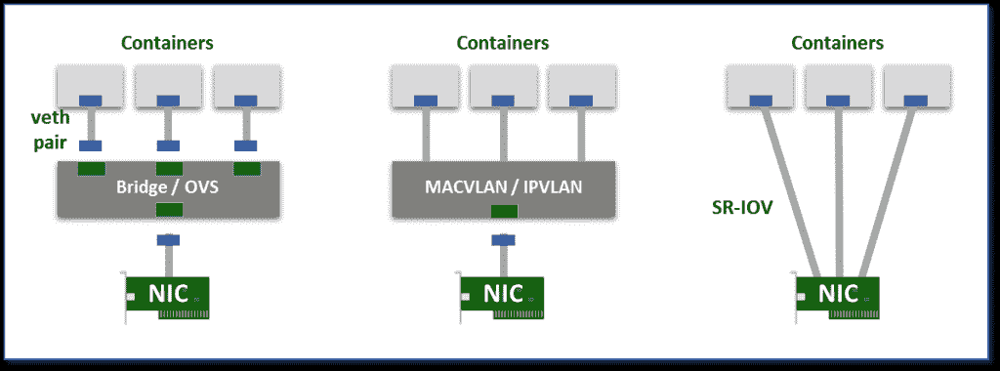
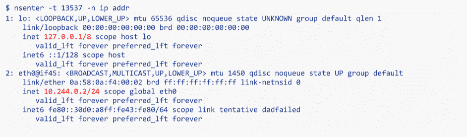
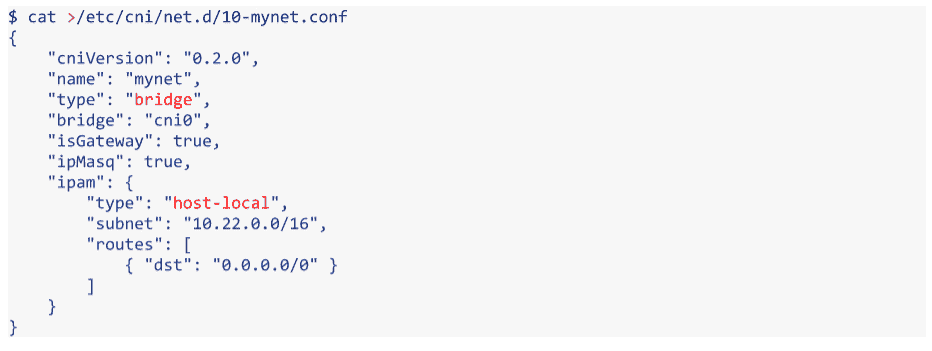

# Kubernetes 网络黑客指南

> 原文：<https://thenewstack.io/hackers-guide-kubernetes-networking/>

我们在 Iguazio 构建的平台是云原生的，使用基于 Docker 的微服务、etcd 和自主开发的集群管理。我们正在逐步迁移到 [Kubernetes](http://www.kubernetes.io) 容器编排引擎，现在它已经变得更加成熟，利用其高级功能，以便我们可以专注于提供独特的服务。

与大多数云原生应用不同，我们的应用是实时的。我们通过使用对网络、存储、CPU 和内存资源的低级直接访问来推动极致性能。容器和 Kubernetes 面临的挑战并不小，需要一些优秀的老式黑客技术。

这篇文章是系列文章的第一篇。我将分享 Kubernetes 和[容器网络接口](https://github.com/containernetworking/cni)如何与一些黑客技巧一起工作，以了解其内部并操纵它。未来的帖子将涵盖我们在容器中使用的高性能存储和进程间通信(IPC)技巧。

## 容器网络基础

容器使用名为 [Cgroups](https://en.wikipedia.org/wiki/Cgroups) 和 [Namespaces](https://en.wikipedia.org/wiki/Linux_namespaces) 的 Linux 分区功能。容器进程被映射到网络、存储和其他命名空间。每个名称空间只“看到”OS 资源的一个子集，以保证容器之间的隔离。

 [Iguazio 的 CTO 和创始人 Yaron Haviv 是一位连续创业者，在大数据、云、存储和网络领域拥有深厚的技术经验。在加入 Iguazio 之前，Haviv 是 Mellanox 的数据中心解决方案副总裁，负责技术创新、软件开发和解决方案集成。Haviv 是领先的数据库和存储供应商、企业组织、云和 Web 2.0 客户的开源计划和新解决方案的主要驱动力。在 Mellanox 之前，Haviv 是 Voltaire 的首席技术官兼 R&D 副总裁，Voltaire 是一家高性能、计算、IO 和网络公司。Haviv 经常在大数据和云技术活动上发言。他在推特上写道@ yaronhaviv。](http://iguaz.io/blog/) 

在网络方面，名称空间拥有自己的网络堆栈，包括接口、路由表、套接字和 IPTABLE 规则。一个接口只能属于一个网络命名空间。使用多个容器需要多个接口。另一种选择是生成伪接口，并将它们软连接到真实接口(我们还可以将容器映射到主机网络名称空间，就像用于[守护进程](https://en.wikipedia.org/wiki/Daemon_(computing))一样)。

以下是创建和连接伪接口的几个选项:

*   **虚拟桥**:创建虚拟接口对(veth)，一端在容器中，另一端在根名称空间中，使用 Linux 桥或 [OpenvSwitch](http://openvswitch.org/) (OVS)实现容器和外部(真实)接口之间的连接。与直接方法相比，网桥可能会引入一些额外的开销。
*   **多路复用**:多路复用可以由一个公开多个虚拟接口的中间网络设备组成，通过数据包转发规则来控制每个数据包到达哪个接口。MACVLAN 为每个虚拟接口分配一个 MAC(传出数据包标记有该 MAC，传入数据包根据目的 MAC 进行多路复用)。IPVLAN 也是如此，它基于 IP 地址并使用单个 MAC，这使得它对虚拟机更加友好。
*   **硬件交换**:如今大多数网卡都支持单根 I/O 虚拟化( [SR-IOV](https://en.wikipedia.org/wiki/Single-root_input/output_virtualization) )，这是一种创建多个虚拟设备的方法。每个虚拟设备都表现为一个独立的 PCI 设备。它可以拥有自己的 VLAN 和硬件实施的 QoS 关联。SR-IOV 提供裸机性能，但通常在公共云中不可用。



虚拟网络模式:桥接、多路复用和 SR-IOV。

在许多情况下，用户希望创建跨越多个 L2/3 网段的逻辑网络子网。这需要覆盖封装协议(最常见的是 [VXLAN](https://en.wikipedia.org/wiki/Virtual_Extensible_LAN) ，它将覆盖流量封装到 UDP 包中)。VXLAN 可能会带来更高的开销，而且由于控制平面缺乏标准化，来自不同供应商的多个 VXLAN 网络通常无法互操作。

Kubernetes 还广泛使用 IPTABLES 和 NAT 来拦截去往逻辑/虚拟地址的流量，并将其路由到适当的物理目的地。像[法兰绒](https://github.com/coreos/flannel)、[印花布](https://www.projectcalico.org/)和[编织](https://www.weave.works/)这样的容器网络解决方案使用 veth 和一个网桥/路由器以及一些覆盖或路由/NAT 操作。

关于各种 Linux 网络选项，请参阅这个很棒的实践教程和使用指南。

除了预期的数据包处理开销，虚拟网络还会增加隐性成本，并可能对 CPU 和内存并行性产生负面影响，例如:

*   网卡根据报头将流量导向内核。如果报头发生变化，流量将会流向错误的内核，从而降低内存和 CPU 效率。
*   网卡构建数据包并将校验和卸载到硬件，以节省大量 CPU 和内存周期。如果覆盖包构建在软件中，或者如果我们在覆盖(云/IaaS)之上有覆盖(容器)，结果将是性能下降。新网卡可以在硬件中构建 VXLAN 数据包，但覆盖解决方案必须直接使用它。

一些应用(如 Iguazio)使用高级网卡功能，如 RDMA、 [DPDK](http://dpdk.org/) 快速网络处理库或加密来卸载消息传递，对 CPU 并行性进行更严格的控制，减少中断或消除内存副本。这只有在使用直接网络接口或 SR-IOV 虚拟接口时才有可能。

## 玩 POD 网络

没有简单的方法来查看网络名称空间，因为 Kubernetes 和 Docker 不会注册它们(“ **ip netns** ”不会与 Kubernetes 和 Docker 一起工作)。但是我们可以使用一些技巧从主机查看、调试、管理和配置 POD 网络。

网络名称空间列在**/proc/<PID>/ns/net**中，因此我们需要为我们的 POD 找到进程 ID (PID)。首先，让我们用下面的命令找到一个容器 ID，只取前 12 位:

```
kubectl get po  &lt;POD-NAME&gt;  -o  jsonpath='{.status.containerStatuses[0].containerID}'  |  cut  -c  10-21

```

接下来，让我们使用 Docker 命令来查找 PID:

```
PID=$(docker inspect  --format  '{{ .State.Pid }}'  &lt;ContainerID&gt;)

```

一旦我们有了 PID，我们就可以监控和配置该 POD 的网络。使用[**n 输入**](http://man7.org/linux/man-pages/man1/nsenter.1.html) 实用程序运行任何具有 POD 名称空间的命令，例如:

```
nsenter  -t  ${PID}  -n  ip addr

```

…将向我们展示所有 POD 接口及其 IP。然后，我们可以使用其他命令，如 **ping** 或 **curl** 来检查连通性，使用特权操作或未安装在 POD 容器中的操作来监控、调试或配置该 POD(例如，ip route、nslookup 等。)



如果我们不喜欢每个 POD 只有一个接口，我们可以从主机名称空间中获取或创建接口，并将它们分配给 POD:

```
ip  link  set  netns  ${PID}  &lt;IFNAME&gt;

```

如果我们想要回它们，我们只需将它们归还给主机:

```
nsenter  -t  ${PID}  -n  ip link set  &lt;IFNAME&gt;  netns  1

```

## 自动化 Kubernetes 与 CNI 的联网

Kubernetes 使用 CNI 插件来协调网络。每次初始化或删除 POD 时，都会使用默认配置调用默认的 CNI 插件。这个 CNI 插件创建一个伪接口，将其连接到相关的底层网络，设置 IP 和路由，并将其映射到 POD 名称空间。

不幸的是，Kubernetes 在一个集群范围的配置中仍然只支持每个 POD 一个 CNI 接口。这是非常有限的，因为我们可能希望为每个 POD 配置多个网络接口，潜在地使用具有不同策略(子网、安全性、QoS)的不同覆盖解决方案。

让我们看看如何绕过这些限制。

当 **Kubelet** Kubernetes 本地代理配置 POD 网络时，它会在 **/etc/cni/net.d/** 中查找 CNI json 配置文件，并在 **/opt/cni/bin/** 中查找相关插件二进制文件(基于类型属性)。CNI 插件可以调用辅助 IP 地址管理(IPAM)插件来设置每个接口的 IP 地址(例如主机本地或 **dhcp** )。也可以通过 **Kubelet** 命令选项使用其他路径:



**Kubelet** 使用包含命令参数的环境变量(CNI_ARGS，CNI _ 命令，CNI_IFNAME，CNI_NETNS，CNI _ 容器 ID，CNI _ 路径)调用 CNI 插件，并通过 **stdin** 传输 json.conf 文件。插件用 json 输出文本进行响应，描述结果和状态。在此查看更多[详细解释和示例](https://github.com/containernetworking/cni/blob/master/SPEC.md)。如果你懂 [Go](/tag/golang/) 编程语言，开发你自己的 CNI 插件就相对简单了，因为这个框架有很多神奇之处，你可以在这里使用或扩展一个现有的插件。

Kubelet 将传递 POD 名称和命名空间作为 CNI_ARGS 变量的一部分(例如“K8S _ POD _ NAMESPACE = defaultK8S _ POD _ NAME = my tests-1227152546-vq7kw；").我们可以使用它来定制每个 POD 或 POD 命名空间的网络配置(例如，将每个命名空间放在不同的子网中)。未来的 Kubernetes 版本将把网络视为平等的公民，并将网络配置作为 POD 或名称空间规范的一部分，就像内存、CPU 和卷一样。目前，我们可以使用注释来存储配置或记录 POD 网络数据/状态。

一旦被调用，CNI 插件就会执行自己的逻辑。它还可以将多个网络接口连接到同一个 POD，并绕过当前的限制，但有一点需要注意:Kubernetes 将只知道我们在结果中报告的那个接口(用于服务发现和路由)。我最近偶然发现了一个很棒的英特尔开源 CNI 插件，名为 [Multus](https://github.com/Intel-Corp/multus-cni) ，它就是这么做的。在最近的一次闲聊后，Linux 程序员[道格·史密斯](https://twitter.com/dougbtv)写了一份详细的[木尔图斯走查](http://dougbtv.com/nfvpe/2017/02/22/multus-cni/)。

Multus 接受一个带有一系列 CNI 定义的分层 conf 文件。它将为每个 POD 配置多个接口，每个定义一个，我们可以指定哪个接口是 Kubernetes 要识别的“masterplugin”。我们以此为基准，结合单元名称和单元注释，为每个单元创建灵活而独特的网络配置。

同一个英特尔 git 还包括另一个有趣的 CNI 驱动程序，用于支持 [SR-IOV 和 DPDK](https://github.com/Intel-Corp/sriov-cni) 。

## 摘要

我喜欢云原生和微服务，它们对敏捷和持续应用交付的影响是巨大的。然而，容器网络项目似乎仍处于萌芽状态，刚刚迈出第一步，本质上只是解决跨部门/云连接的挑战。这些项目仍然需要定制，以适应更广泛的应用基础和更高的性能。希望它能够快速改进，达到其他更成熟的软件定义的网络解决方案的功能水平，如 OpenStack Neutron 或 VMware NSX。

我们如何让所有这些不同的覆盖层和底层控制平面实现互操作，从而在一个逻辑网络的两端支持两种不同的供应商/云解决方案？这是一个价值 64，000 美元的问题，我欢迎您的反馈。这显然是一个需要更多关注和标准化的关键领域。

*有关 Kubernetes 网络和相关主题的更多信息，请参加 3 月 29 日至 30 日在德国柏林举行的[CloudNativeCon+kube con Europe](http://cloudnativeconeu.org/)2017。*

<svg xmlns:xlink="http://www.w3.org/1999/xlink" viewBox="0 0 68 31" version="1.1"><title>Group</title> <desc>Created with Sketch.</desc></svg>