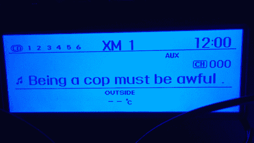

# 引用 Reddit 上的话说，黑进汽车的液晶显示屏

> 原文：<https://thenewstack.io/hacking-cars-lcd-screen-quote-reddit/>

[哈林·德·梅尔](https://twitter.com/solder_flux)驾驶着城里最极客的 2012 款现代 Genesis 跑车…

加拿大机械工程学生[黑进了他汽车](http://solderandflux.com/2016/05/27/making-shower-thoughts-scroll/)的仪表盘显示屏，所以现在显示的是来自 Reddit 的有趣引文。具体来说，它展示了那些奇怪的“[淋浴想法](https://www.reddit.com/r/Showerthoughts)”——来自 Reddit 论坛的头条，这些精彩的一次性见解随机出现在你的脑海中。

*“如果狗狗因为觉得你喜欢扔球而玩捡球游戏呢？”*

存在着一系列有限的行为，如果我按照正确的顺序去做，会让我在一天之内成为百万富翁。我只是不知道它们是什么。”

“除了家里的几个 Arduino 项目，我没有任何编程经验，”De Mel 在博客文章中写道[“所以我的代码肯定不是最佳的。”但是不到一个月，他已经完成了这个项目，并在 GitHub](http://solderandflux.com/2016/05/16/reddits-shower-thoughts-on-my-cars-factory-radio-screen/) 上分享了它的 Python 代码[。“希望这至少会给你自己的项目提供一个起点，你将能够看到实现这一目标的基本过程。”](https://github.com/hdemel/Genesis-Canbus/blob/master/showerthoughtswrap.py)

一个人敢于摆弄他价值 2 万美元的现代汽车上的软件，仅仅是为了让它的仪表盘显示 Reddit 上有趣的引用，这确实令人振奋。

*“轮胎里应该有纸屑，这样即使发生爆胎，天气也还算不错。”*

*“中文字母汤一定是疯了。”*

哈林强烈的“自己动手”倾向延伸到了他对硬件的选择，因为他用一个廉价的可编程 Arduino 板替换了控制显示器 LCD 屏幕的电路，然后将其连接到另一个廉价的 Raspberry Pi 板，用于从 Reddit 下载文本。他不确定只有一块电路板能同时处理这两项任务，因为在他车内的某个地方，“每秒钟有数百条信息在这个网络上传输。我决定最好使用一个带有 MCP2515 的 Raspberry Pi 来传输到 LCD 屏幕，然后让它使用一个连接到 MCP2515 的 Arduino 作为接收节点……”

幸运的是，他的 2012 款现代 Genesis Coupe 中的所有数字设备都使用一个相当常见的标准进行连接，即“控制器局域网总线”(或 CAN 总线)。所以哈林[拿起他的一个 Arduino](http://solderandflux.com/2016/04/27/canbus-sniffing-the-2012-hyundai-genesis-coupe/)——外加一个便宜的 SPI CANBUS 电路板——开始[做一些实验](http://solderandflux.com/2016/04/28/canbus-data-ive-received-so-far/)。当他第一次将 Arduino 电路板安装到仪表板上时，LCD 开始显示一天中的时间——每十毫秒——当系统重新传输时，他发送到屏幕上的任何新信息都被清除了。但是根据[最近在 *Make:* magazine](http://makezine.com/2016/06/14/hack-your-cars-dashboard-to-display-reddit-shower-thoughts/) 上的一篇文章，哈林已经建立了一个继续前进的强大动力，因为“我讨厌那个愚蠢的蓝色小液晶显示器。它只会坐在那里，明亮地盯着我，嘴里说着‘AUX’…”

所以他重新安排了 LCD 的输入。幸运的是，Harin 的另一个 Raspberry Pi 板可以容纳 WiFi 加密狗。通过使用 iPhone 进行连接，它现在能够引用有趣的 Reddit 报价。而 *Make:* 也报道了他的下一个项目可能是直接在他的车上安装路由器。

可能一旦开始修修补补，就很难停下来了。

哈林甚至将他的 Nexus 7 Android 平板电脑安装到他汽车的仪表板上，并用它来播放音乐。在他博客的评论中，他谈到有一天将“正在播放”的信息从平板电脑传输到液晶显示器上。在混合的某个地方，甚至有一个 SQL 数据库。我的主脚本从 Shower Thoughts 中检索 top post，并将字符转换为十六进制的对等字符，添加消息 ID 和行标识符，并将其存储在 SQL 数据库中。

[https://www.youtube.com/embed/XzNXzkWShwI?feature=oembed](https://www.youtube.com/embed/XzNXzkWShwI?feature=oembed)

视频

还有另外两个脚本用于从数据库中检索报价并显示在屏幕上，Harin 说这将为以后的更多功能打下基础。“最终，我将能够在主[[CAN 总线](https://en.wikipedia.org/wiki/CAN_bus)]网络上筛选出针对 LCD 的消息，并将我想要保留的消息添加到 SQL 数据库中，同时删除我不再需要的消息。”

但也许这个项目最鼓舞人心的部分是，从哈林的博客帖子来看；他只是断断续续地做了一个多月。“我是全职学生，有全职工作，”哈林写道，“所以我不能随心所欲地修补。”

现在，他看到的不是显示器上的外部温度，而是令人兴奋的业余哲学。但也许它会告诉你，如果你要去一个陌生的地方，你的旅程也可能是不可预测的。根据他的博客帖子，该屏幕最初是为了显示 Sirius XM 的歌曲信息(标题和艺术家)。

正因为如此，Reddit 上的引用最初是以一个音符开头的，一个截图让他看起来像是在听一首名为“当警察一定很糟糕…”

* * *

# WebReduce

<svg xmlns:xlink="http://www.w3.org/1999/xlink" viewBox="0 0 68 31" version="1.1"><title>Group</title> <desc>Created with Sketch.</desc></svg>