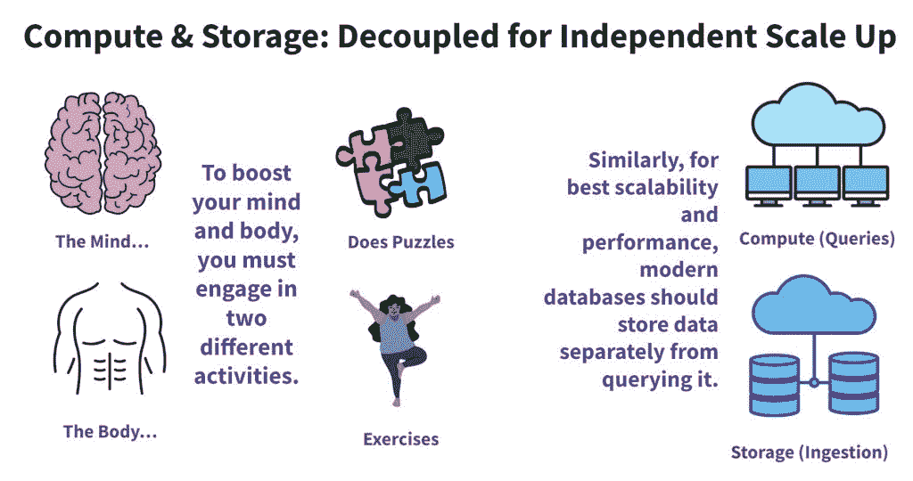
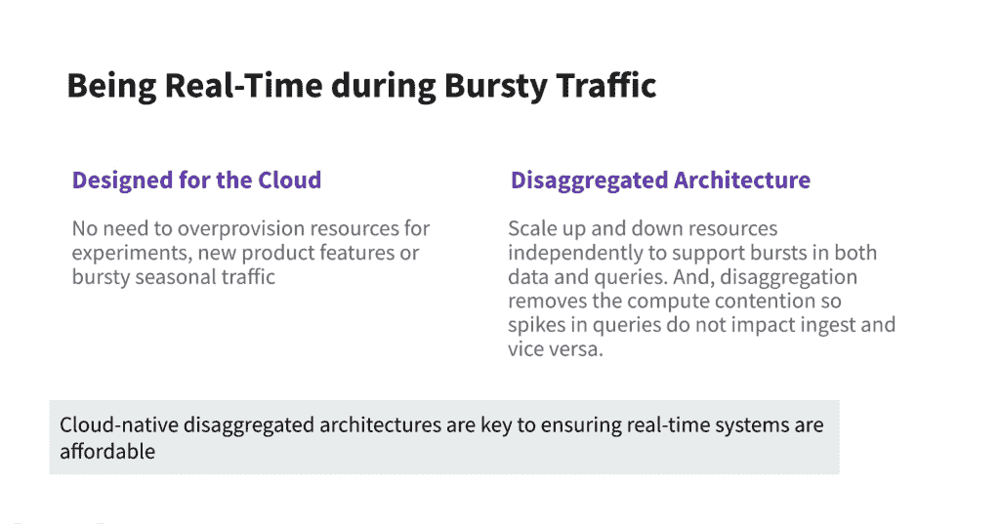
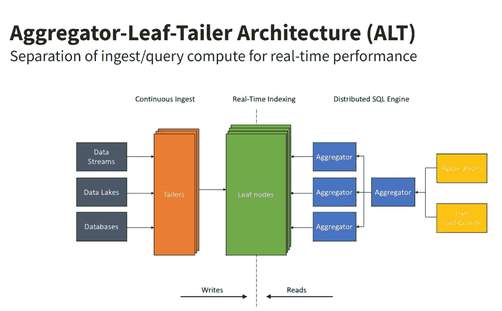

# 处理实时分析应用中的突发流量

> 原文：<https://thenewstack.io/handling-bursty-traffic-in-real-time-analytics-applications/>

[Dhruba Borthakur](https://www.linkedin.com/in/dhruba)

[Dhruba 是 Rockset 的 CTO 兼联合创始人，负责公司的技术方向。他是脸书大学数据库团队的工程师，也是 RocksDB 数据存储的创始工程师。此前在雅虎，他是 Hadoop 分布式文件系统的创始工程师之一。他也是开源 Apache HBase 项目的贡献者。](https://www.linkedin.com/in/dhruba)

*注:本文是“* [*设计下一代实时分析数据系统*](https://rockset.com/blog/why-mutability-is-essential-for-real-time-data-analytics/) *”系列文章的第三篇*

开发人员、数据工程师和站点可靠性工程师可能在许多事情上意见不一致，但有一点他们可以达成一致，那就是突发数据流量几乎是不可避免的。

有充分的证据表明，黑色星期五期间，网络零售流量会激增 10 倍。还有许多其他情况下，数据流量会突然激增。万圣节导致消费者社交媒体应用被照片淹没。重大新闻事件可以让市场因电子交易而沸腾。一个迷因会突然在青少年中传播开来。

在过去的批量分析中，数据流量的爆发更容易管理。高管们并不希望报告每周超过一次，也不希望仪表盘有最新的数据。尽管像事件流这样的一些数据源开始实时到达，但是数据和查询都不是时间敏感的。数据库可以定期缓冲、接收和查询数据。

此外，分析系统和管道是互补的，而不是关键任务。分析没有像今天这样嵌入到应用程序中或用于日常运营。最后，您可以始终提前计划突发流量，并过度配置您的数据库集群和管道。它很贵，但是很安全。

## 为什么突发数据流量是当今的一个问题

这些条件已经完全颠倒了。公司正在迅速转型为数字企业，以效仿优步、Airbnb、Meta 等颠覆者。无论是通过客户推荐引擎、自动化个性化系统还是内部业务观察平台，实时分析现在都在推动他们的运营和底线。没有时间缓冲数据以供悠闲地摄取。由于当今涉及的数据量巨大，过度配置可能会给公司带来财务上的灾难。

许多数据库声称可以按需提供可扩展性，以便您可以避免昂贵的过度配置，并保持数据驱动的操作正常运行。仔细观察，您会发现这些数据库通常采用以下两种穷人的解决方案之一:

*   **手动重新配置。**许多系统要求系统管理员手动部署新的配置文件来扩展数据库。不能通过规则或 API 调用自动触发扩展。这造成了实时不可接受的瓶颈和延迟。
*   **将复杂的分析卸载到** [**数据应用**](https://rockset.com/what-is-a-data-application/) **。其他数据库声称他们的设计提供了对突发数据流量的免疫力。键值和文档数据库是两个很好的例子。两者在执行简单任务时速度都非常快——检索单个值或整个文档——而且这种速度很大程度上不受数据突发的影响。然而，这些数据库倾向于牺牲对任何规模的复杂 SQL 查询的支持。相反，这些数据库制造商已经将复杂的分析工作交给了[应用程序代码](https://rockset.com/what-is-a-data-application/)和他们的开发人员，他们既没有技能也没有时间随着数据集的发展不断更新查询。这种查询优化是所有 SQL 数据库擅长并自动完成的事情*。***

突发性数据流量还会影响许多数据库，这些数据库在默认情况下以平衡配置部署，或者不是为隔离计算和存储任务而设计的。不将摄取与查询分开意味着它们会直接影响对方。写入大量数据会降低读取速度，反之亦然。

这个问题——由摄取和查询计算之间的争用导致的潜在减速——是许多 [Apache Druid](https://rockset.com/comparisons/rockset-vs-apache-druid) 和 [Elasticsearch](https://rockset.com/comparisons/elasticsearch-vs-rockset) 系统的通病。对于[雪花](https://rockset.com/comparisons/rockset-vs-data-warehouse)，这不是什么问题，它通过扩展系统的两端来避免争用。这是一种有效的过度配置策略，尽管代价高昂。

数据库制造商已经试验了不同的设计，以在不牺牲速度、功能或成本的情况下适应突发的数据流量。事实证明，有一种经济高效的方法和一种昂贵低效的方法。

## Lambda 架构:太多的妥协

十年前，一种叫做 [Lambda](https://levelup.gitconnected.com/big-data-lambda-architecture-in-a-nutshell-fd5e04b12acc) 的多层数据库架构开始出现。Lambda 系统试图通过将数据摄取分为两层来满足专注于大数据的数据科学家和专注于流的开发人员的需求。一层处理成批的历史数据。Hadoop 最初被使用，但后来被雪花、红移和其他数据库取代。

还有一个典型的围绕流处理技术构建的“速度”层，如亚马逊 Kinesis 或 Spark。它提供实时数据的即时视图。服务层——通常是 MongoDB、Elasticsearch 或 Cassandra——然后将这些结果提交给仪表盘和用户的特别查询。

当系统被创建出来时，它们的特性也是如此。维护两条数据处理路径给开发人员带来了额外的工作，他们必须编写和维护两个版本的代码，同时也增加了数据出错的风险。开发人员和数据科学家也很难控制流式和批量数据管道。

最后，Lambda 中的大部分数据处理都是在新数据写入系统时进行的。服务层是更简单的键值或文档查找，不处理复杂的转换或查询。相反，数据应用程序开发人员必须处理应用新转换和修改查询的所有工作。不太敏捷。有了这些问题以及更多，难怪[叫](http://radar.oreilly.com/2014/07/questioning-the-lambda-architecture.html)给[【杀λ】](https://engineering.linkedin.com/blog/2016/06/stream-processing-hard-problems-part-1-killing-lambda)保持[年年递增](https://developpaper.com/lambda-architecture-issues/)。

## ALT:突发流量的最佳架构

对于突发数据流量的问题，有一个很好的解决方案。

为了有效地扩展以实时处理突发流量，数据库将分离存储和分析数据的功能。这种分解的体系结构使接收或查询能够根据需要进行伸缩。这种设计还消除了计算争用造成的瓶颈，因此查询中的峰值不会降低数据写入速度，反之亦然。最后，数据库必须是云原生的，所以所有的扩展都是自动的，对开发人员和用户是隐藏的。无需提前过度配置。

这种无服务器的实时架构是存在的，它被称为 Aggregator-Leaf-Tailer (ALT ),因为它将获取、索引和查询数据的工作分开。

就像汽车上的巡航控制一样，如果查询突然增加，ALT 架构可以轻松地保持接收速度，反之亦然。像巡航控制一样，这些接收和查询速度可以基于应用程序规则独立扩展，而不是手动重新配置服务器。有了这两个特性，就不会有争用导致速度变慢的可能，也不需要提前过度配置系统。ALT 架构为实时分析提供了最佳性价比。

我在[脸书](https://engineering.fb.com/2015/03/10/production-engineering/serving-facebook-multifeed-efficiency-performance-gains-through-redesign/)亲眼目睹了 ALT 的威力，当时我所在的团队将新闻订阅源(现已更名为 Feed)——来自你所有朋友的更新——从每小时更新一次变成了实时更新。同样，当 LinkedIn 将其实时 FollowFeed 升级到 ALT 数据架构时，它[提高了查询速度和数据保留](https://engineering.linkedin.com/blog/2016/03/followfeed--linkedin-s-feed-made-faster-and-smarter)，同时将所需的服务器数量削减了一半。谷歌和其他网络规模的公司也使用 ALT。要了解更多细节，[请阅读我在 ALT](https://rockset.com/blog/aggregator-leaf-tailer-an-architecture-for-live-analytics-on-event-streams/) 上的博客，以及为什么它在实时分析方面胜过 Lambda 架构。

公司不需要像上面那样人浮于事的数据工程师来部署 ALT。 [Rockset](http://www.rockset.io) 在围绕 ALT 架构构建的云中提供实时分析数据库。我们的数据库使公司能够轻松处理实时分析工作负载的突发数据流量，并解决其他关键的实时问题，如可变和无序数据、低延迟查询、灵活的模式等。

如果您选择一个为应用程序实时提供数据的系统，请评估它是否实现了 ALT 架构，以便能够处理来自任何地方的突发流量。

<svg xmlns:xlink="http://www.w3.org/1999/xlink" viewBox="0 0 68 31" version="1.1"><title>Group</title> <desc>Created with Sketch.</desc></svg>