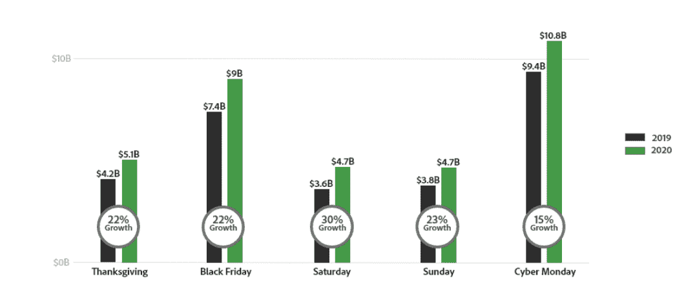
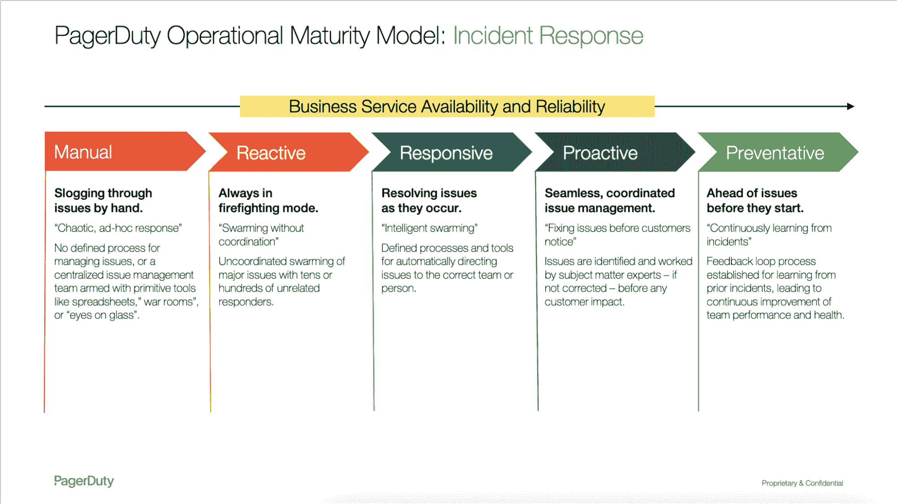

# 用成熟的工程团队管理网络星期一

> 原文：<https://thenewstack.io/handling-cyber-monday-with-a-mature-engineering-team/>

[Hannah Culver](https://www.linkedin.com/in/hannah-culver/)

[Hannah 是 PagerDuty 的一名解决方案营销人员，她对实时紧急工作如何在这个数字时代的所有行业中发挥作用很感兴趣。](https://www.linkedin.com/in/hannah-culver/)

2020 年的假日季与以往不同。随着许多购物者转向数字化，购物习惯可能不可逆转地改变了。根据[在线金融](https://financesonline.com/cyber-monday-statistics/)的数据，91%的购物者因新冠肺炎改变了他们的购物习惯，其中 58%的人主要在网上购物。假期中最重要的一天是哪一天？那天不是黑色星期五。

网络星期一风靡全球，将购物高峰期延长了一天。根据 Adobe Analytics 的数据，去年网络星期一的销售额超过了黑色星期五，达到 108 亿美元，比前一年增长了 15%。

希望利用假日零售购物狂潮的零售商需要从感恩节晚上一直到网络星期一保持高峰流量水平。正常运行时间和可用性是服务和转化尽可能多的销售的必要条件，但这也给负责监控和确保可靠性的技术团队带来了巨大的压力。

希望渡过难关的团队应该专注于提高他们的数字运营成熟度，以规划和构建弹性。其中一个关键部分是建立流程，以最佳方式动员对关键任务紧急工作做出快速、协调的响应。如果整个零售机器在组织的最大收入期即将到来时没有问题地运转，那么投资于维持系统弹性和响应的最佳实践所需的文化转型将是非常值得的。

[运营成熟度](https://www.pagerduty.com/digital-operations-maturity/)是对 it 基础设施的整体一致性、可靠性和弹性的衡量，包括如何管理和维护 IT 基础设施。在数字化运营的背景下，运营成熟度是指组织在检测、分类、动员、响应和解决中断或系统故障方面的准备程度。

运营成熟度的提高可以释放商业利益，包括提高收入、员工倦怠水平和保留率、提高系统可靠性、维护品牌形象等。PagerDuty 有一个操作成熟度的高级模型，以及几个探索各个方面的子模型。下面是我们如何通过事件响应的视角来看待运营成熟度，这是数字化运营的一个关键组成部分，在交通高峰期至关重要。

【T2

从一个级别转移到另一个级别不是大多数组织可以一夜之间完成的事情；这是一个长期反复的学习过程。随着时间的推移，你的团队文化将会改变，不仅仅是流程和技术。这是一项长期投资，比投资正确的工具更复杂。然而，花点时间提高你的运营成熟度可以让下一次网络星期一变得更容易，每一次都会更成功。

如果您的团队正在寻找一些快速提示来帮助即将到来的网络星期一取得成功，您可以查看我们的 [hypercare 清单](https://www.pagerduty.com/resources/ebook/hypercare-readiness-checklist/)。如果你有兴趣听听如何在 2021 年后为自己的成功做准备，请继续读下去！下面我们将分析你的团队可以做些什么来提高他们的成熟度。

## 从手动到反应式

手动阶段的特征是混乱的、临时的响应。没有明确的事件响应流程，或者团队必须依靠带有原始工具(如电子表格和呼叫树)的集中式事件管理。这是最不成熟的阶段。从这里开始，团队希望进入反应阶段，这包括开始群集事件。这意味着一大群人都动员起来解决它。虽然这不是有针对性的，但它至少确保了这个问题受到关注。

要从手动转变为反应式，您需要做一些事情来建立能力基线，包括定义 KPI 和目标、优先服务以及关键人员及其角色。此后，您需要:

**确定沟通和通知方式**:采用现代监控和报警方式，确定沟通和通知方式。监控工具将发现系统运行方式中的异常，最好是在您的客户发现之前！—并将该信息发送到您的[警报和通知平台](https://www.pagerduty.com/platform/on-call-management/)。从那里，您的警报和通知平台将向相关的利益相关者发送警报，消除了一些来自过时的呼叫树和持续“盯着玻璃”的人工劳动

**定义标准事件响应流程**:统一的流程可以加快响应速度，帮助待命团队成员更加自信。与您的团队一起，确定:

*   什么将事件分类为特定的严重程度。
*   根据严重程度，事件中涉及哪些角色。
*   何时上报以及上报给谁。
*   哪些清单可以帮助团队完成响应过程。

有了这些改变，你就不必依赖客户告诉你什么时候出了问题。这将提高您的声誉，因为您可以通过主动向客户传达问题来提前应对事件。在性能下降和停机可能意味着您的客户放弃购物车的高峰期，一封简短的客户电子邮件或一篇社交媒体帖子可以为您挽回损失的收入。

## 反应到响应

反应模式对以前手动计分的队伍有几个好处。虽然这肯定不是理想的状态，因为它仍然需要许多人从计划好的工作中抽出时间来救火，而且它没有针对性。如果您真的只需要一个五六人的核心团队来协助，那么您应该放弃为一个 Sev2 问题动员几十个人的做法。是时候看看你的团队如何向响应式前进了，这是大多数 PagerDuty 客户发现自己所处的阶段。

响应式的特点是智能群集问题。团队将有明确的流程和工具来将问题导向适当的人。虽然组建一个响应团队在这一点上可能仍然是一个挑战，但至少最初的警报会发送给正确的人，然后该人负责联系其余的相关利益相关者。要实现这一点，团队应该将服务映射到团队，并创建随叫随到的时间表，将时间表传递给正确的人。

将服务映射到团队可能会采取[全面服务所有权](https://ownership.pagerduty.com/)的形式，人们负责在软件/服务生命周期的每个阶段支持他们交付的软件。在 PagerDuty，我们认为服务是一个独立的功能，它提供价值，并且完全由团队所有。要定义服务:

*   看看哪个团队拥有这些服务。本着全服务所有权的精神，这应该是构建该服务的团队。如果有多个团队在服务上工作，确定是否真的需要将它分成更小的不同服务，或者是否一个团队可以接管它。
*   确定随叫随到的轮换方式。一旦你确定了你的团队，使用你的[随叫随到平台](https://www.pagerduty.com/platform/on-call-management/)来决定谁来回答传呼。在最终确定之前，创建一个轮换并进行试点。您的团队可以帮助找出如何最好地平衡时间表。有了全面的服务所有权和既定的随叫随到制度，将更容易确保根据服务和传呼机携带者将事件发送到正确的人。
*   检查支持服务的团队规模是否正确。如果你有一个小的服务，有大量的团队成员随时待命支持它，看看其他团队是否需要帮助。或者，如果您发现您没有足够大的团队来支持这项服务，那么就提出资源需求。

一旦你定义了你的服务，创建一个轻量级的[服务图](https://www.pagerduty.com/event/services-like-a-boss-best-practices-for-implementing-and-maintaining-services-architecture/)，它可以描述你的系统的整体架构以及谁拥有什么。随着时间的推移，您可以充实这一点，随着您对这种服务视图越来越熟悉，您可以包括映射到业务服务和阐明依赖关系。

响应式比反应式有几个优点。其中最重要的一条就是成本效率。通过智能地集中问题，你不再需要几十或几百个无关的人在大型电话会议上解决事件。相反，有针对性的团队可以处理它，并在必要时召集更多的人。这也有助于减轻警报疲劳，因为警报应该更有针对性。这在流量高峰时尤其重要，因为技术团队不能在与他们无关的警报上浪费认知能力。

## 从响应到主动

下一个阶段是积极主动的，在您的客户注意到有问题之前，您就在解决问题。事件管理是无缝且协调的。您可以在客户受到影响之前解决问题，而不仅仅是在问题发生时解决问题。

为了达到这个成熟度级别，您需要优化和标准化您的优先服务响应，并映射业务服务和依赖关系。

**标准化优先服务响应**:这是关于通过为常见故障创建响应策略来减少对客户影响最大的故障。在这一阶段，您将希望包括 [runbook automation](https://www.pagerduty.com/resources/ebook/supercharge-incident-response-runbook-automation/) 来帮助运行脚本，并为响应者提供额外的上下文。在高级实践中，您甚至可以配置运行手册来自动修复问题，而无需任何人工干预。

PagerDuty 客户 Parsons 正在使用 Rundeck runbook automation 来提升事故响应实践。帕森斯团队建议从小块和低挂的水果开始。从那里，您可以添加序列来构建更强大的自动化。当你这样做的时候，Parsons 建议你在相关的团队之间共享你的自动化。你越是谈论自动化，越是展示它如何改善响应者的生活，就会有越多的团队采用它。要了解更多关于帕森斯自动化项目的信息，请看[这段视频](https://www.youtube.com/watch?v=uKJO7wpciTA&list=PLW0xKyjystaMvn6T2Pb4LyuJnL6455k_p&index=25)。

**将技术服务映射到业务服务**:在前一个成熟阶段，您创建了技术服务的基本映射，但是您还希望将这些技术服务映射到业务服务，并包括依赖关系。这有助于您全面了解您遇到的问题。您将了解每个事件的下游技术影响和业务影响，并相应地确定优先级。

为此，您需要与其他业务线利益相关者跨职能合作，以确保技术部分与业务单元保持一致。您还需要与拥有无关或依赖服务的团队合作，以确定服务如何相互影响。您可以在之前构建的服务地图上进行迭代，使其随着每次添加而变得更加强大。

这有助于缩短解决问题的时间，并有助于防止客户意识到某个问题已经发生。在高峰时期，停机时间可能达到每分钟几十万美元，这是关键。

## 从主动到预防

预防性是数字化运营成熟度模型的最后一个阶段。其特点是在问题开始之前就提前解决问题，并提供出色的客户体验。主动可能意味着无缝的事件响应，而预防则更进一步，问“这一定是一个事件吗？”

通过从以前的事件中学习，团队能够创建和优化反馈循环，以实现持续改进和更好的团队健康和绩效。实现这一目标的一个关键方法是对事故进行彻底和定期的事后分析，并优先考虑从中获得的改进。

当进行尸检时，重要的是要记住保持它的清白。不要责怪人们或将事件贴上“人为错误”的标签，而是深入挖掘事件中发生的事情，并找到团队可以使他们的工作更容易或系统更可靠的时刻。

通过对这些改进进行优先排序，团队可以最大限度地减少计划外的工作量，减少非工作时间的干扰([一个导致疲劳和损耗的原因](https://www.pagerduty.com/state-of-digital-ops/))，并提供出色的客户体验。

以下是有效验尸的一些建议:

虽然在今年的网络星期一之前达到这种水平对大多数团队来说可能是一个过高的任务，但这是一个伟大的目标，也是一个你可以一步一步努力的目标。为您的团队、客户和底线带来的好处是值得的。

运营成熟度是一个不断发展和持续的过程。随着您进入每个阶段，您将了解更多关于您所支持的系统和服务的信息，哪些技术选择最能支持您的目标，以及您希望您的文化演进是什么样子的。

这个成熟度模型包含了如何改进您的事件响应，但是整体成熟度不仅仅是这个过程。除了事件响应，您还需要改进您的事件智能管理、自动化能力和客户服务流程。当您在这些领域中的每一个领域进行投资时，改进将会波及到成熟领域。运营成熟度是一个很好的成功指标，可以衡量您的组织在管理像网络星期一这样的交通高峰时段方面的表现。

*要了解更多关于如何成熟你的数字运营，请看一下[这本电子书](https://www.pagerduty.com/digital-operations-maturity/)。或者，如果你认为你的团队可以从数字化运营平台中受益，[免费试用一下 PagerDuty】。](https://www.pagerduty.com/sign-up/)*

<svg xmlns:xlink="http://www.w3.org/1999/xlink" viewBox="0 0 68 31" version="1.1"><title>Group</title> <desc>Created with Sketch.</desc></svg>