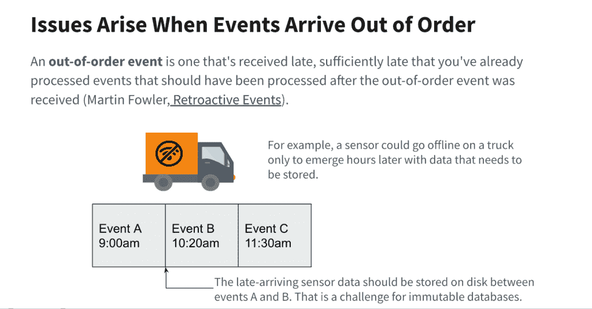
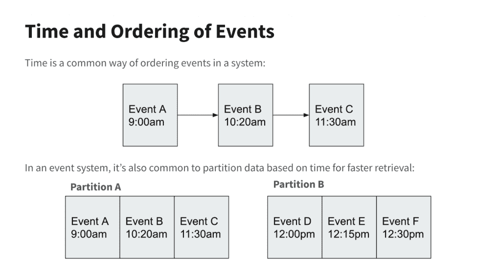
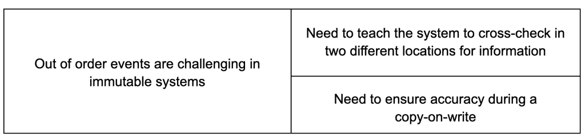

# 处理实时分析应用程序中的无序数据

> 原文：<https://thenewstack.io/handling-out-of-order-data-in-real-time-analytics-applications/>

各地的公司已经升级或正在升级到现代数据堆栈，部署云原生事件流平台来捕获各种实时数据源。

 [Dhruba Borthakur

Dhruba 是 Rockset 的 CTO 和联合创始人，负责公司的技术方向。他是脸书大学数据库团队的工程师，也是 RocksDB 数据存储的创始工程师。此前在雅虎，他是 Hadoop 分布式文件系统的创始工程师之一。他也是开源 Apache HBase 项目的贡献者。](https://www.linkedin.com/in/dhruba) 

那么，为什么他们的分析仍然是批量爬行，而不是实时？

这可能是因为他们的分析数据库缺乏必要的功能来实时准确地提供数据驱动的决策。[可变性](https://rockset.com/blog/why-mutability-is-essential-for-real-time-data-analytics/)是最重要的能力，但是紧随其后并且交织在一起的是处理无序数据的能力。

乱序数据是带有时间戳的事件，由于多种原因，它们在接收数据库或[数据仓库](https://rockset.com/comparisons/rockset-vs-data-warehouse)接收到初始数据流后到达。

在这篇博文中，我将解释为什么可变性是处理无序数据的必备条件，无序数据成为当今问题的三个原因，以及现代可变实时分析数据库如何高效、准确和可靠地处理无序事件。

充分披露: [Rockset](https://www.rockset.com) 提供自己的[实时分析](https://rockset.com/real-time-analytics-explained/)数据库。

## 无序数据的挑战

自 20 世纪 90 年代早期以来，流数据就以许多名称出现了——事件流、事件处理、事件流处理(ESP)等。机器传感器读数、股票价格和其他时序数据被收集并传输到数据库或数据仓库，数据库或数据仓库以时序顺序物理存储它们，以便快速检索或分析。换句话说，时间上接近的事件被写入相邻的磁盘簇或分区。

自从有了流数据，就有了乱序数据。发送送货卡车实时位置的传感器可能会因为电池没电或卡车超出无线网络范围而离线。如果网站或事件发布者崩溃或出现互联网问题，网络点击流可能会中断。该点击流数据可能需要在摄取数据库已经存储之后重新发送或回填。

传输无序数据不是问题。大多数流平台可以重新发送数据，直到它从接收数据库收到确认，表明它已成功写入数据。这就是所谓的至少一次语义。

问题是下游数据库如何存储更新和最新数据。传统的事务数据库，如 Oracle 或 MySQL，在设计时假定数据需要不断更新以保持准确性。因此，操作数据库几乎总是完全可变的，以便可以随时轻松地更新单个记录。

## 不变性和更新:对数据准确性来说成本高且风险大

相比之下，大多数数据仓库，无论是内部的还是云中的，在设计时都考虑到了不可变数据，在数据到达时将数据永久存储到磁盘。所有更新都是附加的，而不是覆盖现有的数据记录。

这有一些好处。首先，它可以防止意外删除。对于分析而言，不变性的关键好处在于，它使数据仓库能够通过在快速 RAM 或 SSD 中缓存数据来加速查询，而不用担心磁盘上的源数据已经更改或过时。

然而，不可变的数据仓库受到无序时间序列数据的挑战，因为没有更新或更改可以插入到原始数据记录中。

作为回应，不可变的数据仓库制作者被迫创建变通办法。雪花、[阿帕奇德鲁伊](https://rockset.com/comparisons/rockset-vs-apache-druid)和其他人使用的一种方法叫做[写时复制](https://en.wikipedia.org/wiki/Copy-on-write)。当事件延迟到达时，数据仓库写入新数据**并且** [重写已经写入的相邻数据](https://www.druidforum.org/t/backfilling-dimension-data-on-existing-segements/2275)，以便按照正确的时间顺序将所有内容正确地存储到磁盘。

在不可变数据系统中处理更新的另一个糟糕的解决方案是将原始数据保存在分区 A(见上图)中，并将晚到达的数据写入不同的位置，即分区 b。应用程序(而不是数据系统)必须跟踪所有链接但分散的记录的存储位置，以及任何由此产生的依赖关系。这种实践被称为[参照完整性](https://esj.com/articles/1998/08/13/referential-integrity-for-the-data-warehouse-environment.aspx?m=1)，它确保分散的数据行之间的关系是按照定义创建和使用的。因为数据库不提供引用完整性约束，所以应用程序开发人员有责任理解并遵守这些数据依赖性。

两种变通办法都有重大问题。写入时拷贝需要大量的处理能力和时间——当更新很少时这是可以忍受的，但随着无序数据量的增加，成本和速度就变得令人难以忍受。例如，如果 1000 条记录存储在一个不可变的 blob 中，并且需要对该 blob 中的单个记录进行更新，则系统必须将所有 1000 条记录读入缓冲区，更新记录，并将所有 1000 条记录写回到磁盘上的一个新的 blob 中— **和**删除旧的 blob。这是非常低效、昂贵和浪费时间的。它可以排除对偶尔无序接收数据的数据流进行实时分析。

使用引用完整性来跟踪分散的数据有其自身的问题。必须仔细检查查询是否从正确的位置提取数据，否则会有数据错误的风险。想象一下应用程序开发人员在访问记录的最新版本时的开销和困惑。在应用程序中使用之前，开发人员必须编写代码来检查多个分区，对来自多个分区的相同记录的内容进行重复数据删除和合并。这极大地阻碍了开发人员的生产力。当对同一记录的更新分散在磁盘上的多个位置时，尝试任何查询优化(如数据缓存)也会变得更加复杂和危险。

## 今天不变性的问题是

当无序更新很少并且速度不太重要时，上述所有问题都是可以管理的。然而，环境变得更加苛刻，原因有三:

### 1.流数据的爆炸

在 Kafka、Spark 和 Flink 之前，流有两种风格:[业务事件处理(BEP)](https://www.computerworld.com/article/2815079/ibm-buys-complex-event-processing-vendor-for-soa.html) 和[复杂事件处理(CEP](https://www.confluent.io/learn/complex-event-processing/) )。BEP 为[基于 SOA 的系统管理](https://www.zdnet.com/article/business-event-processing-and-soa-joined-at-the-hip/)和早期的算法股票交易提供了简单的监控和即时触发。CEP 速度较慢，但更深入，它将不同的数据流结合起来，回答更全面的问题。

BEP 和 CEP 共有三个特点:

1)它们是由大型企业软件供应商提供的。

2)它们是内部的。

3)大多数公司都负担不起。

然后新一代的事件流平台出现了。许多(Kafka、Spark 和 Flink)都是开源的。大多数都是云原生的([亚马逊 Kinesis](https://rockset.com/real-time-analytics-kinesis/) ，谷歌云数据流)或者是商业上适应云的([Kafka](https://rockset.com/sql-on-kafka/)Confluent，Spark data bricks)。它们更便宜，也更容易开始使用。

这使流处理民主化，并使更多的公司开始利用他们被压抑的实时数据供应。之前被 BEP 和 CEP 拒之门外的公司开始收获网站用户点击流、物联网传感器数据、网络安全和欺诈数据等。

各公司也开始[采用变更数据捕获(CDC)](https://rockset.com/blog/change-data-capture-what-it-is-and-how-to-use-it/) ，以便将运营数据库的更新(想想 [Oracle](https://rockset.com/blog/real-time-analytics-on-oracle-and-ms-sql-with-rockset/) 、 [MongoDB](https://rockset.com/solutions/mongodb/) 或亚马逊 [DynamoDB](https://rockset.com/sql-on-dynamodb/) )传输到他们的数据仓库。各公司还开始向现有数据集追加额外的相关时间戳数据，这一过程被称为数据丰富。CDC 和 data enrichment 都提高了他们分析的准确性和范围。

由于所有这些数据都带有时间戳，因此它们可能会无序到达。无序事件的涌入给不可变的数据仓库带来了沉重的压力，它们的工作区并没有考虑到这个量。

### 2.从批处理到实时分析的演变

当公司第一次部署云原生流发布平台以及现代数据堆栈的其余部分时，如果数据是成批摄取的，并且如果查询结果需要花费很多时间，他们不会有问题。

然而，正如我的同事 Shruti Bhat 指出的那样，世界是实时运转的。为了避免尖端竞争对手的破坏，公司正在采用电子商务客户个性化、交互式数据探索、自动化物流和车队管理以及异常检测来防止网络犯罪和金融欺诈。

这些实时和接近实时的用例极大地缩小了数据新鲜度和查询速度的时间窗口，同时增加了数据错误的风险。为此，需要一个能够在几秒钟内接收原始数据流和无序数据，并在不到一秒钟内返回准确结果的分析数据库。

不可变数据仓库采用的变通方法要么接收无序数据的速度太慢(写入时复制)，要么采用复杂的方式(引用完整性)，这会降低查询速度，并带来巨大的数据准确性风险。除了造成排除实时分析的延迟之外，这些变通办法也产生了额外的成本。

### 3.实时分析对任务至关重要

今天的颠覆者不仅是数据驱动的，而且还使用实时分析将竞争对手置于后视窗口。这可以是一个电子商务网站，[通过个性化的优惠和折扣来促进销售](https://rockset.com/blog/ritual-real-time-analytics-to-personalize-the-multivitamin-experience)，一个在线电子竞技平台，[通过即时的、数据优化的玩家比赛来吸引玩家](https://rockset.com/blog/egogames-rockset-real-time-analytics-on-gaming-data/)，或者一个建筑物流服务，[确保混凝土和其他材料按时到达建筑商手中](https://rockset.com/blog/real-time-analytics-construction-logistics-command-alkon/)。

当然，另一方面，复杂的实时分析现在对公司的成功绝对至关重要。数据必须是新鲜的，正确的和最新的，以便查询是没有错误的。随着传入的数据流激增，接收这些数据不能减缓您正在进行的查询。数据库必须提高而不是降低开发人员的生产力。这是一个很高的要求，但是当您的不可变数据库使用笨拙的 hacks 来接收无序数据时，这个要求尤其困难。

## 可变分析数据库如何解决无序数据

解决方案简单而优雅:一个可变的云原生实时分析数据库。迟到的事件被简单地写入数据库中的部分，如果它们在第一时间准时到达的话。

在我帮助创建的实时分析数据库 [Rockset](https://www.rockset.com) 的例子中，数据记录中的各个字段可以被本地更新、覆盖或删除。不需要昂贵而缓慢的写时复制，不需要 Apache Druid，也不需要蹩脚的隔离动态分区。

可变实时分析数据库提供了高原始数据摄取速度、用无序数据更新和回填记录的原生能力，而不会给开发人员和数据工程师带来额外的成本、数据错误风险或工作。这支持当今数据驱动型颠覆者所需的任务关键型实时分析。

在未来的博客文章中，我将描述实时分析数据库的其他必备功能，如突发数据流量和复杂查询。或者，你可以跳过前面，观看我最近在 [the Hive](https://hivedata.com/) 关于“[设计下一代实时分析数据系统](https://youtu.be/NOuxW_SXj5M)”的演讲

<svg xmlns:xlink="http://www.w3.org/1999/xlink" viewBox="0 0 68 31" version="1.1"><title>Group</title> <desc>Created with Sketch.</desc></svg>