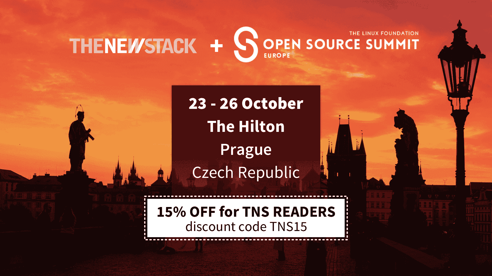

# 在容器和数据流的世界里，REST 发生了什么？

> 原文：<https://thenewstack.io/happened-rest-world-containers-data-streaming/>

[#146:在一个容器和数据流的世界里，静止发生了什么？](https://thenewstack.simplecast.com/episodes/146-what-has-happened-to-rest-in-a-world-of-containers-and-data-streaming)

回顾过去十年，API 引发了和今天容器技术一样多的热烈讨论。API 管理公司的出现是为了帮助公司开放自己的应用程序，以便与其他第三方服务一起使用。公司开始依赖 API 来使用基于 REST 的 API 构建组合服务。看到应用程序和服务如此紧密地联系在一起令人兴奋。

在过去的五年中，由于对微服务更好的打包、部署和扩展的需求，容器市场和云原生市场变得突出。这些问题变成了真正的问题，是现在需要解决的首要问题。这导致了从机器到以应用为中心的基础设施的反思。

现在市场的走向是什么？这是关于我们如何看待 API、数据流以及服务如何适应的新思维的需要吗？API 是否足够？什么有效，什么无效？

在本期[新堆栈分析师](https://thenewstack.io/podcasts/analysts)播客中，我们与中间件平台提供商 [WSO2](http://wso2.com/) 的新任首席执行官[泰勒·朱厄尔](https://www.linkedin.com/in/tylerjewell)和 API 布道者 [Kin Lane](https://www.linkedin.com/in/kin-lane-64318828/) 进行了交谈，他们都谈到了对中间件、基于事件的架构的新思维的需求，以及重新思考 REST 教条的需求。在数据本质上是非结构化和非绑定的时代，REST 的结构和绑定是否足够？

### 在这个版本中:

[9:38:](https://thenewstack.simplecast.com/episodes/146-what-has-happened-to-rest-in-a-world-of-containers-and-data-streaming?t=9:38) 继续发展原料药市场需要什么？
[15:52:](https://thenewstack.simplecast.com/episodes/146-what-has-happened-to-rest-in-a-world-of-containers-and-data-streaming?t=15:52)API 的解耦，以从单个服务中提取价值。
[17:18:](https://thenewstack.simplecast.com/episodes/146-what-has-happened-to-rest-in-a-world-of-containers-and-data-streaming?t=17:18)Kubernetes 和 Mesos 中使用的双层调度环境对下游 API 市场有意义吗？
[22:09:](https://thenewstack.simplecast.com/episodes/146-what-has-happened-to-rest-in-a-world-of-containers-and-data-streaming?t=22:09)Graph API 在主流市场而非硅谷专注于其使用。

[27:22:](https://thenewstack.simplecast.com/episodes/146-what-has-happened-to-rest-in-a-world-of-containers-and-data-streaming?t=27:22) 服务编程模型持续发展的需求。

特色图片:冥王星的边缘地带[通过](https://apod.nasa.gov/apod/ap171005.html)美国宇航局的每日天文图片。

<svg xmlns:xlink="http://www.w3.org/1999/xlink" viewBox="0 0 68 31" version="1.1"><title>Group</title> <desc>Created with Sketch.</desc></svg>