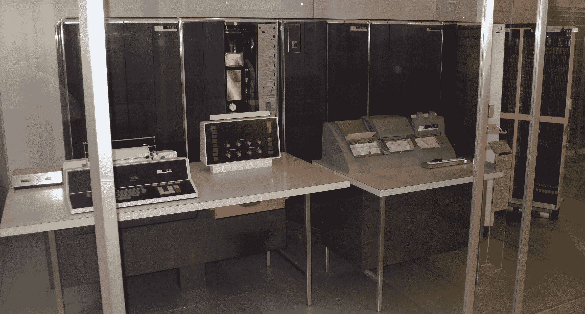

# 当你把 Java 和 1960 年的 IBM 大型机混合在一起时会发生什么

> 原文：<https://thenewstack.io/happens-use-java-1960-ibm-mainframe/>

作为美国数字服务公司(T1)的工程师，[玛丽安娜·贝洛蒂(Marianne Bellotti)](https://twitter.com/bellmar)遇到过仍在生产中使用的老式大型机——有时甚至为网络应用提供动力。上个月，在 Joyent 的[“我们热爱的系统”会议](https://thenewstack.io/systems-we-love/)上，她在一场名为“7074 说你好世界”的演讲中，用其中一些故事娱乐了旧金山的观众。

美国数字服务公司创建于奥巴马政府时期，是一家初创型咨询公司，旨在帮助政府机构实现 IT 运营现代化，从谷歌、脸书和其他网络规模的公司吸引工程人才。

或者，正如奥巴马总统去年 3 月所说，它是“一支特警队——一个世界级的技术办公室。”

因此，听贝洛蒂讲述一些仍在运行的旧设备的故事，以及它与更现代的技术相结合的有时不寻常的方式，令人着迷。

“我喜欢的系统实际上是其他工程师讨厌的系统，”贝洛蒂告诉观众——“凌乱、陈旧、半口香糖和胶带系统，有点像拼凑起来的。

“幸运的是，我为联邦政府工作，所以我真的不缺少这样的东西。”

贝洛蒂在那里分享了关于大型机今天在野外做什么的故事。“我用一些非常非常旧的机器工作，”她告诉观众。她最奇怪的例子之一是提供 JSON API 的大型机。

在内部使用，这个部门已经升级到一台机器，不幸的是，无法连接到他们的 [IMS 数据库](https://en.wikipedia.org/wiki/IBM_Information_Management_System)。为了让您对这项技术的时代有所了解，IMS 数据库是分层的，而不是关系型的。“它们在任何方式、形状或形式上都不是相同的模式，”贝洛蒂解释道。该部门想要的是一个 DB2 数据库，但是“他们没有进行真正困难的数据转换，而是决定构建一个能够与 IMS 数据库对话的驱动程序，并假装这是一个 DB2 数据库。他们有一个 Java 应用程序，它假装成一个终端，与大型机对话，从中抓取数据，然后以 JSON API 的形式交付。”

但这还不是她在政府机构中遇到的最古老的主机。“到目前为止，我发现的最古老的一台是 IBM 7074，这是一台大约建于 20 世纪 60 年代的大型机……它在当时被认为是一台超级计算机，因为它可以很好地进行数学科学计算。”根据 Bellotti 的说法，它使用磁芯存储器(而不是阴极射线管),“这些机器有趣的一点是，它们仍然在许多不同的地方运行——不仅仅是联邦政府。他们也在金融部门和航空公司运作，特别是在预订系统中。”

这引起了观众的认可的笑声…

但是有一个特别的主机吸引了她——一台 IBM 7074 ,它实际上是一个真正的网络应用程序，具有完全现代化的堆栈。“他们使用 Docker 和 Bootstrap 之类的东西。他们在使用甲骨文，但我们不会因此而反对他们。”

中间件是一个 Java 应用程序，可以与终端对话并从中抓取数据。最令人惊讶的是，他们的性能测试数据显示，数据在 1 到 6 毫秒内被返回。

“我喜欢‘什么？！太疯狂了。你是如何让一个 7074 在一到六毫秒内返回的？那是*魔法*！””贝洛蒂说。

该主机已有半个多世纪的历史，7074 于 1960 年艾森豪威尔政府时期首次发布。所以她进行了调查，试图找到这个奇迹的来源。首先，她和一位老 COBOL 程序员——一个朋友的朋友——聊了聊，他描述了那些机器是如何存储数据的。“所以我做了一大堆研究，调出了一大堆文档，仔细查看并试图找到机器名称或其他什么东西……我终于找到了，就是这个。”

她给观众看了一张磁带幻灯片。“一卷又一卷、一卷又一卷的磁带——有人告诉我，这些磁带足够绕世界五圈。”

"现在，我们不是访问 7074，而是在几毫秒内访问磁带！"

这种不可能性需要更多的调查…

最终，贝洛蒂发现了他们的秘密武器——原来是另一个主机库。“他们有一些旧的大型机，需要用它们来执行特定的功能，因此他们会将数据输入到这些旧的大型机中，这些大型机会向磁带写入数据。然后大约每周一次，一组*不同的*大型机会运行一项自动化作业，从磁带上获取数据，并将其加载到更传统的数据库中。”该 Java 应用程序正在从数据库中提取数据——其中有一个 ClearPath Dorado 780，运行 OS 2200。

这就是有趣的地方。“我们被邀请参与这个项目的原因之一是他们的网站性能有问题。他们的页面加载时间在 6 到 10 秒之间，这不是很好，我们很难与他们的工程师交谈并与他们一起排除故障，因为他们经常说，“嗯，它运行得太慢了，因为我们必须使用传统的基础架构。我们系统中的某个地方有所有这些旧的大型机……”

但是来自大型机的数据实际上在不到 6 毫秒的时间内就到达了(从它在数据库中的新家)。瓶颈当然是 Java 应用程序。

此时，部门中经验丰富的数据架构师开始表达他们的愤怒。“15 年前，每个人都告诉我们‘离开大型机…构建这些胖客户端。大型机已经过时了。现在*胖客户端*已经过时，每个人都在转向 API 和微服务，这基本上非常类似于终端用来与主机交互的瘦客户端。"

这让贝洛蒂明白了最重要的一课——有时候，最好的解决方案往往存在于我们的过去。

似乎命运想要强调她的观点，贝洛蒂的演示开始时出现了短暂的延迟，因为她的笔记本电脑拒绝显示她的演示幻灯片。

“这就是我带了一台苹果电脑而不是 IBM 主机的回报，”她开玩笑说。

* * *

## WebReduce

<svg xmlns:xlink="http://www.w3.org/1999/xlink" viewBox="0 0 68 31" version="1.1"><title>Group</title> <desc>Created with Sketch.</desc></svg>