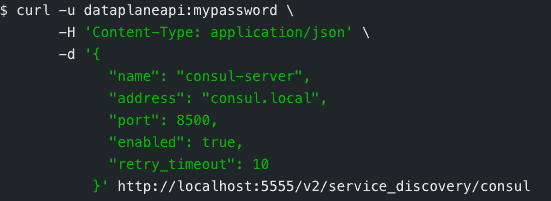
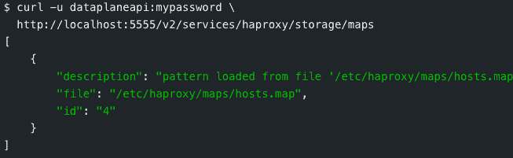

# HAProxy 与 HashiCorp Consul 合作，扩展自动化服务发现

> 原文：<https://thenewstack.io/haproxy-bonds-with-hashicorp-consul-to-extend-automated-service-discovery/>

[HAProxy 的数据平面 API](https://github.com/haproxytech/dataplaneapi) 的 2.2 版本，一个用 API 管理 [HAProxy](https://www.haproxy.com/?utm_content=inline-mention) 代理服务器/负载平衡器的 sidecar，现在[提供](https://www.haproxy.com/blog/announcing-haproxy-data-plane-api-2-2/) [服务发现](https://thenewstack.io/how-does-service-discovery-work-in-kubernetes/)和对 [HashiCorp](https://www.haproxy.com/?utm_content=inline-mention) 的 [Consul](https://www.consul.io/) 服务联网软件的原生支持。

“在此版本中，您现在可以将数据平面 API 注册为 Consul 客户端，并将节点信息下载到正在运行的 HAProxy 实例中。整个后端和其中的服务器列表将动态填充到 HAProxy 配置中，”HAProxy Technologies 产品负责人 Daniel Corbett 在一篇博客文章中写道。

Corbett 后来告诉 New Stack，通过 RESTful HTTP API，HAProxy 直接连接到定义的 Consul 服务器，并从 Consul 目录中获取服务和节点列表。

Corbett 说，该 API 将启动一个过程，可以“定义一个 HAProxy 后端和服务器池来匹配该目录，并根据 Consul 目录中的变化，按需自动扩大或缩小节点/服务器”。

Corbett 在[博客文章](https://www.haproxy.com/blog/building-blocks-of-a-modern-proxy/)中指出，有多少 HAProxy 用户已经依赖于 Consul，并且之前使用过 [HashiCorp](https://thenewstack.io/mitchell-hashimotos-move-from-cto-garners-r-e-s-p-e-c-t/) 的服务网络解决方案来自动检测新的服务节点，并将它们的位置中继到网络中的其他节点。

## 外部文件

HAProxy 数据平面 API 现在可以用于管理 HAProxy 之外的文件，超出了 HAProxy 负载平衡功能的文件， **haproxy.cfg** 。HAProxy 管理的其他文件包括:

*   SSL 证书和密钥包含允许 HAProxy 加密流量的加密数据。
*   映射文件列出了启用字典式查找的键值对，HAProxy 可以在决定如何路由流量、应用速率限制和激活服务器时使用这些键值对。
*   SPOE 配置文件概述了 HAProxy 在向外部程序传递消息时应该使用的格式。

“HAProxy 数据平面 API 的最新版本允许您远程操作这些文件，”Corbett 说。"这使得 API 不仅仅是一个简单的配置 API . "

对于 CI/CD，HAProxy 数据平面 API 也旨在支持软件部署的生产和部署管道。

“在大多数部署管道的末端，您需要负载平衡、反向代理或 API 网关功能。你可以在任何情况下使用 HAProxy，你可以在任何环境下安装它，”Corbett 说。“数据平面 API 可以自动部署这些东西，例如允许蓝/绿和金丝雀等部署模式。

公司[还发布了 HAProxy 本身的 2.3](https://www.haproxy.com/blog/announcing-haproxy-2-3/) 版本，增加了一些功能，如转发、区分优先级和翻译通过 UDP 和 TCP 上的 Syslog 协议发送的消息，OpenTracing SPOA，Stats Contexts，SSL/TLS 增强，改进的缓存，以及连接层的变化，为支持 HTTP/3/QUIC 奠定了基础。

*有关 HAProxy 数据平面 API 的更多信息，[请查看 2 月 9 日(星期二)](https://www.haproxy.com/blog/webinar-whats-new-in-the-haproxy-data-plane-api-2-2/)的 HAProxy 网络研讨会。*

<svg xmlns:xlink="http://www.w3.org/1999/xlink" viewBox="0 0 68 31" version="1.1"><title>Group</title> <desc>Created with Sketch.</desc></svg>