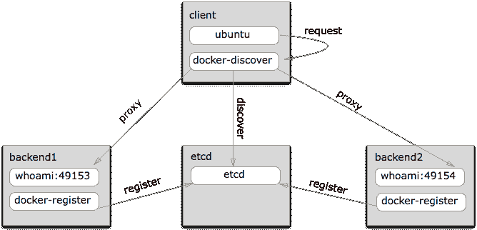

# 对于那些扩展应用程序来说，HAProxy 仍然是箭在弦上

> 原文：<https://thenewstack.io/haproxy-still-an-arrow-in-the-quiver-for-those-scaling-apps/>

HAProxy 并不十分性感，但它很强大，是一个互联网规模对于最小的开发团队也是可行的例子。这是近年来新产品必不可少的技术之一。最新的是 Docker，这是一种有助于更快开发应用程序的技术，但需要 HAProxy 在服务扩展时提供的负载平衡。

HAProxy 运行在 Linux、Solaris 和 FreeBSD 上。它旨在通过在多台服务器上分配工作负载(如数据库)来提高服务器环境的性能和可靠性。HAProxy 的创建者 Willy Tarreau 对负载平衡器的描述如下:

HAProxy 是一个非常快速和可靠的负载平衡器和基于 HTTP 和 TCP 的协议的反向代理，它特别适合于构建高度可用的架构。它可以检查服务器状态，向上层负载平衡器报告自己的状态，在几个服务器之间共享负载，通过使用 HTTP cookies 确保会话的持久性，通过限制同时请求的数量来保护服务器免受冲击，添加/修改/删除传入和传出的 HTTP 报头，阻止或拦截符合预定义标准的请求，并防范某些形式的 DDoS..其简单的基于事件的架构提供了非常高的性能，并使其代码可审计。我已经有几个中等流量的网站(10 到 100 Mbps)成功地使用了它，持续的负载高达每秒几千次点击。(至今)还没有任何非法闯入的报道。众所周知，它至少可以在 FreeBSD、Linux、OpenBSD 和 Solaris 上工作。我也用它来保护我的网络服务器并提供 IPv6 连接。

但是谁用 HAProxy，为什么？数字海洋已经采用了它，并提供了大量的相关文档。公司有一个关于[在 Ubuntu 14.04](https://www.digitalocean.com/community/tutorials/how-to-implement-ssl-termination-with-haproxy-on-ubuntu-14-04) 上用 HAProxy 实现 SSL 终止的详细教程。它为设置开源软件 TCP/HTTP 负载平衡器和代理解决方案提供了细致的操作能力。

在其教程中，Digital Ocean 回顾了如何将 HAProxy 用于 SSL 终止、流量加密和负载平衡 Web 服务器。它还展示了如何使用 HAProxy 将 HTTP 流量重定向到 HTTPS。原生 SSL 支持在 HAProxy 1.5.x 中实现，该版本于 2014 年 6 月作为稳定版本发布。

据数字海洋首席产品官和公司联合创始人莫伊西·乌雷特斯基称，当客户采用更复杂的基础设施时，他们通常会开始使用 ha proxy:

通常，客户的流程是从一个大型的单片应用程序和一个他们选择的位于一台服务器上的数据库开始。他们首先从数据库中分离出来，随着他们开始向更分布式的架构努力，下一个合乎逻辑的步骤是将 Web 服务分离到几个节点上。如果没有负载平衡器服务，这项工作必须全部由客户完成。有了 HAProxy、nginx 和其他开源项目，今天的负载平衡器非常强大，能够以非常少的资源使用来服务巨大的流量。对我们来说，为客户提供这一功能是合乎逻辑的下一步，这样他们就不需要摸索设置、配置和运行服务。这使他们能够更快地回到交付代码的状态，并有一个更可靠的基础设施来满足他们的请求。

关于如何使用 HAProxy 的文档可以写一篇很长的博文。出于我们的目的，我们认为提供一些在其运营中使用 HAProxy 的公司的示例以及将它应用于更新部署(如在 Docker 上)的公司的示例会有所帮助。

## 开源代码库

GitHub 已经运行 HAProxy 好几年了。今年早些时候，GitHub 发布了关于“通过部署前向保密和改进支持的密码列表”来改进其 SSL 设置的帖子。前向保密有许多考虑因素，包括需要消除运行在内存中的会话票证。这意味着攻击者可以解密先前会话的流量，这些会话的票证是使用会话票证密钥加密的。为了解决这个问题，GitHub 保留了会话 id，它在 GitHub 平台上只有五分钟的窗口，而不是进程的整个生命周期。这一举措有助于保持保密性，并继续为客户提供高水平的性能。

## 爱彼迎（美国短租平台）

Airbnb 使用 SmartStack 来管理其相当大的工作量。该公司采用了 SmartStack 方法，因为它从一个单一的应用程序发展到一个具有重要代码库和越来越多的工程师接触代码的不同部分的应用程序。SmartStack 有两个组件:[神经](https://github.com/airbnb/nerve)和[突触](https://github.com/airbnb/synapse)。Nerve 进行服务注册，Synapse 提供服务发现。Airbnb 发现 HAProxy 比其他服务更有效，因为它具有高级负载平衡算法、排队控制、重试和超时等功能。在一篇博客文章中，他们还引用了内置的健康检查，用于防范网络分区。

## 使用 HAProxy 进行 Docker 服务发现

Jason Wilder 描述了一种解决“后端服务问题”的方法，这种方法使用运行在分布式基础设施上的 Docker 容器的服务发现。在之前的一篇文章中，他描述了如何为运行在同一主机上的 Docker 容器创建一个 [自动化 nginx 反向代理](http://jasonwilder.com/blog/2014/03/25/automated-nginx-reverse-proxy-for-docker/) 。

该架构模仿 Airbnb 的 SmartStack，这反映了 Docker 如何影响一个不同于 Airbnb 的新工作流，该工作流使用[etcd](http://coreos.com/using-coreos/etcd/)而不是 [Zookeeper](http://zookeeper.apache.org/) 的，以及运行 [docker-gen](https://github.com/jwilder/docker-gen) 和 [HAproxy](http://www.haproxy.org/) 而不是 [神经](https://github.com/airbnb/nerve)[的两个 Docker 容器](https://github.com/airbnb/nerve)

Wilder 描述了 dis 覆盖的服务是如何被[jwilder/docker-discover](https://registry.hub.docker.com/u/jwilder/docker-discover/)容器处理的。Docker-discover 定期轮询 etcd，并为每种类型的注册服务生成一个带有监听器的 HAproxy 配置。HAProxy 还用于在任何后端服务关闭的情况下进行健康检查。

如果任何后端服务关闭，HAproxy 健康检查会将其从池中删除，并将在健康的主机上重试请求。这确保后端服务可以根据需要启动和停止，并处理注册信息中的不一致，同时确保对客户端的影响最小。

同样，HAProxy 在一种相对新型的工作流程中被用于一个重要的功能，显示了它的寿命和实用性。

## 堆栈交换

栈交换服务因栈溢出而出名。从公司成立的第一天起，它就使用了 HAProxy。它总是使用 dev 版本来充分利用它:

HAProxy 如此出色的原因之一是它是一心一意的，而且(大部分)是单线程的。这使得它能够很好地为我们扩展。软件是单线程的一个好处是，我们可以购买一个相当大的多核服务器，当需要更多资源时，我们只需将它们划分到自己的层，这是另一个使用不同内核的 HAProxy 实例。

SSL 的事情变得更有趣了，因为这里有一个多线程位来处理事务开销。深入探讨如何线程化 HAProxy 超出了这篇文章的范围，所以我就说到这里。

## 照片墙

在第一天，Instagram 就有 25000 名用户注册。我们知道故事的其余部分。这是他们两人一组是如何做到的。

再说一次，HAProxy 是备用的。Instagram 的联合创始人迈克·克里格(Mike Krieger)解释说，优雅和简单是实现规模化的关键。这意味着不要重新发明轮子:如果应用服务器由于负载过重而出现内核崩溃，这是否意味着您要编写一个监控守护进程？

不，你不知道。

这就是 HAProxy 的作用。

“当人们开始开发网络规模的应用程序时，他们需要一个经过战斗考验的负载平衡器，”CoreOS 联合创始人亚历克斯·波尔维说。“这并不超级有趣；它工作得非常好。这是箭囊中的一支箭。”

<svg xmlns:xlink="http://www.w3.org/1999/xlink" viewBox="0 0 68 31" version="1.1"><title>Group</title> <desc>Created with Sketch.</desc></svg>