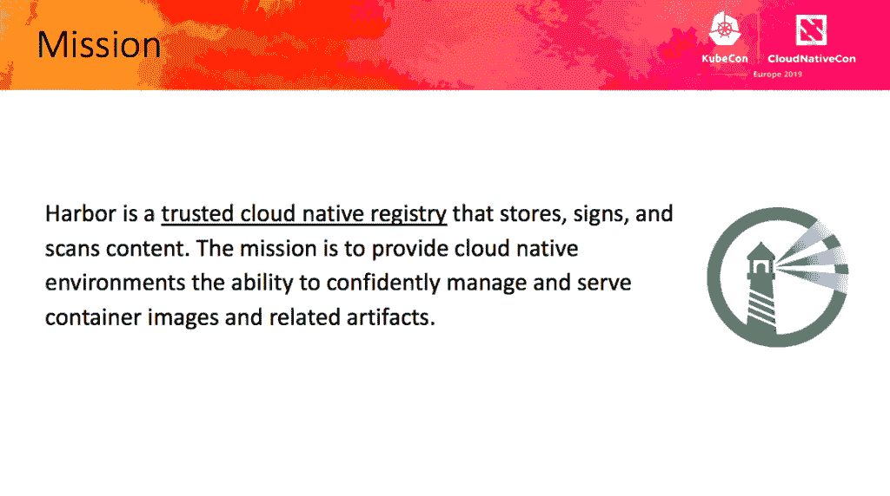

# Harbor 实例可以在其他注册表中复制

> 原文：<https://thenewstack.io/harbor-project-learns-to-share/>

Harbor 1.8 的发布揭示了许多新特性，包括与其他注册中心共享 Harbor 的能力。

以前，为容器图像和舵图设计的 Harbor 只能扩展其他注册表实例。Harbor 实例现在可以在 Docker Hub、Docker Registry 和 Huawei Cloud registry 之间通过推和拉模式复制。

虽然没有透露时间表，但项目成员计划让 Harbor 支持 ECR (AWS)、GCR (Google Cloud)和 ACR (Azure)。

“以前，它只是 Harbor to Harbor，但现在，它是 Harbor to others，”[Project Harbor 创始人兼首席架构师](https://github.com/hainingzhang)[VMware](https://www.vmware.com/)China R&D，在巴塞罗那[kube con+CloudNativeCon Europe](https://events.linuxfoundation.org/events/kubecon-cloudnativecon-europe-2019/schedule/)期间告诉 New Stack。“社区中的许多人都在询问这个功能，所以我们实现了它。”

云本地计算基金会支持的图像注册表项目背后的想法是创建一个开源的云本地注册表，用于存储和扫描容器图像的漏洞。因此，该功能还有助于消除集装箱图像和舵图的相关管理任务。

张指出，出入管理控制仍然是比较受欢迎的港口功能之一。这种基于角色的访问控制(RBAC)适用于身份提供者、AD/LDAP、OIDC 和机器人帐户，适用于 CI/CD 等流程。

当然，Harbor 1.8 还提供了“使其更高效”的其他功能

[Michael Michael](https://www.linkedin.com/in/mimichael) ，Harbor 核心维护人员兼 VMware 产品管理总监。Michael 描述了 Harbor 如何作为 Docker 容器提供升级和迁移工具，以便升级 Harbor 1.7。安装到 1.8，支持“在出现任何问题时”回滚

“Harbor 1.8 是我们更重要、功能更丰富的版本之一，”迈克尔说。"这是社区成员做出重大贡献的直接结果."

迈克尔描述的其他主要特征包括:

*   支持 OpenID Connect，用于将 Harbor 的 IA&M 与外部身份提供者集成，并使用户能够利用 SSO 和联合身份；
*   机器人负责将 Harbor 与 CI/CD 等自动化工具集成在一起；
*   支持在 Harbor UI 中定义基于 cron 的调度任务；
*   健康检查 API 介绍，包括所有 Harbor 组件的详细状态和健康状况。

Harbor 还被视为一种实用的方法，可以在开发周期内在云原生部署之前扫描容器映像的漏洞。在一篇博客文章中，Michael 描述了 Harbor 如何经常与 CI/CD 工具集成，这些工具“无法与联合企业身份提供商一起执行 SSO”

在 1.8 版本中，Michael 写了管理员如何创建机器人帐户，“一种允许 Harbor 被自动化系统(如 CI/CD 工具)集成和使用的特殊帐户。”“你可以配置机器人账户，为管理员提供一个令牌，可以被授予适当的权限来拉或推图像，”迈克尔说。Harbor 用户可以使用其企业 SSO 凭据继续操作 Harbor，并对执行 Docker 客户端命令的 CI/CD 系统使用 robot 帐户

除了位于防火墙之后之外，注册中心，例如 Harbor 的 OpenID Connect (OIDC ),提供了附加的认证层，例如在 OAuth 2.0 之上。Michael 在博客中写道，这一功能使 Harbor 能够根据外部授权服务器或身份提供商执行的身份验证来检查用户的身份。

“管理员现在可以启用 OIDC 提供商作为港口用户的身份验证模式，然后用户可以使用他们的单点登录凭据登录港口门户，”Michael 写道。“在大多数情况下，当用户必须被重定向到外部身份提供者时，Docker 客户端等工具无法使用 SSO 和联合身份登录。为了解决这一问题，Harbor 现在包括 CLI secrets，它可以为最终用户提供一个令牌，可用于通过 Docker 或 Helm 客户端访问 Harbor。”

云原生计算基金会、KubeCon + CloudNativeCon 和 VMware 是新堆栈的赞助商。

Pixabay 的特征图像。

<svg xmlns:xlink="http://www.w3.org/1999/xlink" viewBox="0 0 68 31" version="1.1"><title>Group</title> <desc>Created with Sketch.</desc></svg>