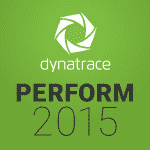
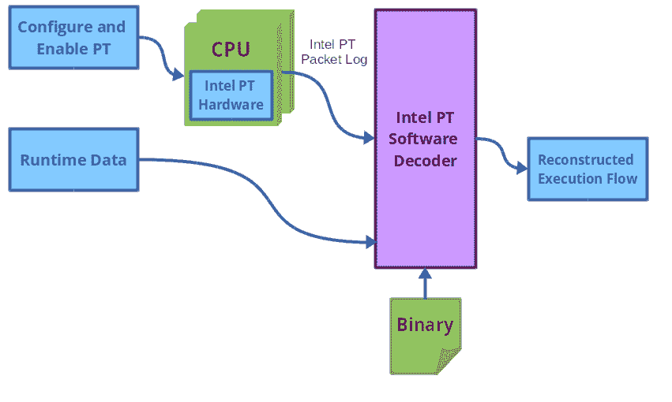

# 硬件跟踪有助于快速精确的性能分析

> 原文：<https://thenewstack.io/hardware-tracing-fast-precise-performance-analysis/>

我已经讨论了在之前跟踪[的重要性——它是深入分析用户空间和内核应用程序不可或缺的工具，尤其是当需要一个开销极低但非常详细的系统视图时。像 LTTng、Ftrace 和 SystemTap 这样的工具已经很好地证明了它们的能力，并获得了不同程度的满意。很长一段时间以来，片上处理器和系统(SOC)已经提供了一些专用的硬件跟踪模块，以便在开发人员处理复杂的错误时为他们提供一些优势。让我们看看以前使用过的一些硬件跟踪基础设施，以及这一领域最近一些有趣的发展。](https://thenewstack.io/comparing-dtrace-iovisor-new-systems-performance-platform-advance-linux-networking-virtualization/)

过去一直使用专门的硬件进行调试和跟踪。然而，这种趋势在嵌入式系统领域更为突出，而不是台式机或服务器级别的机器。很长一段时间以来，芯片支持联合测试行动小组(JTAG)标准，具有特殊端口，可用于远程控制调试和跟踪。这些通常与利用处理器硬件内置调试支持的在线仿真器接口。

2015 年 10 月 14 日至 16 日:全球最大的 APM 专家团队将齐聚 [Perform 2015](http://www.dynatrace.com/en/perform.html) ，共同探讨数字化绩效管理，分享最佳实践，与思想领袖交流。新堆栈的亚历克斯·威廉姆斯将在现场。请务必与他联系，参与报道，并听取行业最佳的关键小组讨论。

例如，ARM 早在 ARM7 和 ARM9 版本中就支持嵌入式在线仿真器( [EmbeddedICE](http://infocenter.arm.com/help/index.jsp?topic=/com.arm.doc.ddi0084f/I883421.html) )硬件。嵌入式逻辑能够直接访问 CPU 的数据和地址总线。调试过程可通过 TAP 控制器进行控制，该控制器通过 JTAG 接口在特殊调试设备的帮助下与外部世界连接。然后，这些设备将与主机上的调试软件结合使用。

最终，ARM11 和 Cortex 等新型架构为嵌入式跟踪宏单元提供了非侵入式实时跟踪支持。这个想法得到了认可，并最终演变成了我们现在所称的 CoreSight，它在 ARM 世界中提供了调试和跟踪支持。

有一些特殊的产品，如 TRACE32 工具和 TimeMachine 调试套件，它们是围绕现代 ARM 处理器中的这种特殊硬件支持而构建的。让我们看看两个最重要的架构中的硬件跟踪支持:ARM 和 Intel x86。

## ARM CoreSight

ARM 的 [CoreSight](http://www.arm.com/products/system-ip/debug-trace/index.php) 调试和跟踪架构本身就是一个几乎完整的解决方案。硬件组件，如嵌入式跟踪宏单元(ETM)和程序跟踪宏单元(PTM)，与 AMBA 高级跟踪总线(ATB)接口。根据配置寄存器中的设置，跟踪数据可以存储在嵌入式跟踪缓冲区(ETB)中以供使用。跟踪控制通过标准 JTAG 接口与调试总线一起提供。

硬件跟踪会产生大量的数据，每秒几兆字节。通过调试总线接入点、JTAG 或 CoreSight 连接器，以及使用特殊硬件，如 [DSTREAM](http://ds.arm.com/ds-5/debug/dstream/) ，开发人员可以访问这一庞大的跟踪数据流。DSTREAM 单元是一个外部硬件设备，与 ARM 开发平台和[ARM DS-5](http://ds.arm.com/ds-5/debug/trace/)Development Studio 中的 trace 支持接口。类似的特殊硬件也由 [Lauterbach](http://www.lauterbach.com/frames.html?home.html) 和 [Green Hills Software](http://www.ghs.com/products/timemachine.html) 以类似 [SuperTrace Probe](http://www.ghs.com/products/supertraceprobe.html) 的工具形式提供，这些工具与它们各自的开发工具(类似 ARM，是专有的)接口。

然而，人们对开源工具的兴趣越来越大。考虑到 Linux 在嵌入式领域的重要性，Linaro 和 ARM 一直致力于将 CoreSight 支持纳入 Linux 内核——它似乎正在形成良好的形状，看起来很容易实现。现在可以使用 sysfs 控制 CoreSight 接口，然后轻松地从跟踪缓冲区(ETB)提取数据。虽然这种分析是针对 DS-5 和 TRACE32 这样的工具，但是如果你喜欢冒险，你可以使用 [ptm2human](https://github.com/hwangcc23/ptm2human) 来解码程序跟踪数据(ptm 提供了程序流跟踪、直接/间接分支异常等等)。)

## 英特尔处理器跟踪

与 ARM 的方法类似，英特尔近年来一直在努力推动硬件跟踪达到一个像样的状态。很长一段时间以来，从 Pentium 4 开始，英特尔就规定使用最后一个分支记录(LBR)来记录程序流，其中可以设置每个分支的断点、中断或异常。这进一步扩展到芯片中的专用硬件，它将在分支跟踪存储(BTS)缓冲器中记录每一个被采用的分支信息。

尽管 BTS 在推出时并不流行，但它最终以英特尔处理器跟踪(Intel PT)的形式为更完整地执行流跟踪基础设施奠定了基础。在[英特尔 64 和 IA-32 架构软件开发人员手册](http://www.intel.com/content/www/us/en/processors/architectures-software-developer-manuals.html)的第 36 章中提到了许多关于英特尔 PT 的血淋淋的细节。基本上，英特尔 PT 的主要目标是通过跟踪代码中的分支来控制流程跟踪。英特尔 PT c 配置可以通过使用特定型号的寄存器(MSR)来完成。启用跟踪后，处理器开始以数据包的形式生成和收集跟踪信息。每个数据包中的跟踪数据对应于分支硬件“事件”当前硬件跟踪数据包可以收集信息，例如:

*   寻呼信息(更改的 CR3 值)
*   工时戳记
*   已采用和未采用信息(跟踪条件分支方向)

跟踪包还可以记录分支、异常和中断的目标指令指针(IP ),以及异步事件(如异常和中断)的源 IP。可以根据 IP 范围、特定逻辑处理器、CR3 值范围等过滤跟踪。可以根据 IP 地址范围、分支状态或过滤器状态触发跟踪，也可以手动触发跟踪。

跟踪输出可以以各种格式写入，例如直接连续的物理地址空间，或者存储为指向这些区域的指针表的可变大小区域。根据平台上可用的支持，还有一个特定于平台的跟踪传输方案选项。除此之外，还有一种“周期精确”模式，它为每个包添加一个周期计数器值，这样我们就可以进行实际的度量来计算实际的每周期指令值。可以收集的硬件跟踪信息非常多。问题是，我们能用它做什么？

### 使英特尔 PT 可访问

软件开发人员和性能工程师会很高兴地知道，硬件跟踪现在正与流行的性能分析和调试工具集成在一起，如 [perf](https://en.wikipedia.org/wiki/Perf_(Linux)) 和 GDB。英特尔 PT 的支持已经[登陆](http://lwn.net/Articles/648154/)Linux 内核。随着内核 4.2 的发布，对基于性能的英特尔 PT 跟踪的用户空间支持也已经到来。这一切是如何运作的？



英特尔 PT 跟踪流程

跟踪的硬件配置是由内核中的一个特殊的 perf 驱动程序完成的。该性能驱动程序将数据转储到单独的环形缓冲区，最终由英特尔 PT 解码器(性能用户空间工具的一部分)解码。perf 输出也可以由用户开发的独立工具解码。之所以这样做，是因为跟踪数据是一个高容量的流，将解码部分卸载到用户空间是非常合理的(内核跟不上巨大的数据流)。此解码后的跟踪数据与来自目标二进制文件的信息以及其他相关的事件运行时数据一起使用，以逐个指令地重建程序的实际流程。这就是 PT 与传统的基于采样的指令剖析方法的区别。所有这些都可以通过非常低的开销来实现。

这是我刚刚在我的新玩具上运行的一个示例——一台 Skylake 英特尔酷睿 i5-6600K 机器——运行 Linux 内核 4.3.0-rc3 :

```
$  perf list  |  grep intel_pt
intel_pt//                           [Kernel PMU event]

```

我们看到`intel_pt`事件是可用的。让我们看看用户空间应用程序`date`的硬件跟踪。我们还需要用户空间应用程序的调试符号:

```
$  perf record  -e  intel_pt//u date
Sun Oct  11  11:35:07  EDT  2015
[  perf record:  Woken up  1  times to write data  ]
[  perf record:  Captured and wrote  0.027  MB perf.data  ]

```

现在我们可以使用`perf report`或其他高级 perf 脚本来显示数据。以下是性能报告显示的内容:

```
$  perf report
...
# Samples: 1  of event 'instructions:u'
# Event count (approx.): 157207
#
# Overhead  Command  Shared Object  Symbol                    
# ........  .......  .............  ..........................
#
 100.00%  date libc-2.21.so [.]  _nl_intern_locale_data
 |
 ---_nl_intern_locale_data
                  _nl_load_locale_from_archive
                  _nl_find_locale
                  setlocale
...

```

我们看到，追踪器总共记录了 157，207 条指令。您可以尝试使用`perf report -D`命令来查看处理器跟踪数据是如何记录的。甚至可以从性能数据中生成[火焰图](http://www.brendangregg.com/flamegraphs.html)。要了解更多信息，我强烈推荐[安迪·克林的这篇关于 LWN 的文章](http://lwn.net/Articles/648154/)，以及即将发布的[英特尔 PT 内核文档](https://github.com/torvalds/linux/blob/master/tools/perf/Documentation/intel-pt.txt)。出于好奇，Andi Kleen 还有一个名为 [simple-pt](https://github.com/andikleen/simple-pt) 的工具，用于对硬件跟踪进行更原始的控制。

## 结论

硬件跟踪是一个重要的工具。这可能不太明显，但是从纯软件的角度来看，使用专用硬件来执行非常精确的跟踪改变了我们通常对跟踪的看法。尽管英特尔 PT 凭借 ARM 和 MIPS 在嵌入式领域取得了成功，但它的目标是真正将这种技术带给大众。它将满足像在崩溃时转储硬件跟踪这样的用例；选择性地启用-禁用性能差的服务器节点上的硬件跟踪以进行分析；更好地再现程序的执行流，而不是采样，以便可以有把握地识别长时间运行的程序中的瞬时错误。前方有激动人心的时刻。让我们看看调试分析工具如何利用这种硬件能力！

<svg xmlns:xlink="http://www.w3.org/1999/xlink" viewBox="0 0 68 31" version="1.1"><title>Group</title> <desc>Created with Sketch.</desc></svg>