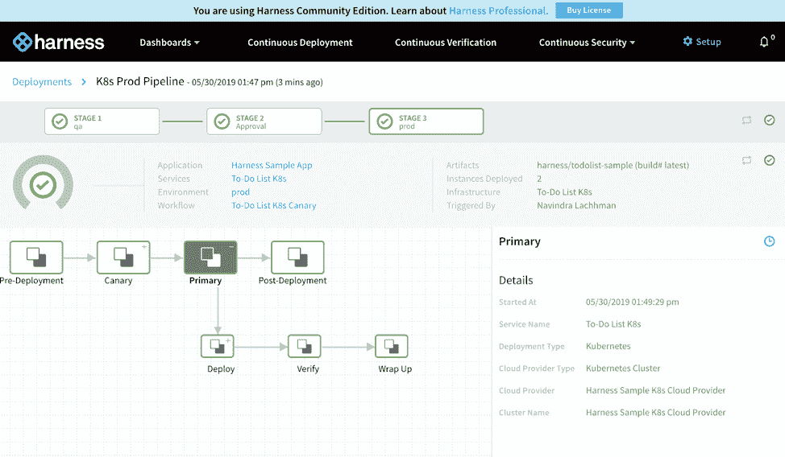

# Harness 社区版:如何在持续交付竞赛中不掉队

> 原文：<https://thenewstack.io/harness-community-edition-how-not-to-get-left-behind-in-the-continuous-delivery-race/>

[驾驭](https://harness.io/build-pipelines-in-minutes/)赞助本帖。

软件即服务(SaaS)和云提供商提供的主要优势之一是尝试和测试新技术和平台变得多么容易。

一个大大降低云环境中高级连续交付(CD)流程门槛的工具是[Harness](https://harness.io/)‘永远免费[社区版](https://harness.io/try-for-free-continuous-delivery-as-a-service/)。你可以认为这是一个特殊对待组织或个人寻找捷径和硕士光盘。

## 免费快艇(有许多玩具)

 [拉维·拉赫曼

Ravi 是 Harness 的福音传道者。在 Harness 之前，Ravi 是 AppDynamics 的布道者。Ravi 在 Mesosphere、Red Hat 和 IBM 担任过各种销售和工程职位，帮助商业和联邦客户构建下一代分布式系统。Ravi 喜欢带着肚子环游世界，痴迷韩国烧烤。](https://www.linkedin.com/in/ravilachhman/) 

尽管如此，跟上软件行业的变化步伐通常并不容易。例如，看看[云本地计算基础环境](https://landscape.cncf.io/)，提供的项目数量正在不断增加。面对如此巨大的变化和技术发展速度，如果我们不前进，有时会感觉我们是在一艘正在下沉的船上。

查看 2018[DORA Accelerate State of devo PS](https://devops-research.com/2018/08/announcing-accelerate-state-of-devops-2018/)报告，组织/团队从低、中、高、精英表现者进行排名。显然，没有一支队伍想处于这个范围的低端。更有甚者，如果你连低配吧的资格都没有呢？但是，当然，你需要不断前进，最重要的是，不断学习，才能生存并最终茁壮成长。[社区版](https://docs.harness.io/article/y1t8hhz4y5-harness-editions)是继续留在比赛中的一种方式。

我们非常小心，以免[社区版](https://docs.harness.io/article/y1t8hhz4y5-harness-editions)成为一个诱饵和钩子的解决方案。相反，我们把它变成了团队每天都可以使用的好东西。例如，Community Edition 不会在试用期结束时过期。它还与 Harness Pro Edition for CD 共享许多功能，包括:

*   管道构建器、工作流向导和触发器；
*   gitop 和管道-as-code(YAML)；
*   基础设施供应(地形和云层形成)；
*   实时部署分析；
*   滚动、[蓝/绿](https://harness.io/2019/02/simplify-amazon-ecs-blue-green-deployments-with-harness/)和[自动金丝雀部署](https://harness.io/2017/12/build-canary-deployment-4-minutes-harness/)策略；
*   [开源监控的持续验证](https://harness.io/2017/11/can-apply-machine-learning-continuous-delivery/)(基于 AI/ML 的健康检查)；
*   自动回滚；
*   [机密管理；](https://docs.harness.io/article/au38zpufhr-secret-management#use_harness_or_third_party_secret_management)
*   Google、Azure、Github 等平台的单点登录(SSO)。

## 最好的部分之一？它是免费的——永远免费

持续验证和自动回滚是免费提供的突出功能之一。前者使用无监督的机器学习，通过开源监控的指标自动验证部署，如 Prometheus、StackDriver 和 CloudWatch。你可以把它看作是对云世界的自动化金丝雀部署。它还使用隐马尔可夫模型、K-Means 聚类和神经网络等技术来告诉您部署后应用程序的性能/质量是好是坏。

Community Edition 面向个人、团队、初创公司甚至开源项目开发人员，他们需要一条通往云原生 CD 管道的捷径。它几乎和一、二、三一样容易设置和使用。

## 1，2，3 建立精英级渠道

即使对于那些不熟悉连续交付(CD)或新的 Harness Community Edition 的人来说，启动您的第一个部署以与精英组织并驾齐驱也很简单。

1.[向您最喜欢的认证提供商注册](https://harness.io/try-for-free-continuous-delivery-as-a-service/)免费社区版账户。一旦完成，我们将看一看[线束示例应用](https://docs.harness.io/article/9hd68pg5rs-quick-start-setup-guide#deploy_the_harness_sample_application)。登录并对蓝色框中的线束示例应用程序设置提示说“是”；

2.一旦解决了这个问题，您就可以开始第一次部署了。因为我们正在利用我们的[线束样本应用程序](https://docs.harness.io/article/9hd68pg5rs-quick-start-setup-guide#review_the_harness_sample_application)，所以有一个[金丝雀部署](https://martinfowler.com/bliki/CanaryRelease.html)的例子来展示金丝雀配置的简易性。Harness 示例应用程序现在自动供应一个临时 GKE 集群一个小时(在我们的 dime 上)。

您可以通过“连续部署”->“开始新部署”来开始部署；。

3.点击“提交”,观看您的第一个连续交付渠道变得活跃起来。有一个批准阶段，将证明是否需要对您的管道进行手动批准。

答:

乙:

### 

## 新社区(为了社区)

为了配合 Community Edition，我们还推出了[http://Community . harness . io](http://community.harness.io)，这样每个人都可以参与在线讨论，支持 Harness 同事，并为 Harness 平台路线图提供想法。你会得到通常的在线论坛、Slack 频道和一些关于部署的笑话来帮助你进入状态。

## 帮助您扩展

在 Harness，我们为所有组织，无论规模大小，都提供了像网飞一样成熟的机会，让他们拥有自己的平台工程资源团队。我们很高兴看到这种可能性的艺术，通过建立精英级别的管道能力，有效地帮助每个人提高他们的软件交付速度。

如果您对软件交付的现代复杂性感到慌乱，或者甚至想要开始或增强您的持续交付，那么只需看看[Harness Community Edition](https://harness.io/try-for-free-continuous-delivery-as-a-service/)。

云本地计算基金会是新堆栈的赞助商。

来自 Pixabay 的 Roman Grac 的特写图像。

<svg xmlns:xlink="http://www.w3.org/1999/xlink" viewBox="0 0 68 31" version="1.1"><title>Group</title> <desc>Created with Sketch.</desc></svg>